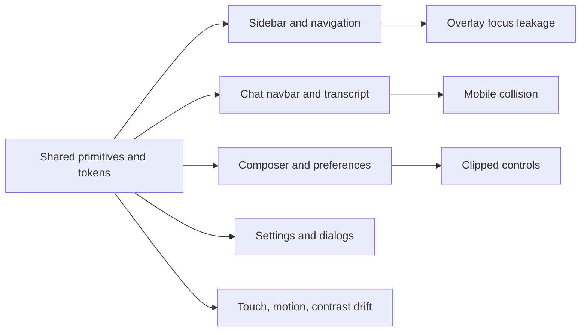

# Kanna UI/UX audit

| Field | Value |
|---|---|
| Audit date | 2026-08-24 |
| Version | 1.41.6 (`c7892151`) |
| Scope | Primary shell, project/session navigation, chat/transcript/composer, settings, shared controls, dialogs, theming, responsive behavior, accessibility, motion, and client delivery performance |
| Viewports | 1280×720 desktop and 390×844 mobile |
| Themes | Light and dark |
| Standard | WCAG 2.1 AA floor, WCAG 2.2 where relevant, Kanna PRODUCT.md and DESIGN.md, and Impeccable product-register rules |

## Anti-pattern verdict

**Fail, but not because the product looks generically AI-generated.** Kanna has a distinctive, calm editorial direction and largely avoids gradient text, decorative glass, hero metrics, and repetitive marketing cards. The failure is product-system inconsistency: pill controls replace the documented 6–8 px component radius, shared dialogs combine borders with broad shadows, uppercase 10 px status pills contradict the design language, and motion/touch behavior varies by component. A fluent user would trust the overall visual direction but pause at the subtly inconsistent or inaccessible controls.

## Audit health score

| # | Dimension | Score | Key finding |
|---|---:|---:|---|
| 1 | Accessibility | 1/4 | Destructive contrast failure, unnamed control, non-inert mobile overlay, pervasive undersized targets |
| 2 | Performance | 1/4 | 2.67 MB minified entry chunk; Shiki cannot split because it is also statically imported |
| 3 | Responsive design | 1/4 | Core chat toolbar overlaps and composer preferences clip at 390 px |
| 4 | Theming | 3/4 | Strong token foundation, but shared components still use pure black/white and one broken token class |
| 5 | Anti-patterns | 2/4 | Distinctive visual identity, but systemic pill controls, hidden scrollbars, shadowed bordered dialogs, and tiny uppercase labels |
| **Total** |  | **8/20 — Poor** | **Major remediation required before the mobile UI or AA claim is release-ready** |

## Executive summary

- **18 verified findings:** 0 P0, 8 P1, 7 P2, 3 P3.
- The highest-risk cluster is the core chat at narrow widths. Status, actions, and durations occupy the same row without a collapse priority, while the preference strip silently overflows with hidden scrollbars.
- Accessibility defects are systemic. The shared button defaults to 36×36 px, source scanning found 258 explicit 20–36 px sizing utilities, the mobile sidebar is a visual overlay rather than a modal navigation surface, and one transcript action has no accessible name.
- The theme architecture is substantially better than average, but destructive buttons violate contrast and hard-coded `black`/`white` bypass the documented tinted-neutral system.
- The application builds and lints cleanly, but the main JavaScript entry is 2,666.65 kB minified / 771.74 kB gzip. This can delay time-to-interactive on a local or tunneled session and increase long-task risk.
- The product already has strong foundations: semantic color pairings, good focus rings on the shared Button, accessible labels on many icon buttons, 16 px mobile composer text, tabular timing numerics, useful empty-state copy, and a coherent light/dark palette.

## Evidence and methodology

The audit combined live browser walkthroughs, accessibility-tree snapshots, responsive screenshots, computed geometry, token contrast calculations, static pattern scans, and a production build. Browser console checks found no runtime exceptions in the audited flows. ESLint and the Vite production build passed.

The project C3 query cache could not be rebuilt in the audit worktree: `c3 check` reported canonical drift in six existing facts and packaged `c3 repair` failed while replacing its generated database. No sealed `.c3` file was read or changed. PRODUCT.md and DESIGN.md were successfully loaded through Impeccable and used as the product contract.

## Detailed findings

### P1 — Mobile chat header overlaps status and actions

- **Location:** `src/client/components/chat-ui/ChatNavbar.tsx:178–260`
- **Category:** Responsive design / visual hierarchy
- **Evidence:** [chat-mobile.png](screenshots/chat-mobile.png)
- **Impact:** At 390 px, the failed-state label and duration collide with adjacent controls. Users cannot reliably parse session state or distinguish action targets, which is especially harmful in the primary monitoring workflow.
- **Standard:** WCAG 1.4.10 Reflow; DESIGN.md “Trust via legibility”; Impeccable ban on container overflow.
- **Recommendation:** Define an explicit narrow-width priority model. Keep menu/new-chat and one status glyph+label visible; move duration and secondary actions into the overflow menu. Use a two-row header only if the second row has a stable semantic purpose. Add visual regression tests at 320, 360, 390, and 430 px with the longest localized status strings.
- **Suggested command:** `$impeccable adapt chat navbar`

### P1 — Composer preference controls are clipped and undiscoverable on mobile

- **Location:** `src/client/components/chat-ui/ChatInput.tsx:1267–1305`
- **Category:** Responsive design / interaction
- **Evidence:** [chat-mobile.png](screenshots/chat-mobile.png)
- **Impact:** The “Full Access” control is cut off and later controls are reachable only through a scrollbar that the implementation explicitly hides. Users may never discover critical model, context, and permission settings.
- **Standard:** WCAG 1.4.10 Reflow; WCAG 2.4.7 Focus Visible when keyboard focus moves off-screen; PRODUCT.md keyboard-first/mouse-friendly parity.
- **Recommendation:** Replace the free-scrolling strip on narrow screens with a compact “Chat settings” button that opens a labeled bottom sheet, while retaining the inline row on desktop. If horizontal scrolling remains, show a fade/chevron affordance, preserve a visible scrollbar for keyboard users, and scroll the focused control into view.
- **Suggested command:** `$impeccable adapt chat composer`

### P1 — Mobile sidebar does not isolate background content

- **Location:** `src/client/app/KannaSidebar.tsx:604–612, 971`
- **Category:** Accessibility / keyboard navigation
- **Evidence:** [sidebar-mobile-open.png](screenshots/sidebar-mobile-open.png); the live accessibility snapshot still exposed all settings buttons and keybinding inputs behind the open sidebar.
- **Impact:** Screen-reader and keyboard users can navigate to controls hidden behind the full-screen sidebar. Focus can escape the navigation, producing an ambiguous and potentially trapping experience.
- **Standard:** WCAG 2.4.3 Focus Order; WCAG 1.3.2 Meaningful Sequence; ARIA modal-dialog/inert interaction expectations.
- **Recommendation:** Implement the mobile sidebar as a modal sheet using the existing Radix Dialog primitive or apply `inert` and `aria-hidden` to the application shell while open. Trap focus, focus the close button on entry, close on Escape, and restore focus to the opener.
- **Suggested command:** `$impeccable harden mobile sidebar`

### P1 — Destructive button colors fail WCAG AA

- **Location:** `src/client/components/ui/button.tsx:10–19`; palette contract in DESIGN.md
- **Category:** Accessibility / theming
- **Impact:** The shared destructive variant uses `bg-destructive/80 dark:text-white`. The documented pale foreground on coral computes to approximately **2.64:1**, far below 4.5:1 for 14 px button text; 80% opacity does not repair it. Destructive actions can be unreadable for low-vision users precisely when clarity matters most.
- **Standard:** WCAG 1.4.3 Contrast (Minimum), 4.5:1.
- **Recommendation:** Add a dedicated destructive-filled foreground/background pair to the single tone-pairing catalog and machine-test both themes after alpha compositing. A darker coral fill with pale text or near-ink text on the current coral can pass; do not reuse the text-only destructive token without testing the filled surface.
- **Suggested command:** `$impeccable colorize destructive actions`

### P1 — Transcript “scroll to bottom” button has no accessible name

- **Location:** `src/client/app/ChatPage/ChatTranscriptViewport.tsx:668–683`
- **Category:** Accessibility / semantics
- **Impact:** The accessibility tree exposes a nameless button. Screen-reader and voice-control users cannot identify or invoke a crucial transcript navigation control.
- **Standard:** WCAG 4.1.2 Name, Role, Value; WCAG 2.5.3 Label in Name.
- **Recommendation:** Add `aria-label="Scroll to latest message"`, hide the arrow icon from assistive technology, and announce the arrival of new messages separately without stealing focus.
- **Suggested command:** `$impeccable harden transcript controls`

### P1 — Touch and pointer targets are systematically undersized

- **Location:** shared default at `src/client/components/ui/button.tsx:22–30`; examples at `src/client/app/KannaSidebar.tsx:632–640`; live geometry across sidebar and chat toolbar
- **Category:** Accessibility / responsive interaction
- **Impact:** Live measurement found 24×24 project actions, a 16×24 drag handle, 18×18 tab close, 22×22 split controls, and many 32–40 px toolbar buttons. Small targets increase selection errors for touch, tremor, trackpad, and low-dexterity users.
- **Standard:** WCAG 2.2 2.5.8 Target Size (Minimum), 24×24 CSS px minimum with spacing exceptions; Kanna DESIGN.md sets 44 px mobile targets.
- **Recommendation:** Make the shared size contract platform-aware: 44×44 on coarse pointers/mobile, at least 32×32 for dense desktop icon controls, and 24×24 only where spacing or inline exceptions are proven. Expand hit areas without enlarging icons. Add DOM geometry assertions for high-frequency controls.
- **Suggested command:** `$impeccable adapt interaction targets`

### P1 — Reduced-motion support is incomplete across the design system

- **Location:** shared dialog `src/client/components/ui/dialog.tsx:14–65`; sidebar logo transition `src/client/app/KannaSidebar.tsx:632–640`; transcript scroll control `src/client/app/ChatPage/ChatTranscriptViewport.tsx:668–675`; global animations `src/index.css:447–540`
- **Category:** Accessibility / motion
- **Impact:** Static scan found **198** animation/transition references but only **8** reduced-motion guards. Dialog zoom/slide, sidebar scale transitions, blur-based empty-state entrances, cursor blinking, and transcript scaling continue for users who request reduced motion.
- **Standard:** PRODUCT.md explicitly requires reduced-motion alternatives; WCAG 2.3.3 Animation from Interactions; inclusive vestibular-motion guidance.
- **Recommendation:** Establish a global reduced-motion layer that removes non-essential animation duration and disables blur/scale/slide transforms. Keep state feedback as instant changes or short crossfades. Require `motion-safe:` for every new non-essential animation and add a lint rule/test.
- **Suggested command:** `$impeccable animate reduced motion`

### P1 — Initial client bundle is excessively large

- **Location:** production build output; Shiki import graph from `HighlightedCode.tsx`, file preview code, and `@pierre/diffs`
- **Category:** Performance
- **Impact:** The main entry is **2,666.65 kB minified / 771.74 kB gzip**, plus 120.42 kB CSS. Vite reports that Shiki is both dynamic and static, so the dynamic import cannot create a separate chunk. On a tunnel, older laptop, or cold cache this delays interactivity and raises long-task/memory risk.
- **Standard:** Core Web Vitals responsiveness goals; Impeccable product requirement for fast task entry.
- **Recommendation:** Profile the entry graph, remove the static Shiki path from the startup dependency graph, route syntax highlighters/diff engines/mermaid renderers behind feature boundaries, and lazy-load settings branches. Set a CI budget for entry gzip and parse/execute cost, not only total build success.
- **Suggested command:** `$impeccable optimize client bundle`

### P2 — Nested and competing interactive semantics in navigation rows

- **Location:** project/chat rows under `src/client/components/chat-ui/sidebar/`; confirmed by accessibility snapshots showing a parent button containing drag, project, options, new-chat, fork, and archive buttons
- **Category:** Accessibility / information architecture
- **Impact:** A single row is exposed as a button with several child buttons, creating confusing announcements and invalid/fragile interaction semantics. Keyboard and screen-reader users cannot form a stable mental model of whether the row or its individual controls owns activation.
- **Standard:** WCAG 4.1.2; HTML interactive-content nesting rules.
- **Recommendation:** Use a non-interactive row container, one explicit link/button for the project or chat title, and sibling action buttons. Keep drag semantics separate and expose grab/drop instructions where keyboard reordering is supported.
- **Suggested command:** `$impeccable harden sidebar semantics`

### P2 — Shared button vocabulary contradicts the documented design system

- **Location:** `src/client/components/ui/button.tsx:5–30`; composer at `src/client/components/chat-ui/ChatInput.tsx:1154–1256`
- **Category:** Anti-pattern / consistency
- **Impact:** DESIGN.md specifies approximately 6 px button corners, while defaults, small buttons, icon buttons, dialogs, and the 29 px composer repeatedly use full pills. This weakens hierarchy because every control receives the same rounded emphasis and makes settings, navigation, and destructive actions feel like different component systems.
- **Standard:** DESIGN.md component vocabulary; Impeccable product ban on inconsistent component vocabulary.
- **Recommendation:** Restore `rounded-md` for standard controls, reserve circles for true icon-only controls, and keep the composer container at 12–16 px rather than 29 px. Encode allowed radii in variants so feature code cannot silently redefine them.
- **Suggested command:** `$impeccable polish component vocabulary`

### P2 — Shared dialogs violate motion, depth, and mobile-sheet rules

- **Location:** `src/client/components/ui/dialog.tsx:14–67, 122–149`
- **Category:** Responsive design / anti-pattern
- **Impact:** The dialog combines a border with `shadow-xl`, uses unguarded zoom+slide animation, relies on pure black overlay, and remains a centered desktop modal on mobile. This conflicts with Kanna’s flat tonal system and makes small-screen forms cramped.
- **Standard:** DESIGN.md flat-by-default, tinted-neutral, reduced-motion, and “mobile dialogs become bottom sheets”; Impeccable ghost-card ban.
- **Recommendation:** Keep one depth mechanism, add a mobile bottom-sheet layout with safe-area padding, use the warm overlay token, and add reduced-motion variants. Consolidate primary/ghost dialog buttons onto the shared Button variants.
- **Suggested command:** `$impeccable adapt dialogs`

### P2 — Hidden scrollbars obscure available content throughout the app

- **Location:** global `.scrollbar-hide` at `src/index.css:424–432`; sidebar `src/client/app/KannaSidebar.tsx:718–724`; composer `src/client/components/chat-ui/ChatInput.tsx:1267–1271`; settings horizontal navigation near `src/client/app/SettingsPage.tsx:1827–1835`
- **Category:** Interaction / anti-pattern
- **Impact:** Users cannot tell that more navigation or settings exist, particularly with mouse, keyboard, or low-precision touch. This directly contributed to the clipped mobile preference controls.
- **Standard:** PRODUCT.md mouse/keyboard parity; Impeccable product ban on custom/reinvented scroll affordances.
- **Recommendation:** Preserve native scrollbars on content/navigation regions or replace overflow with a structurally appropriate menu. Use hidden scrollbars only for nonessential carousels with visible next/previous affordances.
- **Suggested command:** `$impeccable clarify overflow affordances`

### P2 — Motion uses layout-wide `transition-all`

- **Location:** shared button `src/client/components/ui/button.tsx:5–7`; sidebar logo `src/client/app/KannaSidebar.tsx:632–640`; transcript scroll affordance `src/client/app/ChatPage/ChatTranscriptViewport.tsx:668–675`; 14 source occurrences total
- **Category:** Performance / motion
- **Impact:** `transition-all` can animate unintended properties during responsive or theme changes, creates hard-to-debug motion, and may trigger more expensive rendering than necessary.
- **Standard:** Impeccable motion guidance: animate only intentional properties and avoid layout-property animation.
- **Recommendation:** Replace with explicit `transition-colors`, `transition-opacity`, or `transition-transform` per component and pair each with a reduced-motion behavior.
- **Suggested command:** `$impeccable animate shared interactions`

### P2 — The theme system still bypasses its own single source of truth

- **Location:** `src/client/components/ui/dialog.tsx:21` (`bg-black/50`); `src/client/components/ui/button.tsx:12–13` (`dark:text-white`); malformed `border-inpu` at `src/client/components/ui/button.tsx:14–16`
- **Category:** Theming / maintainability
- **Impact:** Pure black/white violate the documented Tint-Everything Rule, and the malformed border utility can silently remove the intended input border. These bypasses make theme changes and contrast guarantees unreliable.
- **Standard:** DESIGN.md Tint-Everything Rule and single tone-pairing catalog.
- **Recommendation:** Add semantic overlay and destructive-filled tokens, fix the border token, and lint against raw black/white plus unknown design utilities in shared primitives.
- **Suggested command:** `$impeccable colorize shared primitives`

### P2 — “Workflows” is disabled without explaining the dependency

- **Location:** `src/client/app/KannaSidebar.tsx:564–570` and navigation rendering
- **Category:** UX copy / discoverability
- **Evidence:** [settings-desktop.png](screenshots/settings-desktop.png)
- **Impact:** On settings and project-level states, the navigation item simply appears faded and cannot receive interaction. Users do not learn that a chat must be active or how to satisfy the requirement.
- **Standard:** Nielsen error-prevention/help principles; Product register requires complete disabled/error states.
- **Recommendation:** Keep the item focusable with `aria-disabled="true"` and a concise tooltip such as “Open a chat to view workflows,” or route to an instructional empty state instead of disabling navigation.
- **Suggested command:** `$impeccable clarify workflow navigation`

### P3 — Status pills use tiny uppercase tracked text

- **Location:** `src/client/components/ui/status-pill.tsx:11–19`
- **Category:** Typography / anti-pattern
- **Impact:** 10 px uppercase tracked labels are slower to scan and contradict the documented sentence-case, 12 px minimum label language. Status is frequent operational information, not decorative metadata.
- **Standard:** DESIGN.md No-All-Caps Rule and 12 px label scale; Impeccable ban on tiny uppercase tracked labels as default scaffolding.
- **Recommendation:** Use sentence case at 12 px minimum, retain color-plus-shape, and reserve all-caps only for a genuinely exceptional state.
- **Suggested command:** `$impeccable typeset status system`

### P3 — Muted text meets AA but misses Kanna’s stated AAA target

- **Location:** DESIGN.md `margin-gray-light` and `margin-gray-dark`; widespread `text-muted-foreground`
- **Category:** Accessibility / typography
- **Impact:** Computed contrast is approximately **4.81:1** in light mode and **6.76:1** in dark mode. This passes AA for normal text but misses the product’s stated 7:1 body-text target, especially noticeable in dense 12 px sidebar/settings copy.
- **Standard:** WCAG 1.4.6 Enhanced Contrast; PRODUCT.md AAA where feasible.
- **Recommendation:** Darken the light muted token and slightly lighten the dark token until both reach 7:1 on their actual composited surfaces, then re-run the token-pairing tests for all usages.
- **Suggested command:** `$impeccable colorize muted text`

### P3 — Settings mobile navigation loses visible location context

- **Location:** mobile settings navigation near `src/client/app/SettingsPage.tsx:1827–1835`
- **Category:** Information architecture / responsive design
- **Evidence:** [settings-keybindings-mobile.png](screenshots/settings-keybindings-mobile.png)
- **Impact:** The horizontally scrolling chips extend beyond the viewport, and the active section can move out of view. Users lose both the complete menu and their current location while scrolling a long settings page.
- **Standard:** WCAG 2.4.8 Location (AAA); mobile navigation clarity.
- **Recommendation:** Use a compact labeled section selector on mobile, keep the current section name sticky, and expose all destinations in a popover/sheet rather than a clipped chip rail.
- **Suggested command:** `$impeccable adapt settings navigation`

## Systemic patterns

1. **Responsive behavior is being patched at component level instead of governed by priority rules.** The chat navbar and composer both preserve too many desktop controls at 390 px.
2. **Shared primitives are not the only source of component truth.** Feature code frequently overrides height, width, radius, motion, and color, causing drift from DESIGN.md.
3. **Accessibility checks emphasize labels but not complete interaction behavior.** Many icon controls are named, yet overlay isolation, target geometry, interactive nesting, and motion preferences are not enforced.
4. **Overflow is hidden rather than resolved.** Hidden scrollbars and silent horizontal rails defer information-architecture decisions to users.
5. **Performance boundaries do not align with feature boundaries.** Highlighters, diff rendering, diagrams, and large settings branches remain reachable from the initial graph.

## Positive findings

- The palette and semantic tone catalog are unusually well documented, with explicit alpha-composited contrast testing for status pairings.
- Most toolbar icon buttons have meaningful accessible names and visible shared focus rings.
- The chat composer uses 16 px text and 44 px attachment/send targets on mobile, preventing iOS focus zoom and supporting touch.
- Timings use monospaced/tabular numerics, which prevents live values from reflowing.
- Light and dark themes are coherent and the audited screens produced no browser runtime errors.
- Loading, empty, failed, and connection states generally explain system state instead of showing blank panels.
- Lint and production build both pass, giving remediation work a stable baseline.

## Recommended remediation sequence

1. **[P1] `$impeccable adapt chat navbar`** — establish a narrow-width action/status priority model and regression tests.
2. **[P1] `$impeccable harden mobile sidebar`** — implement modal semantics, inert background, focus trapping, Escape, and restoration.
3. **[P1] `$impeccable adapt chat composer`** — replace the clipped preference rail with a responsive settings affordance.
4. **[P1] `$impeccable colorize destructive actions`** — create and test an AA-compliant filled destructive pairing.
5. **[P1] `$impeccable harden transcript controls`** — name the scroll affordance and remove nested interactive semantics.
6. **[P1] `$impeccable adapt interaction targets`** — enforce coarse-pointer and dense-desktop target contracts in shared primitives.
7. **[P1] `$impeccable animate reduced motion`** — make motion opt-in through `motion-safe` and add a global reduced-motion test.
8. **[P1] `$impeccable optimize client bundle`** — split highlighters, diffs, diagrams, and settings from startup; add budgets.
9. **[P2] `$impeccable polish component vocabulary`** — reconcile radii, shadows, button variants, overflow, and theme tokens with DESIGN.md.
10. **[P3] `$impeccable polish`** — final cross-theme, keyboard, responsive, and visual-regression pass.

## Verification plan after fixes

- Automated: contrast pair tests, unknown-token lint, accessible-name scan, interactive-nesting scan, target-size geometry tests, reduced-motion computed-style tests, and entry gzip budget.
- Browser: keyboard-only pass; screen-reader smoke test; 200% zoom; 320/360/390/430/768/1280/1440 px; light/dark/system themes; reduced motion; coarse pointer emulation.
- Core flows: open/close mobile sidebar, select project/chat, monitor all chat states, use every navbar action, change provider/model/permission, open dialogs, navigate all settings sections, and recover from loading/empty/error states.

You can ask me to run these one at a time, all at once, or in any order you prefer.

Re-run `$impeccable audit` after fixes to see your score improve.

## Final remediation — 2026-08-25

All **18 of 18 findings are closed**. The implementation preserves Kanna's editorial visual system while enforcing the audit requirements at shared boundaries.

| Audit area | Resolution | Evidence |
| --- | --- | --- |
| Narrow chat navbar | Low-priority duration hides below 430 px while named primary actions remain available. | 390 px browser accessibility snapshot; source contract tests. |
| Mobile sidebar | Modal role, accessible name, focus loop, Escape close, background `inert`, and opener focus restoration. | Live 390×844 keyboard/browser evaluation. |
| Mobile composer | Clipped preference rail replaced by one 44 px Chat settings trigger and bottom sheet with trigger focus restoration. | Live dialog geometry and focus evaluation. |
| Destructive actions | Shared filled destructive token pair is cataloged and AA-tested in both themes. | `tone-pairings.test.ts`; `design-contract.test.tsx`. |
| Transcript control | Scroll-to-latest control has an accessible name and mobile target. | Browser accessibility snapshot and shared target contract. |
| Target sizes | Shared mobile minimum is 44 px; dense sidebar, stack, pane-tab, and row controls use 32 px desktop targets. | Live geometry plus component contract tests. |
| Reduced motion | Global fallback removes non-essential duration, smooth scrolling, and transforms; component animation paths carry reduced-motion behavior. | UI source contract and source scan. |
| Startup performance | Non-chat routes and diff rendering are lazy. Entry fell from 771.74 kB to **342.23 kB gzip**, below the enforced 350 kB budget. | Production build and `check:bundle`. |
| Nested interactions | Project and chat rows are noninteractive containers with sibling title, drag, menu, fork, archive, and create controls. | Browser accessibility snapshots and sidebar tests. |
| Radius vocabulary | Buttons use documented radii; composer uses `rounded-xl`; true icon controls alone retain circular treatment. | Shared design contract and Impeccable scan. |
| Dialog system | Warm overlay, flat depth, mobile bottom sheet, safe-area padding, reduced motion, and 44 px mobile close control. | Live 390 px geometry and dialog contract test. |
| Overflow affordance | Hidden-scrollbar utilities removed; mobile rails replaced structurally by selector/sheet controls. | UI source contract and source scan. |
| Explicit motion | Every client `transition-all` occurrence was replaced with intentional property transitions. | UI source contract. |
| Theme source of truth | Raw black/white shared surfaces removed; overlay and destructive semantic tokens used; malformed border utility corrected. | UI source and contrast contracts. |
| Disabled Workflows | Remains keyboard-focusable with `aria-disabled` and “Open a chat to view workflows” explanation. | Desktop accessibility snapshot. |
| Status typography | Sentence case, static status indicators, 12 px minimum label text. | Design contract and source contract. |
| Muted contrast | Light and dark muted tokens both meet WCAG AAA ≥7:1. | Machine-computed contrast tests. |
| Mobile settings location | Sticky labeled section selector exposes every destination and current section. | Live selection from General to Providers updated `/settings/providers`. |

### Final verification record

- `bun run check`: typecheck, lint, production build, and the 350 kB gzip budget passed.
- `bun run lint:usestate`: passed.
- Focused design/sidebar/contrast tests: 77 passed before the final shared-dialog contract addition.
- Full suite: **7,092 passed, 2 skipped, 0 failed** after updating one stale uppercase expectation to the audited 12 px sentence-case contract.
- Browser confirmation: 390×844 mobile and 1280×720 desktop, light and dark themes, no horizontal document overflow, no runtime errors, working route lazy loading, mobile sidebar isolation, settings navigation, and composer-sheet Escape/focus restoration.
- Impeccable detector: no blocking findings. Its four advisory literal values were normalized to documented radius and type tokens immediately after the scan.
