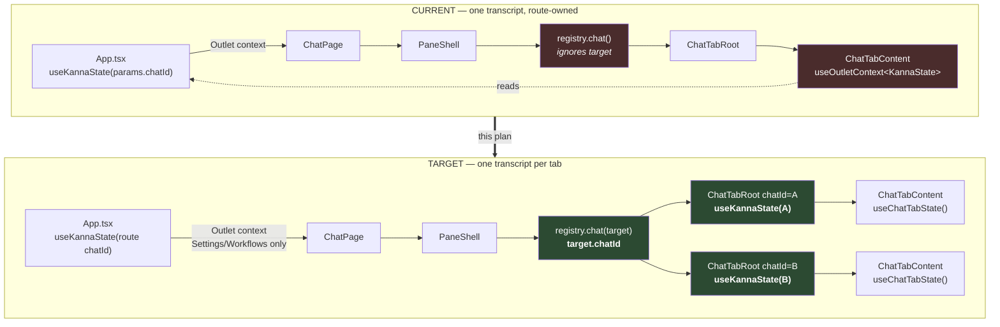
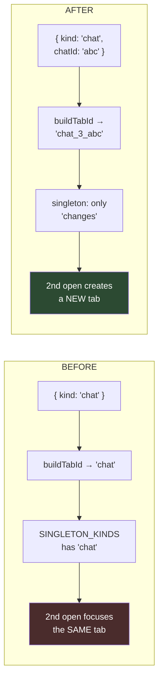
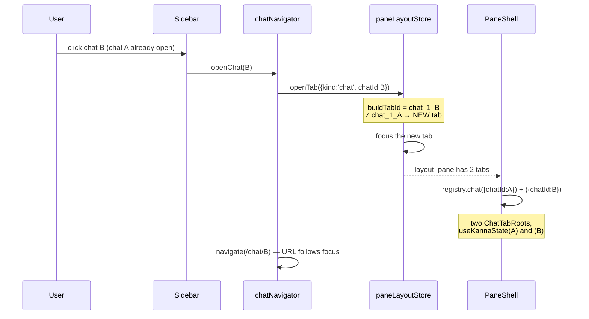

# Session tabs — wiring the model into the app

## Goal

One tab per open chat. N open chats = N tabs. Keyboard switching. Two chat
tabs render two **different live transcripts** side by side.

## Root cause of "always exactly one tab"

`PaneTabTarget`'s chat variant is `{ kind: "chat" }` — it carries **no
chatId**. `buildTabId` maps it to the constant `"chat"`, and `chat` is in
`SINGLETON_KINDS`. So opening a second chat resolves to the same tab id and
just focuses the existing tab. Which chat is displayed comes from the route,
not the tab.

`tabTarget.ts` states the reason outright:

> `chat` is a singleton for a hard reason, not a stylistic one: every
> transcript prop originates from a single `useOutletContext<KannaState>()`,
> so a second live transcript has no context to read from.

**That blocker is already gone.** PRs #624 + #625 (plan chunks 0.1–0.9) exist
precisely to remove it:

- `useKannaState(activeChatId)` is parameterized by chatId, and its own comment
  says it is designed for "multiple useKannaState instances mount (one per open
  chat tab)".
- `chatStateStore` is keyed by chatId (snapshot, history, ready, resync nonce).
- `AppGlobalProvider` owns the socket + global subscriptions, so N instances do
  not open N sockets.
- `ChatTabScopedStore` gives each tab its own composer / scroll / input height.

What remains is to let a chat tab **address** a chat, and to source its state
from its own `useKannaState` rather than the single route-level one.

## Current vs target

### Tab identity change

### Opening a chat

## Stages

Each stage ends green (`bun run lint`, `bun run typecheck`, `bunx ast-grep test`,
targeted tests). Browser check at C and at the end.

**A — tab identity (pure).**
`PaneTabTarget` chat gains `chatId`. `buildTabId` → `chat_${part(chatId)}`.
`normalizeTabTarget` validates/drops a chat tab with no chatId. `tabTargetsEqual`
compares chatId. Drop `chat` from `SINGLETON_KINDS`. `describeTab` labels a chat
tab from its title and makes it closable when it is not the last one.
Migration: a persisted `{kind:"chat"}` maps to the layout's chat or is dropped.

**B — per-tab state.**
`ChatTabRoot({chatId})` calls `useKannaState(chatId)` and provides it through a
new `ChatTabStateContext`. `ChatTabContent` reads `useChatTabState()` instead of
`useOutletContext`. Other pages keep the outlet context untouched.

**C — wiring.**
Opening a chat opens/focuses its tab. Closing a tab drops it. Focus ↔ URL stay
in sync. Browser: 2 chats → 2 tabs, split → two live transcripts.

**D — keyboard.** Verify `nextPaneTab`/`closePaneTab` cycle chat tabs; fix if not.

**E — oracle.** Replace the synthetic tests with ones that mount the real
`App`/`ChatPage` and assert tab COUNT grows on a second chat, and that two tabs
render two different transcripts. The oracle must fail if the app stops calling
the primitives.

**F — remove the duplicate.** `lib/paneTree/sessionPanes.ts` is a second, flat
pane model added by an earlier chunk and called from zero production code; the
real engine is `tree.ts`/`operations.ts`. Delete it with its tests.

## Why the previous oracle passed while the feature did not

Its tests called `openPane`/`nextPane` directly and hand-mounted two
`ChatTabRoot`s. That proves the primitives work; it cannot prove the app calls
them. Test (a) mounted a synthetic consumer through a router, not the real
`ChatPage`. Stage E fixes this by asserting on the rendered app.
