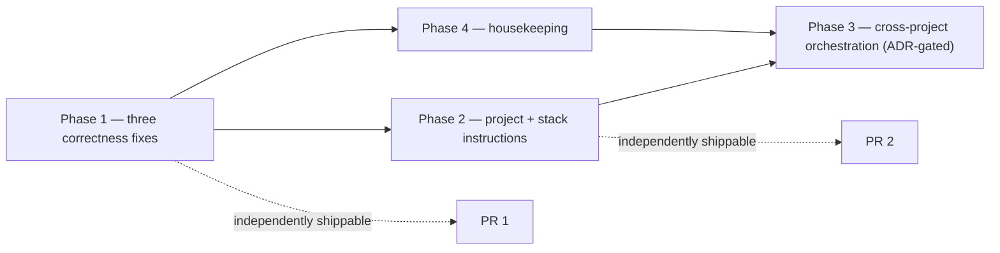
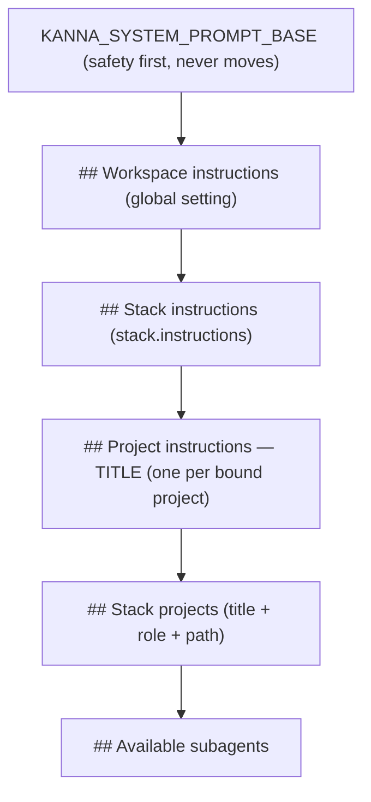

# PLAN — Stacks that actually support working on several projects at once

Status: **plan only, nothing implemented.** This document is the handoff. An
implementing agent should be able to start from here without repeating the
investigation. Tracking file: `PROGRESS-stack-multi-project.md` (same commit).

Baseline reviewed: `main` @ `6fc297f8`. Every `file:line` below was read at that
revision — re-check the line numbers before editing, the file contents are what
matter.

## 0. The requirement, in one paragraph

A Kanna user works in several registered projects at the same time. The Stack
feature is the vehicle for that, and it must make Kanna aware of three things:
**where each project lives** (so the agent can read and write across roots),
**what each project's instructions are** (so it obeys that project's
conventions, not just the primary's), and **how work across projects is
coordinated** (so parallel work in N repos is orchestrated rather than manually
juggled). Today the first is ~85% delivered, the second is essentially absent,
and the third has no owner.

## 1. What exists today (read this before touching anything)

| Concern | Where | Current behaviour |
| --- | --- | --- |
| Stack model | `src/shared/types.ts:175` | `Stack {id, title, projectIds[]}` — no description, no instructions |
| Binding | `src/shared/types.ts:192` | `StackBinding {projectId, worktreePath, role: "primary" \| "additional"}`, stored on the **chat** (`ChatRecord.stackBindings`), not the stack |
| Binding validation | `src/server/event-store-write-ops.ts:211-260` | exactly one primary, no duplicate projectId, non-empty, `stackId` requires `stackBindings` |
| Path resolution | `src/server/claude-session-config.ts:55` `resolveSpawnPaths` | `cwd = primary.worktreePath`; `additional` → `additionalDirectories[]` |
| Filesystem reach | `src/server/claude-session-start.ts:158`, `src/server/claude-pty/driver.ts:344` | SDK `additionalDirectories`, PTY one `--add-dir` per root |
| Model legibility | `src/shared/kanna-system-prompt.ts:37` `renderStackProjectsBlock` | `## Stack projects` block: `- <title> [<role>]: <path>` + `(missing)` — adr-20260617 |
| Name resolution | `src/server/claude-session-config.ts:79` `resolveStackProjects` | title lookup via `store.getProject` (which filters `deletedAt`, `event-store.ts:503`) |
| Subagents | `src/server/claude-subagent-wiring.ts:205-279` | inherit cwd + additional dirs; stack labels **suppressed** for a path-restricted subagent (correct — it cannot reach every root) |
| Global instructions | `src/shared/app-settings-types.ts:326` `globalPromptAppend` | ONE global string, rendered as `## Project instructions` (a misnomer), edited at `src/client/app/SettingsPage.tsx:667` |
| Stack CRUD | `src/shared/protocol.ts:157-162`, `src/server/ws-router-misc.ts:178-215` | `stack.create / rename / remove / addProject / removeProject / listWorktrees` |
| Stack events | `src/server/events.ts:276-304`, replay bucket `0` (`event-store-helpers.ts:188-193`), log `"stacks"` (`events.ts:459-463`), apply `event-store-apply.ts:87` → reducer `event-store-chat-lifecycle.ts:104` | `stack_added / removed / renamed / project_added / project_removed` |
| Boards | `src/server/board-start-work.ts`, `src/server/board-sync.ts` | stack board holds one sync binding per member repo; every card carries its own `projectId`; Start work → worktree + branch + chat with a single primary binding |
| Retired engine | `.c3/adr/adr-20260802-retire-orchestration-core.md` | the durable multi-task engine was deleted on purpose; nothing replaced its cross-project sequencing |

### The three current defects, with evidence

1. **`setup_loop` resolves its workdir from the project's registered path, not
   the chat's cwd.** `src/server/claude-loop-commands.ts:406` passes
   `project.localPath` into `validateLoopSetup`, and
   `src/server/loop-template.ts:597` defaults `workdirAbs = cwd`. Because
   `src/server/board-start-work.ts:162` gives **every** card-started chat a
   primary binding pointing at a fresh worktree, arming a loop there runs the
   oracle and writes the `PROGRESS.md` skeleton in the main checkout — a
   different tree from the one the agent edits. Cron gets this right
   (`src/server/cron/commands.ts:123` → `resolveChatCwd` → `resolveSpawnPaths`),
   and so do the tracking-doc MCP tools (`src/server/kanna-mcp.ts:740`, which
   falls back to the chat cwd). `setup_loop` is the only outlier.

2. **The additional roots' `CLAUDE.md` and `.claude/rules/` never load.** Claude
   Code's memory docs are explicit: *"The `--add-dir` flag gives Claude access
   to additional directories outside your main working directory. By default,
   CLAUDE.md files from these directories are not loaded. To also load memory
   files from additional directories, set
   `CLAUDE_CODE_ADDITIONAL_DIRECTORIES_CLAUDE_MD=1`"* — which loads `CLAUDE.md`,
   `.claude/CLAUDE.md`, `.claude/rules/*.md` and `CLAUDE.local.md` from each
   added directory. So a stack chat today has full write access to project B and
   none of B's conventions.

3. **Codex drops the stack entirely, silently.**
   `src/server/claude-turn-starter.ts:488` — the comment states it: *"Codex
   single-cwd: peer worktrees not passed to startSession. Cross-root writes use
   grantRoot."* But `grantRoot` exists only as a protocol field
   (`src/server/codex-app-server-protocol.ts:235`) and **nothing in `src/` ever
   sets it**. Codex also never receives the `## Stack projects` block (the branch
   passes `developerInstructions: globalPromptAppend` and no stack input). So
   switching a stack chat to Codex quietly downgrades it to a single-project chat
   with no refusal and no UI signal. OpenRouter is fine — it runs the SDK path
   (`isClaudeSdkProvider`, `src/server/provider-catalog.ts:93`).

## 2. Phasing



Phases 1, 2 and 4 are each a separate PR. Phase 3 does not start until its ADR
is accepted. **Do not bundle phases** — Phase 1 is a bug fix that should land on
its own so it can be reverted independently of a feature.

## 3. Ground rules for the implementing agent

Non-negotiable, from `CLAUDE.md` and `.claude/skills/kanna/SKILL.md`:

- Run `/c3 query <topic>` (or `c3x lookup <file>`) **before** editing, and
  `/c3 change` in the same PR when a boundary or contract moves. After ANY
  `c3x` write run `git status .c3/` and `git checkout --` what you did not
  intend — `c3x` rewrites docs your change never touched.
- One worktree, one branch, per phase. Never commit to `main`.
- TDD: write the failing test, run it, confirm it fails **for the right
  reason**, then implement.
- Verification, all of it, before claiming done:
  `bun run check` (typecheck → lint → build:client → check:bundle),
  `bun run test`, `bun run lint:usestate`, `bunx ast-grep test`,
  `bun run check:arch`, `bun run lint:limits`, `bun run scan:secrets`.
  Never bare `bun test` (Lexical TDZ) — always `bun run test`.
- Client work: read `DESIGN.md` first; no arbitrary hex, no `backdrop-blur`, no
  native `title` on intrinsic elements, `tabular-nums` on every count. Derive
  tinted pill classes from `TONE_PAIRINGS`.
- Every React root a test mounts must be unmounted, or the sweep in
  `scripts/test-preload.ts` fails a *different* test in a *different* file.

### Architecture-budget headroom — read this before writing client code

`bun run check:arch` is an exact ratchet. Measured at `6fc297f8`:

| File | Lines | Pin | Headroom |
| --- | --- | --- | --- |
| `src/client/app/useAppGlobalState.ts` | 1472 | 1472 | **0** |
| `src/client/app/KannaSidebar.tsx` | 1003 | 1007 | 4 |
| `src/server/claude-pty/driver.ts` | 1103 | 1104 | 1 |

So: **no new handler may be added to `useAppGlobalState.ts`** and essentially
nothing to `KannaSidebar.tsx` or `driver.ts`. The budget's own message
prescribes the remedy — put the new code in a module that owns it. Concretely:
a new `src/client/app/useProjectInstructions.ts` (or a slice module) for
Phase 2's handlers, and extract `buildPtyEnv` out of `driver.ts` for Phase 1.
Raising a pin is a visible diff that says the PR made a tracked issue worse; do
not do it.

Also: do **not** put the instructions length validation in
`src/server/app-settings.ts` — the `settings-bound-throws` pattern budget there
is pinned at exactly 14 `throw new Error(` lines.

## 4. Phase 1 — three correctness fixes

Branch: `fix/stack-multi-project-correctness`. One PR. No new user-facing
surface, so no ADR required, but `/c3 change` if the loop contract moves.

### 1a. The loop arms in the chat's own tree

**Change.** In `setupLoop` (`src/server/claude-loop-commands.ts:394-428`),
resolve the chat cwd the same way every other consumer does and use it as the
validation base:

```ts
const chatCwd = resolveSpawnPaths(chat, project.localPath).cwd
const validation = validateLoopSetup(args.input, chatCwd, { ... })
```

Keep the same-repo guard comparing against `project.localPath` — it is the
repository identity check and is still correct:

```ts
if (resolved.workdirAbs !== chatCwd) {
  const sameRepo = await deps.isWorktreeOfSameRepo(project.localPath, resolved.workdirAbs)
  ...
}
```

**Watch for:** `LoopCommandDeps.store.getChat`'s declared return type
(`claude-loop-commands.ts` deps block, ~line 40-60) may be too narrow to carry
`stackBindings`. Widen it to `Pick<ChatRecord, "id" | "projectId" |
"stackBindings" | ...>` rather than casting. `resolveSpawnPaths` throws when
bindings exist with no primary — that is the pre-existing invariant, leave it.

**Also update** the `setup_loop` tool description in
`src/server/kanna-mcp.ts:563`: "Defaults to the project cwd" becomes "Defaults
to this chat's working directory". The model reads that string to decide whether
to pass `workdir` at all.

**Tests** (`src/server/claude-loop-commands.test.ts`):
- A chat with `stackBindings: [{projectId, worktreePath: "/repo/.worktrees/feat", role: "primary"}]`
  and no explicit `workdir` arms with `workdirAbs === "/repo/.worktrees/feat"`,
  and the arm-time `runVerifyCommand` is called with that `cwd`.
- The tracking-file skeleton is written under the worktree, not the checkout.
- A solo chat (no bindings) is unchanged — `workdirAbs === project.localPath`.
- An explicit `workdir` outside the repo is still refused.

**Acceptance.** Start work on a board card, then arm a loop with no `workdir`;
`PROGRESS.md` appears in the card's worktree and the oracle runs there.

### 1b. Member repos' instructions load with their directories

**Change.** Set `CLAUDE_CODE_ADDITIONAL_DIRECTORIES_CLAUDE_MD=1` on the spawned
child **when, and only when, the spawn has additional directories.**

Add one pure helper — single source for both drivers — next to
`buildClaudeEnv` in `src/server/claude-spawn-helpers.ts:173`:

```ts
/**
 * Claude Code does not load CLAUDE.md / .claude/rules from --add-dir roots
 * unless this is set. A stack chat can write every bound root, so it must
 * read every bound root's conventions. Off when there are no extra roots so
 * a solo chat's context is unchanged.
 */
export function withAdditionalDirectoryMemory(
  env: NodeJS.ProcessEnv,
  additionalDirectories: readonly string[] | undefined,
  enabled: boolean,
): NodeJS.ProcessEnv
```

Call it at exactly two sites:
- SDK: `src/server/claude-session-start.ts:211`, wrapping the existing
  `buildClaudeEnv(...)` expression. `args.additionalDirectories` is in scope
  (`claude-session-start.ts:85`).
- PTY: `src/server/claude-pty/driver.ts:481`, wrapping `buildPtyEnv({...})`.
  `args.additionalDirectories` is in scope (`driver.ts:274`).

`driver.ts` has one line of budget headroom, so **extract `buildPtyEnv`
(`driver.ts:398-411`) into a new `src/server/claude-pty/env.ts`** with its
colocated test, and import it back. That buys ~14 lines and gives the module
somewhere to grow. Lower its `MODULE_ALLOWANCES` pin in the same PR (a listed
module may shrink freely; it stays listed because it is still over 700).

**Env gate.** `KANNA_STACK_MEMORY=disabled` opts out (mirrors
`KANNA_MERMAID_GUARD` / `KANNA_CRON_REPAIR`); default enabled. Resolve it in a
pure function, not by reading `process.env` inside domain code — the
side-effect seal bans `process.env` outside adapters and exempt globs. Follow
how `KANNA_MERMAID_GUARD` is threaded.

**Tests:**
- `claude-pty/env.test.ts`: var set when `additionalDirectories` is non-empty;
  **absent** when empty or undefined; absent when disabled; existing assertions
  (`ANTHROPIC_API_KEY` deleted, `HOME`, `DISABLE_AUTOUPDATER`, OAuth token) all
  still hold.
- `claude-session-start.test.ts` (or the nearest existing suite): the SDK
  `env` option carries the var for a multi-root spawn.

**Manual smoke — required, do not skip.** The variable is documented for the
CLI; the SDK spawns that CLI, but that inheritance is not something to assert
from a doc. Bind two projects into one stack chat, put a distinctive rule in the
*additional* project's `CLAUDE.md`, run `/context` in the session and confirm
the file appears under **Memory files** on both drivers. Record the result in
`PROGRESS-stack-multi-project.md`. **If the SDK path does not honour it, say so
in the PR and keep the PTY half** — do not paper over it.

**Trade-off to state in the PR:** this spends context tokens on every added
root's memory files. That is the correct direction (an agent that can write a
repo should know its rules), but it is a real cost on a wide stack, and it is
why the var is gated on `additionalDirectories` being non-empty.

### 1c. Codex stops pretending the stack does not exist

**Change.** Compose Codex's `developer_instructions` from the same pieces the
Claude prompt uses, via one shared pure helper in
`src/shared/kanna-system-prompt.ts` (reusing `renderStackProjectsBlock`):

```ts
export function buildCodexDeveloperInstructions(args: {
  globalPromptAppend?: string
  stackProjects?: ResolvedStackBinding[]
}): string | undefined
```

Wire it at both Codex call sites:
- main turn: `src/server/claude-turn-starter.ts:495` (`developerInstructions`)
- subagent: `src/server/subagent-provider-run.ts:279`

`resolveStackProjects` is already imported in the turn starter for the SDK
branch; reuse it.

**Say the true thing in the block.** Codex's session is created with a single
`cwd` and Kanna never sets `grantRoot`, so peer roots are outside the session's
workspace. Before wording it, **verify empirically** what a Codex turn does when
asked to read and to write a peer root (read may work, write may be
approval-gated or refused), then write one sentence that matches observed
behaviour. A prompt that overstates the reach is worse than none.

**Second half (may be its own commit):** a visible signal in the provider
picker. `ChatSnapshot.resolvedBindings` (`src/shared/types.ts:430`) is already on
the wire, so the client can tell a multi-binding chat. Add a hint next to the
Codex option when `resolvedBindings.length > 1` — "Codex works in
<primary title> only; the other roots are not available." Use the project
Tooltip / `HoverHint` (`src/client/components/ui/truncated-text.tsx`), never a
native `title`.

**Tests:** helper unit tests (block present / omitted / order); a turn-starter
test asserting `developerInstructions` carries the block for a stack chat and is
unchanged for a solo chat; a client test for the hint's presence and absence.

**Explicitly out of scope:** wiring `grantRoot`. It is a real option for a later
PR, needs its own investigation of the app-server's approval model, and must not
ride a bug-fix PR.

## 5. Phase 2 — instructions at the project and stack level

Branch: `feat/project-stack-instructions`. Needs an ADR (`c3x add adr`) because
it adds two event types and changes the system-prompt contract.

### Target prompt composition



`KANNA_SYSTEM_PROMPT_BASE` stays first — the existing safety-ordering rule
(`kanna-system-prompt.ts:88-91`) exists so the refusal policy is read before any
user-controlled text. Do not reorder it.

**Rename the global block `## Project instructions` → `## Workspace
instructions`.** It is a global setting, and leaving two different things both
called "Project instructions" is exactly the comprehension hazard
adr-20260802 was written about. Update `src/shared/kanna-system-prompt.test.ts`
and the Settings copy (`SettingsPage.tsx:667`) in the same commit.

### Server work, in dependency order

1. **Types** (`src/shared/types.ts`): `instructions?: string` on
   `ProjectSummary` (175 → project record inherits it via `ProjectRecord extends
   ProjectSummary`, `src/server/events.ts:16`), on `Stack` and `StackSummary`,
   and on `ResolvedStackBinding` (so the prompt builder gets the text with the
   name it already carries — no second lookup). Optional, because absent and
   empty are the same thing here.
2. **Events** (`src/server/events.ts`): `project_instructions_set
   {projectId, instructions}` and `stack_instructions_set {stackId,
   instructions}`. Log target `"projects"` / `"stacks"` (`events.ts:435-463`).
   Replay priority **0** for both — `getReplayEventPriority`
   (`event-store-helpers.ts:132-193`) puts project *and* stack events in bucket
   0; add the cases beside their siblings. A missing case is not a warning, it
   is bucket 99 and a silently misordered replay.
3. **Builders** (`src/server/event-store-write-ops.ts`, beside
   `buildRenameStackEvent:127`): return `null` when unchanged, throw when the
   entity is missing or deleted, trim, and cap the length. Reuse the same cap
   as `GLOBAL_PROMPT_APPEND_MAX_CHARS` (`src/server/app-settings.ts`) — export
   it rather than minting a second number.
4. **Apply + reducer**: case in `src/server/event-store-apply.ts:87` region,
   reducer beside `stack_renamed` in
   `src/server/event-store-chat-lifecycle.ts:104`.
5. **Store methods** (`src/server/event-store.ts`): `setProjectInstructions`,
   `setStackInstructions`, mirroring `renameStack`.
6. **Protocol + router**: `{type:"project.setInstructions"; projectId;
   instructions}` and `{type:"stack.setInstructions"; stackId; instructions}` in
   `src/shared/protocol.ts:148-162`; handlers in
   `src/server/ws-router-project.ts` and `src/server/ws-router-misc.ts:178`
   (follow `stack.rename` exactly, including the `analytics.track` call).
7. **Read models** (`src/server/read-models.ts`): carry `instructions` on the
   sidebar `StackSummary` and on `resolvedBindings` (`read-models.ts:413`).
8. **Prompt** (`src/shared/kanna-system-prompt.ts`): extend
   `KannaSystemPromptOptions` with `stackInstructions?: string`; render one
   `## Project instructions — <title>` block per binding that has instructions,
   sourced from `ResolvedStackBinding.instructions`. **A solo chat must get its
   project's instructions too** — a solo chat has no bindings, so the resolver
   must synthesize a single-entry list from `chat.projectId`, or the feature
   only works inside stacks. Decide this once in `resolveStackProjects` and
   test both shapes.
9. **Both providers**: Claude via `buildKannaSystemPromptAppend`
   (`claude-session-spawner.ts:226`), Codex via the Phase 1c helper. Subagents
   via `composeSubagentSystemPrompt` (`subagent-provider-run.ts:156`) — a
   subagent that can write project B needs B's rules as much as the main agent.

### Client work

- **Project**: an "Edit instructions" item in `ProjectSectionMenu`
  (`src/client/components/chat-ui/sidebar/Menus.tsx:26`) opening a small dialog
  with a textarea, a character counter (`tabular-nums`) and Save/Cancel.
- **Stack**: a textarea in `StackCreatePanel`
  (`src/client/components/chat-ui/sidebar/StackCreatePanel.tsx`) — it already
  has `mode: "create" | "edit"` and a scoped store, so this is a field, not a
  new surface.
- **Handlers live in a new module**, not `useAppGlobalState.ts` (zero
  headroom). Selectors return stable references (module-level `EMPTY`, or
  `useShallow`) or `bun run lint:usestate` fails and React #185 is one render
  away.
- No inline JSX state logic: a pure transition becomes one named store action;
  anything closing over props/refs/IO becomes an extracted `useCallback`
  (`rules/no-jsx-inline-state-logic.yml`).

### Tests

- Builders: unchanged → `null`; missing entity → throws; over-cap → rejected;
  trimmed.
- Round-trip through the real `EventStore` (follow
  `src/server/event-store.stack-methods.test.ts`) **plus a replay test**: write
  the events, snapshot, replay, assert the instructions survive. An event that
  applies live but not on replay is the classic failure here.
- Prompt builder: per-project blocks present/absent, ordering, BASE still first,
  solo-chat case, missing-project case.
- Codex: `developerInstructions` carries the same content.
- Client: dialog renders, saves, and shows the persisted value; use
  `renderClientMarkup` for anything reading a zustand store (a static render
  never observes `setState`), and unmount every root.

### Acceptance

Two projects in a stack, each with distinct instructions ("in api, never edit
`generated/`"; "in web, run `pnpm gen` after schema changes"). Open a stack chat
and ask the agent to summarise its instructions per project: it names both, plus
the stack-level relationship, on Claude SDK, Claude PTY and Codex.

## 6. Phase 3 — cross-project orchestration (ADR first, no code before it lands)

This is the part that does not exist and must not be guessed. `c3-232
orchestration-core` was retired deliberately (adr-20260802) for being unreachable
and redundant; anything proposed here has to be reachable from a real user
gesture on day one or it repeats that mistake.

**Write the ADR** (`c3x add adr`, and it MUST have the
`id`/`title`/`type`/`goal`/`status`/`date` frontmatter or `c3x repair` deletes
it) covering the two candidate designs:

**Option A — board-driven dependencies (recommended first move).** Add a
dependency edge between cards (`blockedBy: cardId[]`) and let
`board-start-work.ts` refuse or defer a blocked card, with the reason surfaced
in the drawer (it already renders `blockedReason`). This fits the invariant that
makes the current design safe — one card = one worktree = one branch = one chat
— and needs no new execution engine. Ships in slices: the edge and its
validation (no cycles), then the Start-work gate, then the drawer copy.

**Option B — stack-scoped autonomous loop.** Relax the loop's same-repo guard
(`claude-loop-commands.ts:418`, `loop-template-io.adapter.ts:76`) from "a
worktree of the primary project" to "any root bound to this chat", and let the
oracle be per project. This is the direct answer to "orchestration at a high
level", and also the riskier one: the loop's whole durability contract assumes
one tracking file in one tree, and `run_verify`'s memoization fingerprints one
working tree.

**Independently shippable and worth doing regardless of A/B: the stack
rollup.** `ChatActivity` (`src/shared/types.ts:198`) is already computed per
chat and `SidebarData.stacks` already carries `StackSummary`. Aggregate the
member chats' activity onto the stack row so "what is running across this stack
right now" is answerable — running agents, armed loops, failing runs. Small,
self-contained, no new events; do this even if the ADR stalls.

Do not start Phase 3 implementation until the ADR is `accepted`.

## 7. Phase 4 — housekeeping (small, do it beside Phase 1 or 2)

1. **Stacks have no C3 component fact.** Nothing in `.c3/eval/**` or
   `.c3/code-map.yaml` binds `StacksSection.tsx`, `StackChatCreateRow.tsx`,
   `StackCreatePanel.tsx`, `StackBoardsRoutePage.tsx` or the stack helpers in
   `claude-session-config.ts`, so `c3x lookup` on any of them answers nothing.
   Boards got three facts (c3-310 / c3-232 / c3-119); stacks got two ADRs and no
   component. Author the fact, add the `code:` list to `.c3/eval/c3-NNN.yaml`
   and the matching `code-map.yaml` block, then `c3x repair` (must be clean) and
   `c3x lookup` on three of those files to confirm resolution.
2. **No wiki page.** The only `wiki/` hits for "stack" are `keybindings.md` and
   an incidental one in `self-host.md`. Add
   `wiki/src/content/docs/features/stacks.md` (sibling of
   `projects-sessions.mdx`): what a stack is, the primary/additional roles, what
   each provider can reach, where instructions come from. If Phase 1b adds
   `KANNA_STACK_MEMORY`, regenerate the env table:
   `cd wiki && bun run scripts/extract-env-vars.ts`.
3. **Deduplicate binding resolution.** `resolveStackProjects`
   (`claude-session-config.ts:79`) and the inline resolver at
   `read-models.ts:413` build the same `ResolvedStackBinding[]`; the former's
   doc comment admits it "mirrors" the latter. They agree today only because
   `getProject` filters `deletedAt` (`event-store.ts:503`) — a drift risk, not a
   live bug. Keep the pure one, have the read model call it, delete the copy.
4. **Known gap, file an issue rather than fixing it here:** the `/` command and
   skill catalog is primary-only (`ws-router-project.ts:237` scopes it to the
   resolved cwd), so skills committed in the additional projects never appear in
   the picker on a stack chat. Fixing it means unioning per-project catalogs,
   which changes `ProjectCommandsSnapshot`'s shape
   (`src/shared/types.ts:407`) — its own change, with its own reasoning about
   name collisions between projects.

## 8. Definition of done, per phase

- The behaviour is fixed at its root cause, not worked around.
- Colocated tests added; TDD order followed; the focused test was seen failing
  first.
- `bun run check`, `bun run test`, `bun run lint:usestate`, `bunx ast-grep test`,
  `bun run check:arch`, `bun run lint:limits`, `bun run scan:secrets` all pass —
  quote the actual output in the PR, no "should pass".
- Manual smoke performed where the plan asks for it (1b, 1c, Phase 2
  acceptance), with the result recorded in `PROGRESS-stack-multi-project.md`.
- `.c3/` updated in the same PR when a boundary moved, and `git status .c3/`
  reviewed for churn `c3x` introduced on its own.
- Wiki updated when user-visible behaviour or an env var changed.
- No pin raised in `src/ops/architecture/budget.ts`.
- The diff contains nothing unrelated; other worktrees untouched.

## 9. Risks

| Risk | Mitigation |
| --- | --- |
| The SDK path does not honour `CLAUDE_CODE_ADDITIONAL_DIRECTORIES_CLAUDE_MD` | Manual `/context` smoke on both drivers before claiming 1b; ship the PTY half and report the gap rather than assuming parity |
| Extra roots' memory files inflate every stack turn's context | Gate on `additionalDirectories` non-empty; `KANNA_STACK_MEMORY=disabled` escape; state the cost in the PR |
| Changing the loop's workdir base moves an already-armed loop | Armed loops persist an absolute `workdirAbs` on `loop_armed`, so existing arms are unaffected; assert that in a replay test |
| Two new event types break replay on downgrade | Both are additive with a bucket-0 priority; `applyStoreEvent` has no `default`, so an older binary treats them as no-ops. Pin it with a replay test |
| Per-project instruction blocks push a wide stack's prompt very long | Cap per entry (reuse `GLOBAL_PROMPT_APPEND_MAX_CHARS`); render only non-empty entries |
| A Codex prompt block that overstates reach | Verify Codex's real cross-root read/write behaviour before wording the sentence |
| `c3x` rewrites unrelated `.c3/` docs | `git status .c3/` after every `c3x` write; watch for `\ |` in table cells and stripped backticks around globs (both are known damage patterns, documented in `CLAUDE.md`) |

## 10. Out of scope for this plan

Wiring Codex `grantRoot`; unioning the slash-command catalog across bound
projects; per-project default provider/model; per-project subagent rosters;
resurrecting anything from the retired `orchestration-core`; changing how
worktrees are created.
