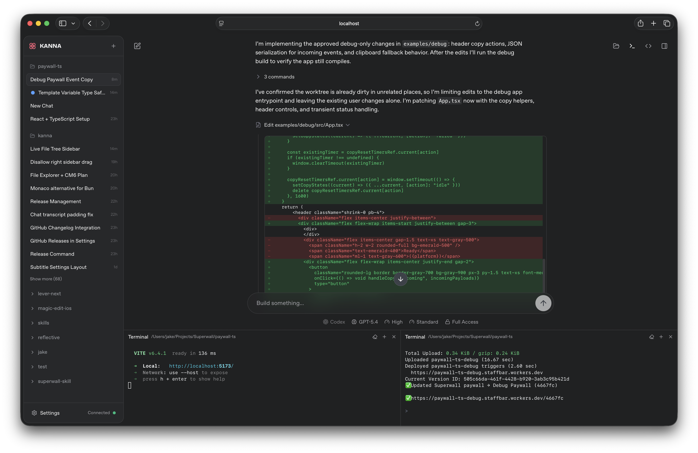
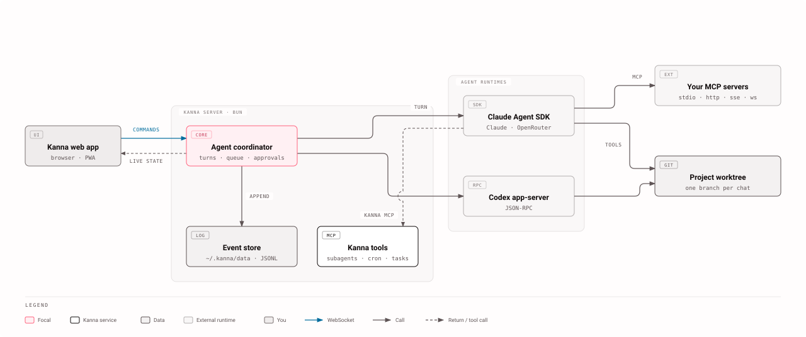
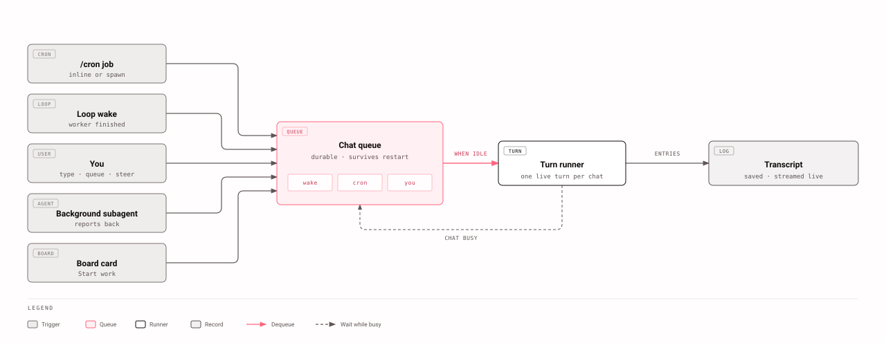
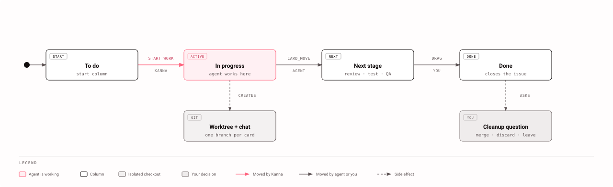

<p align="center">
  
</p>

<h1 align="center">Kanna</h1>

<p align="center">
  <strong>A web UI for the Claude Code and Codex agents, built for long sessions across many projects.</strong>
</p>

<p align="center">
  <a href="https://www.npmjs.com/package/@cuongtran001/kanna"></a>
  <a href="https://www.npmjs.com/package/@cuongtran001/kanna"></a>
  <a href="https://github.com/cuongtranba/kanna/actions/workflows/release-please.yml"></a>
  <a href="https://github.com/cuongtranba/kanna/blob/main/LICENSE"></a>
</p>

<p align="center">
  <a href="https://kanna-wiki.lowbit.link"><strong>Documentation</strong></a> ·
  <a href="https://kanna-wiki.lowbit.link/getting-started/install/">Install guide</a> ·
  <a href="CHANGELOG.md">Changelog</a>
</p>

<br />

<p align="center">
  <picture>
    <source media="(prefers-color-scheme: dark)" srcset="assets/screenshot.png" />
    <source media="(prefers-color-scheme: light)" srcset="assets/screenshot-light.png" />
    
  </picture>
</p>

## What Kanna is

Kanna runs on your machine and puts a browser UI in front of the coding agents you already use: the Claude Agent SDK, the Codex app-server, and OpenRouter models. Every chat belongs to a project, every event is saved to disk, and the UI works on a desktop, a phone, or through a tunnel.

## Quickstart

```bash
curl -fsSL https://bun.sh/install | bash   # if you don't have Bun 1.3.11+
bun install -g @cuongtran001/kanna
kanna                                       # opens http://localhost:3210
```

Add a Claude OAuth token, a Codex login, or an OpenRouter key in **Settings → Providers**, open a project folder, and start a chat. The [install guide](https://kanna-wiki.lowbit.link/getting-started/install/) covers requirements and flags.

## How it fits together

<p align="center">
  <picture>
    <source media="(prefers-color-scheme: dark)" srcset="assets/diagrams/kanna-architecture-dark.svg" />
    
  </picture>
</p>

One Bun process owns everything. The browser sends commands over a WebSocket, the agent coordinator runs each turn on a provider, and every change lands in an append-only event log under `~/.kanna/data`. Refresh the page or restart the server and the chat comes back exactly as it was.

## Features

**Chat with any agent**

- **Claude, Codex and OpenRouter** in one composer, with per-chat model, reasoning effort and context-window controls. [Providers & models](https://kanna-wiki.lowbit.link/features/providers-models/)
- **OAuth token pool**: register several Claude tokens and Kanna rotates between them, failing over when one hits a rate limit. [OAuth pool](https://kanna-wiki.lowbit.link/getting-started/oauth-pool-setup/)
- **Live output**: on Claude chats, thinking, text and tool input stream in as the model writes them.
- **Rich transcript**: grouped tool calls, inline diffs, plan-mode approval, mermaid diagrams checked before you see them, and interactive charts and reports the agent composes ([generative UI](https://kanna-wiki.lowbit.link/features/generative-ui/)).
- **Slash commands everywhere**: `/clear`, `/compact`, `/cron`, plus your local Claude Code skills, on every provider. [Slash commands](https://kanna-wiki.lowbit.link/features/slash-commands/)

**Let it work while you're away**

<p align="center">
  <picture>
    <source media="(prefers-color-scheme: dark)" srcset="assets/diagrams/kanna-turn-queue-dark.svg" />
    
  </picture>
</p>

- **Subagents**: named agents with their own prompts and tools. The main agent delegates, runs them in parallel or in the background, and gets the result back as a new turn. [Subagents](https://kanna-wiki.lowbit.link/guides/user/subagents/)
- **Autonomous loops**: give a goal and a verify command; Kanna works through a durable task list until the check passes and stops on its own. [Loops](https://kanna-wiki.lowbit.link/features/loops/)
- **Cron jobs**: `/cron` schedules a recurring instruction, down to the second, in the same chat or a fresh one. [Cron jobs](https://kanna-wiki.lowbit.link/features/cron-jobs/)
- **Durable queue**: messages, wakes and scheduled runs wait in a per-chat queue that survives a server restart.
- **Background tasks and workflows**: dev servers, long builds and Claude Code workflows show live status, and Kanna keeps their session alive while they run.

**Organize the work**

<p align="center">
  <picture>
    <source media="(prefers-color-scheme: dark)" srcset="assets/diagrams/kanna-board-card-dark.svg" />
    
  </picture>
</p>

- **Projects and session tabs**: chats grouped by project with live status, a split-pane workspace, a project quick switcher, and one-click import of existing Claude Code sessions. [Projects & sessions](https://kanna-wiki.lowbit.link/features/projects-sessions/)
- **Kanban boards**: *Start work* on a card creates a branch, a git worktree and a chat, so several agents can work at once without touching each other's files. Boards sync with GitHub issues. [Boards](https://kanna-wiki.lowbit.link/features/boards/)
- **Multi-repo stacks**: group several repositories so one chat can read and edit across all of them. [Stacks](https://kanna-wiki.lowbit.link/features/multi-repo-stacks/)

**Extend and connect**

- **Your MCP servers** (`stdio`, `http`, `sse`, `ws`, with OAuth 2.1) are available in every chat. [Advanced](https://kanna-wiki.lowbit.link/features/advanced/)
- **Kanna plugins** add sidebar pages, panels and `/` commands, with a server half running in its own process. [Plugins](https://kanna-wiki.lowbit.link/features/plugins/)
- **Beacons** pair another machine you own, so the agent can read files or run commands there within limits you set. [Beacons](https://kanna-wiki.lowbit.link/guides/user/beacons/)
- **Package updates** for installed skills, Claude Code plugins and Codex plugins, checked and applied from Settings. [Package auto-update](https://kanna-wiki.lowbit.link/features/package-auto-update/)

**Run it anywhere**

- **Password gate**, LAN or Tailscale binding, and Cloudflare tunnels (`--share`, `--cloudflared`), plus an agent tool that exposes a dev server on request. [Self-host](https://kanna-wiki.lowbit.link/guides/ops/self-host/)
- **Read-only share links** that render a chat exactly as you see it. [Session share](https://kanna-wiki.lowbit.link/sharing/session-share/)
- **Resumable uploads** for multi-gigabyte files, even behind a tunnel's request-size limit.
- **Web push, PWA install, phone layout**, customizable keybindings, and **in-app self-update** under pm2, systemd, Docker or a plain shell. [Self-update](https://kanna-wiki.lowbit.link/guides/ops/self-update/)

## Usage

```bash
kanna                         # localhost only, opens a browser
kanna --port 4000             # custom port
kanna --remote                # bind 0.0.0.0 (LAN, Tailscale)
kanna --password <secret>     # require a password for the app, WebSocket and API
kanna --share                 # temporary public trycloudflare.com URL + terminal QR
kanna --cloudflared <token>   # run a named Cloudflare tunnel
kanna plugin ls               # manage Kanna plugins
```

`kanna --help` lists every flag. State lives in `~/.kanna`; back it up to keep your chat history. Deployment recipes for [pm2](https://kanna-wiki.lowbit.link/guides/ops/pm2/), [systemd](https://kanna-wiki.lowbit.link/guides/ops/systemd/), [Docker](https://kanna-wiki.lowbit.link/guides/ops/docker/) and a [Cloudflare tunnel](https://kanna-wiki.lowbit.link/guides/ops/cloudflare-tunnel/) are in the wiki.

## Development

```bash
git clone https://github.com/cuongtranba/kanna.git && cd kanna
bun install
bun run setup:hooks   # gitleaks + commit-message hooks, once per clone
bun run dev           # Vite client on :5174, server on :5175
bun run check         # typecheck, lint, build
bun run test          # never bare `bun test`
```

Start with [`CLAUDE.md`](CLAUDE.md) and the [contributing guide](https://kanna-wiki.lowbit.link/guides/contributing/overview/). The server is event-sourced, IO is sealed behind `*.adapter.ts` files, and the lint gates enforce both; the [architecture page](https://kanna-wiki.lowbit.link/guides/contributing/architecture/) explains the shape. Releases are cut by release-please; see [Releasing](https://kanna-wiki.lowbit.link/guides/contributing/releasing/).

## Star History

<a href="https://www.star-history.com/?repos=cuongtranba%2Fkanna&type=date&legend=top-left">
 <picture>
   <source media="(prefers-color-scheme: dark)" srcset="https://api.star-history.com/image?repos=cuongtranba/kanna&type=date&theme=dark&legend=top-left" />
   <source media="(prefers-color-scheme: light)" srcset="https://api.star-history.com/image?repos=cuongtranba/kanna&type=date&legend=top-left" />
   
 </picture>
</a>

## License

[MIT](LICENSE)
