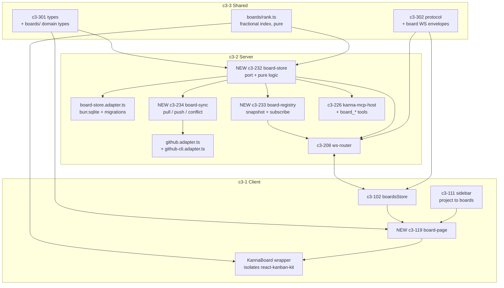
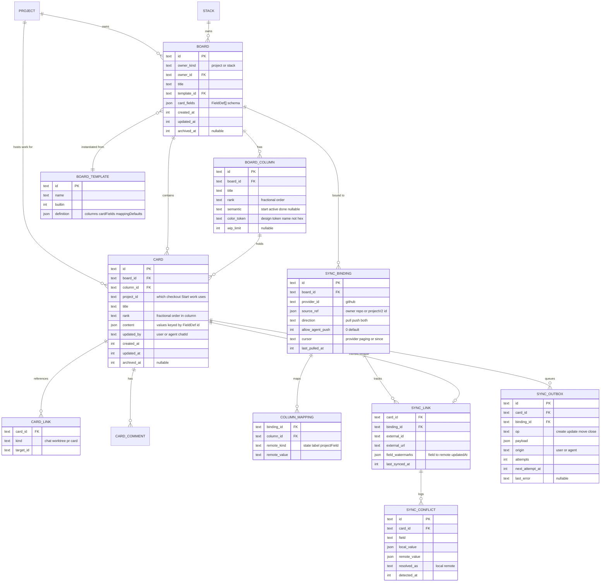
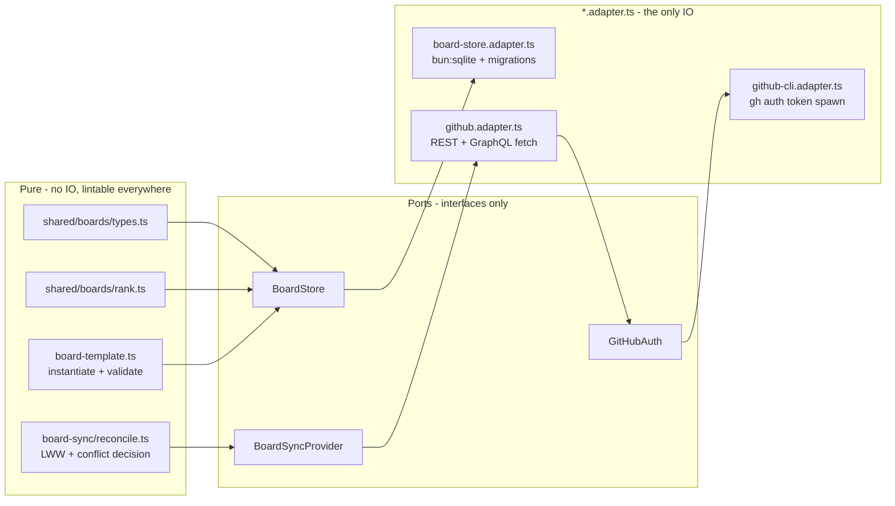
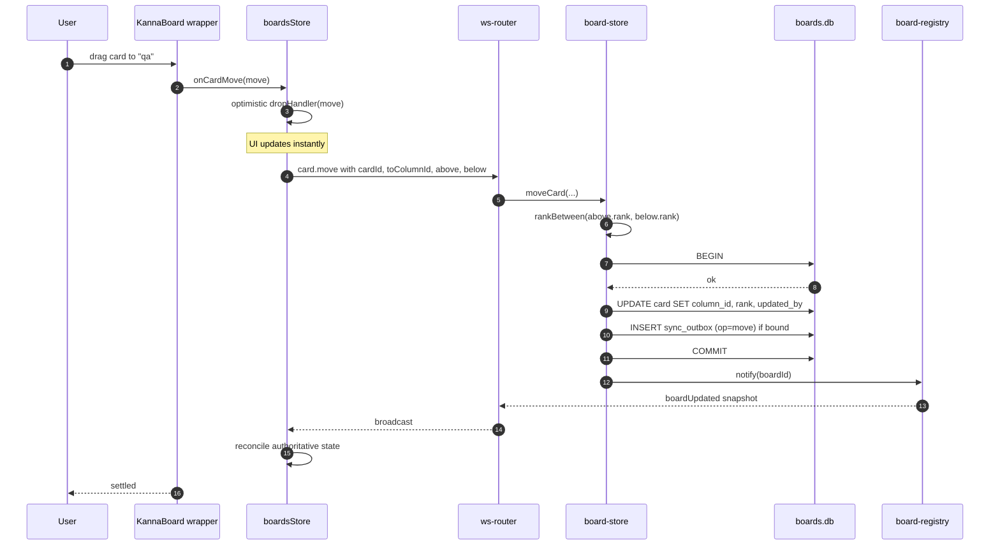
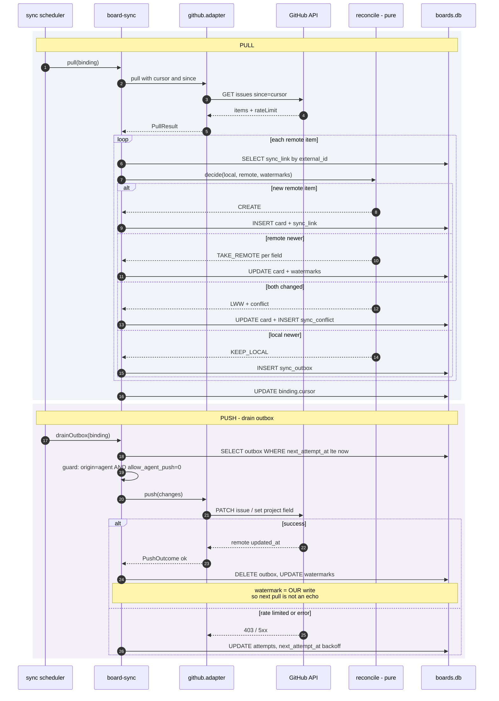
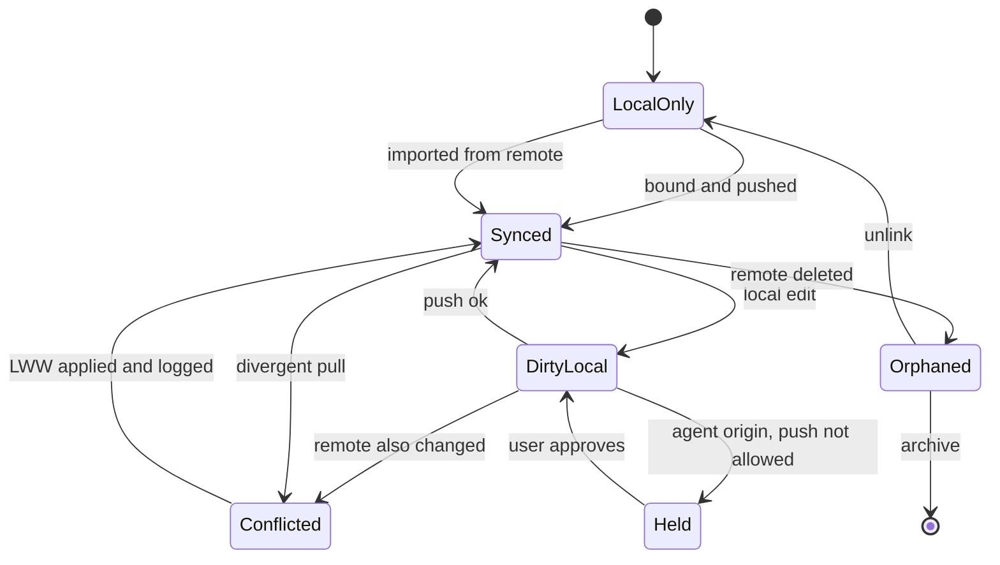
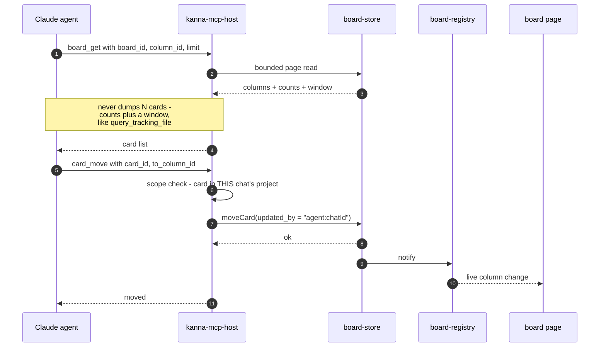
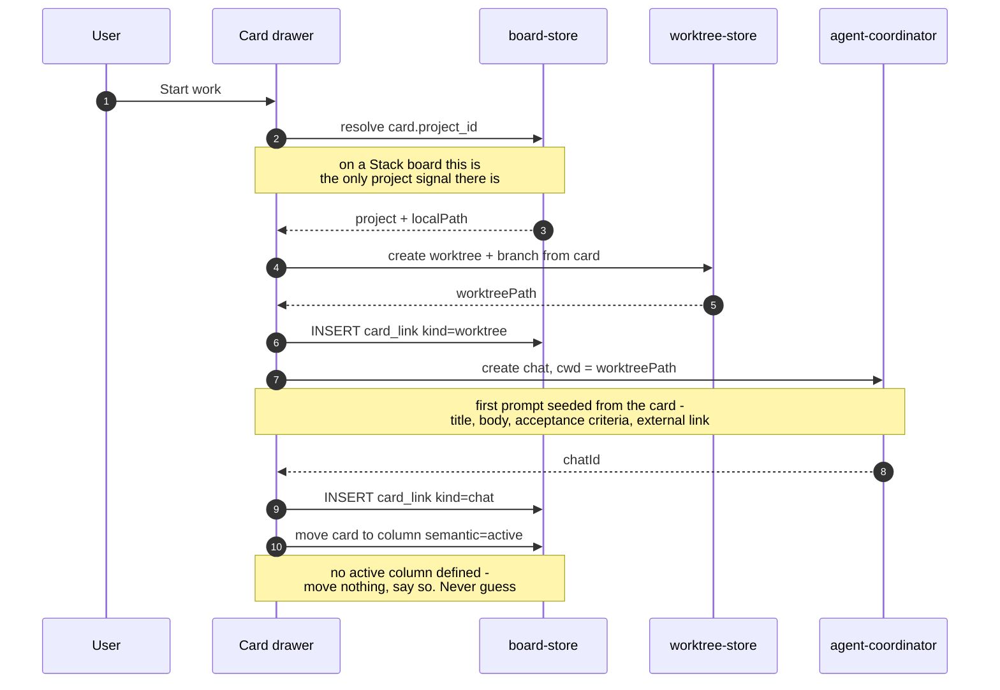
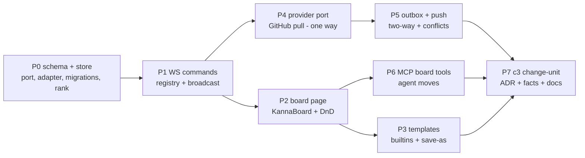

# Kanban Boards for Kanna — Design Brainstorm

Status: **draft for review** · Branch: `feat/kanban-boards` · Date: 2026-08-10

Goal: every Kanna project can own **N user-defined boards**, backed by a **local
SQLite database**, kept in **two-way sync** with external trackers through a
**pluggable provider port** (GitHub first), and driveable **by agents** through
MCP tools.

---

## 1. Decisions taken

| # | Decision | Consequence |
|---|---|---|
| D1 | **`bun:sqlite`** is the board store, not the JSONL event log | New persistence engine → needs an ADR that scopes an override of `ref-event-sourcing`; `new Database` only inside a `.adapter.ts` |
| D2 | Columns are **user-defined workflow stages** (backlog → todo → progress → test → qa → deployment) | No hardcoded status enum anywhere; every remote mapping is data |
| D3 | **Agents move cards** via `mcp__kanna__board_*` tools | Board becomes the agent's work queue; needs attribution + a push guard |
| D4 | **Two-way sync behind a provider port**, more adapters later | `BoardSyncProvider` interface; GitHub is adapter #1 |
| D5 | Credentials from the **`gh` CLI token**, PAT fallback | No new auth UI; `gh` absent → clear error + settings fallback |
| D6 | **Last-writer-wins per field + conflict log** | Needs per-field watermarks, never silently loses work |
| D7 | **Full template system** | Board = instantiated template (columns + card field schema + mapping defaults) |

### D1 is the one that needs justification

Kanna persists everything else as append-only JSONL replayed into in-memory read
models (`ref-event-sourcing`, `ref-local-first-data`). Boards break that pattern
deliberately, because **two-way sync is a relational, queryable workload**:

- *"which cards changed since watermark X"* is an indexed range scan, not a log replay;
- sync needs **per-field watermarks**, an **outbox**, and a **conflict log** joined by external ref;
- imported issue volume (a 5k-issue repo) wants indexes and paging, not a full in-memory projection;
- a **transactional outbox** (card write + push intent in one `BEGIN…COMMIT`) is the root-cause fix for lost updates, and it needs real transactions.

`ref-local-first-data` is **not** overridden — the DB file lives at
`~/.kanna/data/boards.db`, same directory, same local-first posture.

---

## 2. Where it sits in the C3 model



**New facts to author** (one c3 change-unit, same PR as the code): server
components `board-store`, `board-registry`, `board-sync`; client component
`board-page`; refs `ref-relational-board-store` and `ref-sync-provider-port`;
plus the ADR carrying the D1 override.

---

## 3. Data model

A board is owned by **either** a project or a Stack (`owner_kind` + `owner_id`). A card
therefore carries its **own** `project_id` — on a project board it is simply the owner, but
on a Stack board it is the only thing that can answer *"which checkout does Start work
spawn a chat in?"*.



### Ordering: fractional indexing, not integers

`rank TEXT` holds a base62 fractional key. A drag emits
`{cardId, fromColumnId, toColumnId, taskAbove, taskBelow}` — exactly the inputs
`rankBetween(above, below)` needs, so **a move is one `UPDATE` of one row**, not a
renumber of the column. Pure and unit-testable in
`src/shared/boards/rank.ts`; a rebalance pass runs when a key exceeds a length
threshold.

### Colors are token names, not hex

`color_token` stores `"chart-1"`, resolved client-side to `var(--color-chart-1)`.
The design lint bans raw hex in source, and storing hex would push an
un-themeable value into the DB — token names stay correct in light and dark.

---

## 4. Layering — the side-effect seal

`bun:sqlite`, `new Database`, and `Bun.spawn` are ESLint **errors** across
`src/server/**` production code. Everything therefore funnels through ports:



**Rule of thumb:** reconciliation logic (who wins, what changed, what to enqueue)
is a **pure function over two snapshots**; the adapter only fetches and writes.
That is what makes conflict resolution testable without a network or a DB.

### The provider port

```ts
export interface BoardSyncProvider {
  readonly id: string                               // "github"
  readonly capabilities: {
    push: boolean
    remoteKinds: readonly RemoteKind[]              // "state" | "label" | "projectField"
    fields: readonly RemoteFieldDescriptor[]
  }
  discoverSources(auth: ProviderAuth): Promise<readonly RemoteSource[]>
  pull(input: PullInput): Promise<PullResult>       // { items, cursor, rateLimit }
  push(input: PushInput): Promise<readonly PushOutcome[]>
}
```

Adapter #1 is GitHub, split in two so Issues and Projects v2 evolve
independently: `github-issues.adapter.ts` (REST, `since` cursor) and
`github-projectv2.adapter.ts` (GraphQL, status field options → columns).
GitLab / Jira / Linear later implement the same three methods.

---

## 5. Flow: a human drags a card



The card write and the push intent land in **one transaction** — the outbox row
cannot be lost if the process dies before the network call.

---

## 6. Flow: two-way sync



Two subtleties that are easy to get wrong and are designed in here:

- **Echo suppression.** After a successful push we store the resulting *remote*
  `updated_at` into the watermark. Without it, the next pull reads our own write
  as a remote change and ping-pongs forever.
- **Agent push guard.** An agent moving a card to `deployment` must not silently
  close a real GitHub issue. Agent-origin outbox rows are held unless the binding
  sets `allow_agent_push = 1` (default off); held rows surface in the UI.

### Card sync lifecycle



---

## 7. Flow: an agent moves a card



**MCP surface** (registered when a `chatId` is present, scoped to that chat's
project): `board_list`, `board_get`, `card_create`, `card_move`, `card_update`,
`card_comment`, `card_link_chat`.

Two guardrails carried over from the loop tooling, for the same reasons:

1. **Context bounding.** `board_get` returns counts plus a bounded window, never
   the whole board — the same discipline `query_tracking_file` enforces, so a
   5k-card board cannot blow up a turn.
2. **Project scoping.** Every id is resolved against the chat's project before
   any write, the way `confinePathToDir` scopes the tracking-doc tools.

---

## 7b. "Start work" — card becomes an isolated agent session

One card, one worktree, one branch, one chat. This is what makes the parallel case real:
three agents on three cards cannot touch each other's files.



**Branch naming** derives from the card: `card/<external-ref-or-short-id>-<slugged-title>`,
so `#412 Fix: login redirect loop` → `card/412-fix-login-redirect-loop`.

**Cleanup is asked, never automatic.** When a card enters a column marked
`semantic: done`, Kanna asks once: merge the branch, or discard the worktree. It never
deletes an unmerged worktree — losing an agent's work to a column drag is not a
recoverable mistake. A declined prompt leaves the worktree alone and does not ask again
for that card.

**Re-entry.** A card that already has a live worktree shows `Open chat` instead of
`Start work`; a card with a worktree but no live chat shows `Resume` and reuses the
existing worktree rather than creating a second one.

## 8. Templates

A board is an **instantiated template**. `definition_json` carries:

```ts
type BoardTemplateDefinition = {
  columns: readonly { title: string; semantic?: ColumnSemantic; colorToken: string; wipLimit?: number }[]
  cardFields: readonly FieldDef[]        // text | longtext | select | multiselect | number | date | url | label | chat_link
  mappingDefaults?: readonly { columnTitle: string; remoteKind: RemoteKind; remoteValue: string }[]
}
```

Seeded built-ins (migration-inserted, `builtin = 1`, not user-deletable):
**Dev Pipeline** (backlog → todo → in progress → test → qa → deployment),
**Scrum**, **Bug Triage**, **GitHub Issues**. Any board can be saved as a new
template; instantiation is a pure function so it is testable without a DB.

---

## 9. Client

- **Route** `project → Boards`, reachable from the sidebar (c3-111); board list + board view.
- **`<KannaBoard>` wrapper** is the only file importing `react-kanban-kit`. Every visual element is supplied by us through the library's render props (`renderColumnHeader`, `renderColumnWrapper`, `renderListFooter`, `renderColumnAdder`, `renderSkeletonCard`, `configMap.card.render`) using token classes — the library provides layout, DnD, and virtualization, nothing visible.
- **Design gate:** no raw hex, no `backdrop-blur`, project `Tooltip` instead of native `title`, `tabular-nums` on counts and ages. Column dots carry no pulse/glow.
- **Store rules:** `boardsStore` selectors return stable refs (module-level `EMPTY`), state transitions are **named store actions** — no inline updaters in JSX (`no-jsx-inline-state-updater`, `no-jsx-inline-state-logic`), no inline functions passed to custom hooks (`no-unstable-hook-fn-arg`).
- **Scale:** `virtualization` + `loadMore(columnId)` wired to a paged `board.cards.page` command; `totalChildrenCount` comes from a `COUNT(*)`, so a 5k-issue import renders as skeletons and pages in.

---

## 10. Risks

| Risk | Severity | Mitigation |
|---|---|---|
| **`react-kanban-kit` is `0.0.2-beta.7`** — pre-1.0, and ships `husky` / `vite-plugin-dts` in `dependencies` (packaging bug); CSS is injected by JS | High | Pin the exact version; confine it to `<KannaBoard>`. Its engine is `@atlaskit/pragmatic-drag-and-drop` (stable, Atlassian-maintained) — the fallback is to drop to that directly behind the same wrapper, without touching server, store, or sync |
| SQLite is a **new persistence precedent** | Medium | ADR scoping the `ref-event-sourcing` override to boards only; `boards.db` stays under `~/.kanna/data` |
| `gh` CLI not installed | Medium | Detect at bind time; fall back to a PAT in settings (0600, like `customMcpServers`); never fail silently |
| GitHub rate limits on large repos | Medium | Honour `x-ratelimit-remaining`, backoff in the outbox, `since` cursor so pulls are incremental |
| **Agent closes a real issue** | High | `allow_agent_push` defaults to `0`; agent-origin pushes are held and surfaced |
| Sync echo loops | High | Post-push watermark = the remote `updated_at` we caused |
| Board-vs-chat scope confusion for agents | Medium | Project-scoped id resolution on every MCP write |

---

## 11. Delivery phases



Each phase is independently shippable and independently verifiable. P0–P3 give a
working local board with zero network. P4 is useful on its own (import). P5 is
the risky half of sync, isolated behind the port. P6 is additive.

---

## 12. Open questions

1. **Board placement in the UI** — a dedicated project route, or also a pane in the pane-layout (c3-104) so a board can sit beside a chat?
2. **Sync trigger** — on board open + manual refresh, or a background interval per binding?
3. **Chat linkage direction** — should opening a card be able to *spawn* a chat with the card as context, or only link existing chats?
4. **Cross-project boards** — a board is project-scoped here. Does a Stack (multi-project) need one board spanning its projects?
