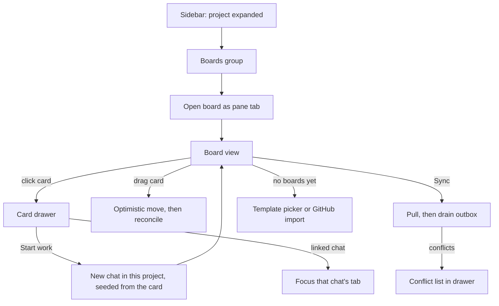

# Kanban Boards — Design Brief

Status: **awaiting confirmation** · Produced by `$impeccable shape` · Register: **product**
Companion to `kanban-boards-brainstorm.md` (architecture).

---

## 1. Feature summary

A project owns N boards. A board turns work — hand-written or imported from GitHub —
into cards an agent can pick up, and shows at a glance which agent is on which card.
Built for the developer in PRODUCT.md: one person, three agents, two projects, a 27-inch
monitor, a long session. The board is not a project-management surface bolted onto Kanna;
it is the **queue the agents feed from**.

## 2. Primary user action

**Look at the board and decide which card to hand to the next agent** — then hand it over
without leaving the board.

Everything else (editing fields, syncing, configuring mappings) is secondary and must not
compete for attention with that one action.

## 3. Design direction

**Color strategy: Restrained.** This is the surface most likely to break Kanna's palette,
because every kanban tool on earth colors its columns. It will not. See §5.

**Scene sentence.** A developer at 11pm, dim room, 27-inch display as the only light
source, three agents running, glancing at the board between transcript reads to decide
what to start next. → The board must read at low light with **no glow, no colored panels**,
and must not flash brightness when a column is empty. Dark mode is the design target;
light mode must hold the same structure (Kanna ships both; neither is an afterthought).

**Anchor references.** Linear's issue board (density with restraint, keyboard-first),
Notion's board view (warm neutrals, content-first columns), and — for the agent-status
layer only — Kanna's own `BackgroundTasksSection` (type icon + description + live elapsed
in tabular-nums).

**Anti-references** carried from PRODUCT.md, plus one specific to this surface:
**Trello/Jira rainbow columns.** Colored column headers are the category reflex here and
are banned outright.

## 4. Scope

| Axis | This run |
|---|---|
| Fidelity | Design brief — no code |
| Breadth | 4 surfaces: board view · card drawer · create-board/template · sync config + conflicts |
| Interactivity | Specified, not built |
| Time intent | Confirm direction, then build P0–P2 from the architecture doc |

## 5. Layout strategy

### The one rule that shapes everything: columns are not colored panels

DESIGN.md's Flat-By-Default Rule says depth is a **state response**, not an idle
aesthetic. Applied here:

- A column at rest is **not** a tinted panel. It is the page background, delimited by
  spacing and one 1px `border-border` divider. No filled header, no background wash.
- A column's optional `color_token` renders as a **6px dot** beside its title — never as a
  background. (This is also why the DB stores a token name, not hex: `bg-chart-1`
  resolves correctly in both themes.)
- During a drag, the hovered column shifts to `bg-secondary` for 150ms. **That** is when
  the column becomes a surface — because that is when it means something.

The board therefore reads as a document with columns, not a dashboard of panels — which
is exactly the "editorial workspace" north star.

### Board pane

```
┌──────────────────────────────────────────────────────────────────────────┐
│ Sprint board                       ● 2 conflicts   Synced 2m ago  [Sync] │ ← header, 1px bottom border
├──────────────────────────────────────────────────────────────────────────┤
│  Backlog  24 │  Todo  6      │  In progress  3 │  Test  2   │  QA  0     │ ← Title 15/600 + count mono
│  ────────────│───────────────│─────────────────│────────────│──────────  │ ← 1px divider per column
│  ┌─────────┐ │ ┌───────────┐ │ ┌─────────────┐ │            │            │
│  │ card    │ │ │ card      │ │ │ card        │ │            │  (empty)   │
│  └─────────┘ │ └───────────┘ │ │ ● 12m  agent│ │            │            │
│  ┌─────────┐ │ ┌───────────┐ │ └─────────────┘ │            │            │
│  │ card    │ │ │ card      │ │                 │            │            │
│  └─────────┘ │ └───────────┘ │                 │            │            │
│  + Add card  │ + Add card    │ + Add card      │ + Add card │ + Add card │ ← ghost row, always last
└──────────────────────────────────────────────────────────────────────────┘
```

Column width fixed (~300px), horizontal scroll past the viewport. Cards virtualized;
`totalChildrenCount` drives skeletons so a 5k-issue import pages in.

### Card face — the scanning unit

```
┌────────────────────────────────────────┐
│ Fix: login redirect loop               │  ← Title 14/500, max 2 lines, text-wrap: pretty
│ #412   auth  bug                       │  ← mono tabular-nums · up to 3 labels · then +N
│ ● 12m  ⌥ 1                             │  ← ONLY when non-default (see below)
└────────────────────────────────────────┘
```

1px `border-border`, `rounded-lg` (8px), **no shadow**, **no left stripe**. Row 3 appears
only when there is something to say:

| Signal | Rendering | Why |
|---|---|---|
| Agent running on this card | Editor Amber dot + elapsed in mono tabular-nums | DESIGN.md assigns amber to *running*. This is the highest-value glance on the board |
| Linked chats, none running | Chat icon + count, muted | Presence without noise |
| Sync conflict / held push | Destructive-text icon + word | Color-Plus Rule: never the dot alone |
| Synced and healthy | **nothing** | Silence is the healthy state. A badge on every card is noise, not information |

That last row is the discipline that keeps the board calm at 200 cards.

### Card drawer

Right-side drawer **inside the board pane**, 400px, overlaying the rightmost columns —
the board stays visible so the card keeps its spatial context. Not a modal (product
register: modals are usually laziness; here they would also hide the very thing the user
is reasoning about).

Responsive, structurally: when the pane is narrower than ~720px (board split beside a
chat), the drawer takes the full pane with a back affordance.

## 6. Key states

**Board view**
- *Default* — columns with cards.
- *Empty board* — the first column carries one line of teaching copy; other columns show only their add row.
- *Empty column* — nothing at rest. During a drag: 1px dashed drop zone.
- *Loading / paging* — skeleton cards at real card height, `bg-secondary`, `animate-pulse` (sanctioned for skeletons). Never a spinner in the content area.
- *Syncing* — header only; columns stay interactive. Sync never blocks the board.
- *Sync failed* — header shows the reason inline (`Sync failed · rate limited · retry in 4m`), muted, with Retry. Not a toast: the user may not be looking.
- *Remote move* — a card that arrives via broadcast (agent or sync moved it) gets a 400ms ring highlight so the change is noticed without watching. `prefers-reduced-motion`: a static 1.5s outline instead.

**Card drawer** — default · editing a field · agent running (live status row) · conflicted (per-field local/remote choice) · push held (agent-origin, `allow_agent_push` off) · orphaned (remote deleted).

**Start work** — idle (`Start work`) · creating worktree (button busy, branch name appears as it is derived) · chat live (`Open chat` + elapsed) · worktree without chat (`Resume`) · worktree creation failed (dirty tree or branch exists → say which, offer the fixed name) · no active column (`Started · no column marked active`, muted, card stays put) · done-column prompt (merge / discard / leave).

**Create board** — first-run (no boards) · template picker · GitHub import picker · importing (progress by count, not a spinner) · import failed (`gh` missing → teach the fallback).

**Sync config** — unbound · binding · bound + mapped · unmapped columns (warn, don't block) · conflict list · empty conflict list.

## 7. Interaction model



**Board placement.** `PaneTabTarget` already models a tab as an address
(`chat` | `changes` | `terminal`). A board is one more variant, `{kind: "board", boardId}` —
so board-beside-chat, split, and layout persistence come free and behave exactly like
every other tab. The sidebar gains a **Boards** group under each project; N boards means
N rows, and opening two boards means two tabs.

**Drag.** Optimistic: the card lands where dropped, immediately. The server reconciles via
`boardUpdated`. If the server disagrees the card animates to its true position rather than
snapping — a snap reads as a bug.

**Sync.** On board open (if bound and stale) **and** on the explicit Sync button. The
button carries its own state: `Sync` → `Syncing…` → `Synced 2m ago` (muted mono,
tabular-nums, ticking). Conflicts appear as a count beside it, icon-paired, opening the
conflict list in the drawer.

**Start work** (the card→chat action, confirmed). One primary button in the drawer. It
creates **a worktree and branch for that card**, spawns a chat with the worktree as cwd,
seeds the first prompt from the card (title, body, acceptance criteria, external link),
links both to the card, and moves the card to the column marked `semantic: active`. If no
column is marked active it does not guess — it moves nothing and says so.

The button is one action, never a form. Its label carries the state instead:
`Start work` → `Open chat` (live chat exists) → `Resume` (worktree exists, chat does not —
reuses the worktree, never creates a second). Branch name is derived and shown, not asked:
`card/412-fix-login-redirect-loop`.

**Cleanup is a question, not a behaviour.** A card entering a `semantic: done` column
prompts once — merge, or discard the worktree. Kanna never deletes an unmerged worktree;
a column drag must not be able to destroy an agent's work. Declining leaves it alone and
does not ask again for that card.

**Keyboard.** Arrow keys move focus between cards; `Enter` opens the drawer; `Space` picks
a card up and arrows move it (pragmatic-dnd ships keyboard DnD); `S` syncs; `Esc` closes
the drawer. Every one of these has a visible mouse equivalent.

## 8. Content requirements

Copy is Kanna's voice: explains state, never performs it. Sentence case throughout
(No-All-Caps Rule — note the existing `WorkflowStatusPill` uses `uppercase`; do not copy
that, it is drift).

| Surface | Copy |
|---|---|
| No boards | **"No boards in this project yet."** / "A board turns issues into work your agents can pick up." + template picker |
| Empty board | "Add a card, or import issues from GitHub." |
| Empty column | *(nothing at rest)* |
| Sync idle | `Synced 2m ago` |
| Sync running | `Syncing…` |
| Sync failed | `Sync failed · rate limited · retry in 4m` |
| `gh` missing | **"GitHub CLI not found."** / "Install `gh` and run `gh auth login`, or add a personal access token in Settings." |
| Conflict row | `Title changed in both places` + `Keep local` / `Keep remote` |
| Push held | **"Held: an agent moved this card."** / "Pushing to GitHub from an agent is off for this board. Review, then push." |
| Orphaned | **"Removed on GitHub."** / "Unlink to keep the card, or archive it." |
| Start work | `Start work` → `Open chat` (live) → `Resume` (worktree, no chat) |
| Branch derived | `card/412-fix-login-redirect-loop`, shown not asked |
| No active column | `Started · no column marked active` |
| Worktree failed | **"Couldn't create the worktree."** / "`card/412-…` already exists. Resume it, or pick another name." |
| Card reaches done | **"Done with `card/412-…`?"** / `Merge` · `Discard worktree` · `Leave it` |

Realistic ranges to design against: 0 / 6 / 5000 cards per board; 3 / 6 / 12 columns;
0 / 2 / 40 labels; titles from 8 to 240 characters (2-line clamp, `pretty`).

## 9. Recommended references for implementation

`reference/layout.md` (column rhythm, drawer responsiveness), `reference/animate.md`
(drag feedback, remote-move highlight, reduced-motion), `reference/onboard.md` (first-run
board creation, the empty states that teach), `reference/harden.md` (sync failure, `gh`
absent, conflict edge cases).

## 10. Decisions asserted (not open questions)

1. **Card detail is a drawer, not a modal** — the board must stay visible.
2. **Columns carry no background color** — a dot, and a drag-state tint only.
3. **Healthy cards show no sync badge** — silence is the healthy state.
4. **Sync config reuses the same drawer**, not a second mechanism.
5. **Agent-running is the loudest signal on the board** — amber dot + live elapsed, because that is the glance PRODUCT.md promises.

---

## Confirm or override

The direction above commits to: columns as document structure rather than colored panels,
a drawer instead of modals, silence for healthy state, and the agent-running indicator as
the board's primary signal.

Tell me which of those to change, or confirm and I'll start **P0** (schema + SQLite store
port + adapter + migrations + fractional rank, server-only with tests).

---

# Addendum — the Boards page (Direction A, confirmed)

Confirmed by looking, not by reading: a static demo rendered with Kanna's real
tokens and fonts put both directions side by side (`dist/client/board-demo.html`,
gitignored) and Direction A won.

## The split, and why it is not redundancy

Two surfaces, two questions:

| Surface | Answers | Route |
| --- | --- | --- |
| Boards page | *"what boards does this project have?"* | `/boards/:projectId` |
| Board pane tab | *"where is this card up to?"* | `{kind:"board", boardId}` |

The rejected direction (board owns a full route) collapses both into one and
loses the second: it cannot sit beside the chat an agent is working in, which is
the "three agents, three cards" case this feature was justified by.

## Entry point

One `Boards` item at the TOP of the project context menu, with a separator under
it. It is the only item that navigates away; everything below the rule acts on
the project in place.

**No submenu listing boards.** A project may own many, and a menu that grows with
the data stops being a menu.

## The list is rows, not a card grid

The comparison a reader actually makes runs down ONE column — which board is
busy. A grid forces reading in two directions to find it, and identical card
grids are a banned shape besides.

```
Sprint board                          6 columns   42 cards   ● 2 running   ⋯
Backlog through deployment, for work an agent picks up.
────────────────────────────────────────────────────────────────────────────
Bug triage                            5 columns   17 cards                 ⋯
Reported bugs, triaged and verified before they close.
```

- Name (15px/600), description muted on the second line, truncated to one line.
- Counts are the only figures, in `tabular-nums`, so a live one cannot reflow the row.
- **A healthy board says nothing.** Only a running agent speaks: Editor Amber dot
  plus a count. Same discipline as the card face — silence is the healthy state.
- Row hover tints `bg-secondary`; `⋯` reveals the actions.
- Whole row is the open affordance; it hands the board to the pane tab.

## CRUD

| Action | Where | Behaviour |
| --- | --- | --- |
| Create | `New board` + the empty state | Template picker: 4 built-ins, or an empty board |
| Rename / describe | `⋯` → inline edit on the row | No dialog for a two-field edit |
| Archive | `⋯`, confirmed | Hides from the list, keeps the data (`archiveBoard`) |
| Duplicate structure | `⋯` | Copies columns + card schema, **not cards** — a 318-card board must not silently clone 318 rows. The label says `structure` so it cannot mislead |
| Save as template | `⋯` | Columns + card schema become a reusable template |

## States

*Default* · *empty project* (template picker inline, teaching copy) · *renaming*
(inline, Enter commits, Esc reverts) · *archive confirm* · *command failed*
(inline on the row, not a toast — the row is what failed).

## Copy

| Surface | Copy |
| --- | --- |
| Empty | **"No boards in this project yet."** / "A board turns issues into work your agents can pick up. Start from a shape, or import an existing tracker." |
| Header | `Boards` · `kanna · 3 boards` |
| Duplicate | `Duplicate structure` |
| Archive confirm | **"Archive `Sprint board`?"** / "It leaves the list. Nothing is deleted." |
