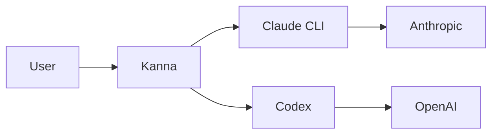

# Kanna Wiki Implementation Plan

> **For agentic workers:** REQUIRED SUB-SKILL: Use superpowers:subagent-driven-development (recommended) or superpowers:executing-plans to implement this plan task-by-task. Steps use checkbox (`- [ ]`) syntax for tracking.

**Goal:** Ship a public Kanna documentation site at `https://kanna-wiki.lowbit.link` covering features, usage, and contributing/ops guidelines for new users, power users, and contributors.

**Architecture:** Astro Starlight site lives under `wiki/` with its own `package.json` (isolated from main repo). Built and deployed via GitHub Actions using `actions/deploy-pages@v4`. Visual theme mirrors Kanna's `src/index.css` tokens (oklch palette, custom "Body" font, Roboto Mono code font). Screenshots captured one-shot locally from a seeded demo Kanna under a tmpdir `KANNA_HOME` using `agent-browser` (Playwright). PNGs committed.

**Tech Stack:** Astro 4 + Starlight, Pagefind (built-in search), Bun (package manager), TypeScript for scripts, agent-browser (Playwright wrapper) for screenshots, GitHub Pages + custom domain.

**Reference spec:** `docs/superpowers/specs/2026-05-20-kanna-wiki-design.md`

**Worktree:** `feat/kanna-wiki` branch at `.claude/worktrees/kanna-wiki/`. All paths below are relative to that worktree root.

---

## Task 1: Scaffold Astro Starlight workspace

**Files:**
- Create: `wiki/package.json`
- Create: `wiki/astro.config.mjs`
- Create: `wiki/tsconfig.json`
- Create: `wiki/.gitignore`
- Create: `wiki/src/content/docs/index.mdx` (placeholder)
- Create: `wiki/public/CNAME`

- [ ] **Step 1: Create `wiki/package.json`**

```json
{
  "name": "kanna-wiki",
  "version": "0.0.1",
  "private": true,
  "type": "module",
  "scripts": {
    "dev": "astro dev",
    "build": "astro build",
    "preview": "astro preview",
    "astro": "astro",
    "capture": "bun run scripts/capture-all.sh"
  },
  "dependencies": {
    "@astrojs/starlight": "^0.30.0",
    "astro": "^5.0.0",
    "sharp": "^0.33.0"
  },
  "devDependencies": {
    "typescript": "^5.5.0"
  }
}
```

- [ ] **Step 2: Create `wiki/astro.config.mjs`**

```js
import { defineConfig } from 'astro/config'
import starlight from '@astrojs/starlight'

export default defineConfig({
  site: 'https://kanna-wiki.lowbit.link',
  base: '/',
  integrations: [
    starlight({
      title: 'Kanna',
      description: 'A beautiful web UI for the Claude Code & Codex CLIs',
      logo: {
        src: './src/assets/logo.svg',
        replacesTitle: false,
      },
      customCss: ['./src/styles/kanna-theme.css'],
      social: [
        { icon: 'github', label: 'GitHub', href: 'https://github.com/cuongtranba/kanna' },
        { icon: 'npm', label: 'npm', href: 'https://www.npmjs.com/package/@cuongtran001/kanna' },
      ],
      sidebar: [
        {
          label: 'Getting Started',
          items: [
            { label: 'Install', slug: 'getting-started/install' },
            { label: 'First Chat', slug: 'getting-started/first-chat' },
            { label: 'OAuth Pool Setup', slug: 'getting-started/oauth-pool-setup' },
          ],
        },
        {
          label: 'Features',
          items: [
            { label: 'Providers & Models', slug: 'features/providers-models' },
            { label: 'Chat & Transcript', slug: 'features/chat-transcript' },
            { label: 'Projects & Sessions', slug: 'features/projects-sessions' },
            { label: 'Advanced', slug: 'features/advanced' },
            { label: 'Security & Sandboxing', slug: 'features/security-sandboxing' },
          ],
        },
        {
          label: 'Guides',
          items: [
            { label: 'User Guide', autogenerate: { directory: 'guides/user' } },
            { label: 'Contributing', autogenerate: { directory: 'guides/contributing' } },
            { label: 'Ops & Self-Host', autogenerate: { directory: 'guides/ops' } },
          ],
        },
        {
          label: 'Reference',
          items: [
            { label: 'Env Vars', slug: 'reference/env-vars' },
            { label: 'Keybindings', slug: 'reference/keybindings' },
          ],
        },
        {
          label: 'Changelog',
          slug: 'changelog',
        },
      ],
    }),
  ],
})
```

- [ ] **Step 3: Create `wiki/tsconfig.json`**

```json
{
  "extends": "astro/tsconfigs/strict",
  "include": ["**/*.ts", "**/*.tsx", "**/*.astro", "scripts/**/*.ts"]
}
```

- [ ] **Step 4: Create `wiki/.gitignore`**

```
dist/
node_modules/
.astro/
.DS_Store
```

- [ ] **Step 5: Create `wiki/public/CNAME`**

```
kanna-wiki.lowbit.link
```

- [ ] **Step 6: Create placeholder `wiki/src/content/docs/index.mdx`**

```mdx
---
title: Kanna
description: A beautiful web UI for the Claude Code & Codex CLIs
template: splash
hero:
  tagline: Documentation site coming online.
---
```

- [ ] **Step 7: Install deps and build**

Run: `cd wiki && bun install && bun run build`
Expected: builds to `wiki/dist/index.html` with no errors. `wiki/dist/CNAME` exists with `kanna-wiki.lowbit.link` content.

- [ ] **Step 8: Commit**

```bash
git add wiki/package.json wiki/astro.config.mjs wiki/tsconfig.json wiki/.gitignore wiki/public/CNAME wiki/src/content/docs/index.mdx
git commit -m "feat(wiki): scaffold Astro Starlight site"
```

---

## Task 2: Apply Kanna theme tokens

**Files:**
- Create: `wiki/src/styles/kanna-theme.css`
- Create: `wiki/src/assets/logo.svg`

Kanna's `src/index.css` exposes oklch tokens with light + dark variants. Logo color is `oklch(71.2% 0.194 13.428)` (pink, ~`#f472b6`). Body font "Body" loaded from woff2. Code font Roboto Mono.

Starlight CSS variable names live under `--sl-color-*` (see Starlight CSS docs). Map Kanna's tokens onto Starlight's.

- [ ] **Step 1: Copy Kanna icon as SVG (or convert from PNG)**

If `assets/icon.svg` exists in main repo, copy. Otherwise use existing PNG at `assets/icon.png` re-saved as `wiki/src/assets/logo.svg` (wrap in `<svg><image href=...>` or convert with `magick`).

Run from worktree root: `cp ../../../assets/icon.png wiki/src/assets/logo.png` then convert to SVG, or write inline SVG fallback below.

Inline fallback `wiki/src/assets/logo.svg`:

```xml
<svg xmlns="http://www.w3.org/2000/svg" viewBox="0 0 100 100" width="100" height="100">
  <circle cx="50" cy="50" r="42" fill="oklch(71.2% 0.194 13.428)" />
  <text x="50" y="62" text-anchor="middle" font-family="Bricolage Grotesque, sans-serif" font-weight="800" font-size="44" fill="white">K</text>
</svg>
```

- [ ] **Step 2: Create `wiki/src/styles/kanna-theme.css`**

```css
/* Kanna theme — mirrors src/index.css tokens for visual parity with the app. */

:root {
  /* Light mode — Kanna :root tokens */
  --sl-color-white: oklch(99.5% 0.003 13);
  --sl-color-gray-1: oklch(96% 0.005 13);
  --sl-color-gray-2: oklch(91% 0.008 13);
  --sl-color-gray-3: oklch(82% 0.008 13);
  --sl-color-gray-4: oklch(70% 0.012 13);
  --sl-color-gray-5: oklch(55% 0.013 13);
  --sl-color-gray-6: oklch(26% 0.01 13);
  --sl-color-black: oklch(16% 0.01 13);

  --sl-color-accent: oklch(71.2% 0.194 13.428);
  --sl-color-accent-high: oklch(56% 0.18 13);
  --sl-color-accent-low: oklch(96% 0.005 13);

  --sl-color-text: oklch(16% 0.01 13);
  --sl-color-text-accent: oklch(56% 0.18 13);
  --sl-color-bg: oklch(99.5% 0.003 13);
  --sl-color-bg-nav: oklch(99.5% 0.003 13);
  --sl-color-bg-sidebar: oklch(99.5% 0.003 13);
  --sl-color-bg-inline-code: oklch(96% 0.005 13);
  --sl-color-hairline: oklch(91% 0.008 13);
  --sl-color-hairline-light: oklch(91% 0.008 13);

  --sl-font: "Body", ui-sans-serif, system-ui, -apple-system, "Segoe UI", Roboto,
    "Helvetica Neue", Arial, sans-serif;
  --sl-font-mono: "Roboto Mono", ui-monospace, SFMono-Regular, Menlo, monospace;

  --sl-radius-sm: 0.25rem;
  --sl-radius-md: 0.375rem;
  --sl-radius-lg: 0.5rem;
}

:root[data-theme='dark'] {
  /* Dark mode — Kanna .dark tokens */
  --sl-color-white: oklch(98% 0.003 13);
  --sl-color-gray-1: oklch(26% 0.01 13);
  --sl-color-gray-2: oklch(29% 0.008 13);
  --sl-color-gray-3: oklch(55% 0.01 13);
  --sl-color-gray-4: oklch(70% 0.012 13);
  --sl-color-gray-5: oklch(85% 0.008 13);
  --sl-color-gray-6: oklch(98% 0.003 13);
  --sl-color-black: oklch(20% 0.01 13);

  --sl-color-accent: oklch(71.2% 0.194 13.428);
  --sl-color-accent-high: oklch(80% 0.18 13);
  --sl-color-accent-low: oklch(26% 0.01 13);

  --sl-color-text: oklch(98% 0.003 13);
  --sl-color-text-accent: oklch(71.2% 0.194 13.428);
  --sl-color-bg: oklch(20% 0.01 13);
  --sl-color-bg-nav: oklch(20% 0.01 13);
  --sl-color-bg-sidebar: oklch(20% 0.01 13);
  --sl-color-bg-inline-code: oklch(26% 0.01 13);
  --sl-color-hairline: oklch(29% 0.008 13);
  --sl-color-hairline-light: oklch(29% 0.008 13);
}

/* Use "Body" font from main app if available, otherwise system fallback. */
@font-face {
  font-family: "Body";
  src: url("/fonts/body-regular.woff2") format("woff2");
  font-weight: 400;
  font-display: swap;
}
@font-face {
  font-family: "Body";
  src: url("/fonts/body-medium.woff2") format("woff2");
  font-weight: 500;
  font-display: swap;
}
@font-face {
  font-family: "Body";
  src: url("/fonts/body-semibold.woff2") format("woff2");
  font-weight: 600;
  font-display: swap;
}

/* Tabular numerics on reference tables */
.sl-markdown-content table tbody td:first-child code,
.sl-markdown-content table tbody td:nth-child(2) {
  font-variant-numeric: tabular-nums;
}

/* Hero accent treatment */
.hero h1 {
  background: linear-gradient(135deg, var(--sl-color-text) 0%, var(--sl-color-accent) 100%);
  background-clip: text;
  -webkit-background-clip: text;
  color: transparent;
}
```

- [ ] **Step 3: Copy main app fonts into `wiki/public/fonts/`**

```bash
mkdir -p wiki/public/fonts
cp public/fonts/body-regular.woff2 wiki/public/fonts/ 2>/dev/null || true
cp public/fonts/body-regular-italic.woff2 wiki/public/fonts/ 2>/dev/null || true
cp public/fonts/body-medium.woff2 wiki/public/fonts/ 2>/dev/null || true
cp public/fonts/body-semibold.woff2 wiki/public/fonts/ 2>/dev/null || true
ls wiki/public/fonts/
```

Expected: four `body-*.woff2` files. If main repo has no fonts there, the `@font-face` URLs 404 gracefully and fall back to system sans-serif (acceptable for v1).

- [ ] **Step 4: Build to verify theme loads**

Run: `cd wiki && bun run build`
Expected: build succeeds. Open `wiki/dist/index.html` in a browser → site renders with pink accent.

- [ ] **Step 5: Commit**

```bash
git add wiki/src/styles/kanna-theme.css wiki/src/assets/logo.svg wiki/public/fonts/
git commit -m "feat(wiki): apply Kanna theme tokens (oklch + Body font)"
```

---

## Task 3: Create reusable Astro components

**Files:**
- Create: `wiki/src/components/PathCard.astro`
- Create: `wiki/src/components/FeatureGrid.astro`
- Create: `wiki/src/components/EnvVarTable.astro`
- Create: `wiki/src/components/Screenshot.astro`

- [ ] **Step 1: Create `wiki/src/components/PathCard.astro`**

```astro
---
interface Props {
  title: string
  description: string
  href: string
  icon?: string
}
const { title, description, href, icon } = Astro.props
---

<a href={href} class="path-card">
  {icon && <span class="path-card-icon">{icon}</span>}
  <div class="path-card-body">
    <h3>{title}</h3>
    <p>{description}</p>
  </div>
  <span class="path-card-arrow">→</span>
</a>

<style>
  .path-card {
    display: flex;
    align-items: center;
    gap: 1rem;
    padding: 1.25rem 1.5rem;
    border: 1px solid var(--sl-color-hairline);
    border-radius: var(--sl-radius-lg);
    background: var(--sl-color-bg);
    color: var(--sl-color-text);
    text-decoration: none;
    transition: border-color 200ms ease, transform 200ms ease;
  }
  .path-card:hover {
    border-color: var(--sl-color-accent);
    transform: translateY(-2px);
  }
  .path-card-icon {
    font-size: 2rem;
    line-height: 1;
  }
  .path-card-body {
    flex: 1;
  }
  .path-card h3 {
    margin: 0 0 0.25rem;
    font-size: 1.1rem;
    font-weight: 600;
  }
  .path-card p {
    margin: 0;
    color: var(--sl-color-gray-4);
    font-size: 0.95rem;
  }
  .path-card-arrow {
    color: var(--sl-color-accent);
    font-size: 1.25rem;
  }
</style>
```

- [ ] **Step 2: Create `wiki/src/components/FeatureGrid.astro`**

```astro
---
// Slot-based grid. Children are PathCard or similar items.
---

<div class="feature-grid">
  <slot />
</div>

<style>
  .feature-grid {
    display: grid;
    grid-template-columns: repeat(auto-fit, minmax(280px, 1fr));
    gap: 1rem;
    margin: 1.5rem 0;
  }
</style>
```

- [ ] **Step 3: Create `wiki/src/components/Screenshot.astro`**

```astro
---
interface Props {
  light: string
  dark: string
  alt: string
  width?: number
}
const { light, dark, alt, width = 1200 } = Astro.props
---

<picture class="screenshot">
  <source media="(prefers-color-scheme: dark)" srcset={dark} />
  
</picture>

<style>
  .screenshot {
    display: block;
    margin: 1.5rem 0;
    border: 1px solid var(--sl-color-hairline);
    border-radius: var(--sl-radius-lg);
    overflow: hidden;
  }
  .screenshot img {
    display: block;
    width: 100%;
    height: auto;
  }
</style>
```

- [ ] **Step 4: Create `wiki/src/components/EnvVarTable.astro`**

```astro
---
interface EnvVar {
  name: string
  default: string
  description: string
}
interface Props {
  vars: EnvVar[]
}
const { vars } = Astro.props
---

<table class="env-var-table">
  <thead>
    <tr><th>Variable</th><th>Default</th><th>Description</th></tr>
  </thead>
  <tbody>
    {vars.map(v => (
      <tr>
        <td><code>{v.name}</code></td>
        <td><code>{v.default}</code></td>
        <td>{v.description}</td>
      </tr>
    ))}
  </tbody>
</table>

<style>
  .env-var-table {
    width: 100%;
    border-collapse: collapse;
    margin: 1rem 0;
    font-size: 0.9rem;
  }
  .env-var-table th,
  .env-var-table td {
    text-align: left;
    padding: 0.5rem 0.75rem;
    border-bottom: 1px solid var(--sl-color-hairline);
    vertical-align: top;
  }
  .env-var-table code {
    font-variant-numeric: tabular-nums;
  }
</style>
```

- [ ] **Step 5: Build to verify component imports resolve**

Run: `cd wiki && bun run build`
Expected: build succeeds.

- [ ] **Step 6: Commit**

```bash
git add wiki/src/components/
git commit -m "feat(wiki): add PathCard, FeatureGrid, Screenshot, EnvVarTable components"
```

---

## Task 4: Landing page with audience path cards

**Files:**
- Modify: `wiki/src/content/docs/index.mdx`

- [ ] **Step 1: Replace `wiki/src/content/docs/index.mdx` with full landing**

```mdx
---
title: Kanna
description: A beautiful web UI for the Claude Code & Codex CLIs
template: splash
hero:
  tagline: A beautiful web UI for the Claude Code & Codex CLIs. OAuth-pool subscription billing, durable approvals, subagent orchestration, and more.
  image:
    file: ../../assets/logo.svg
  actions:
    - text: Install
      link: /getting-started/install/
      icon: right-arrow
      variant: primary
    - text: View on GitHub
      link: https://github.com/cuongtranba/kanna
      icon: external
      variant: minimal
---

import PathCard from '../../components/PathCard.astro'
import FeatureGrid from '../../components/FeatureGrid.astro'

## Pick your path

<FeatureGrid>
  <PathCard
    title="New User"
    description="Install Kanna and send your first chat in under five minutes."
    href="/getting-started/install/"
    icon="🚀"
  />
  <PathCard
    title="Power User"
    description="PTY subscription billing, OAuth pool rotation, subagent orchestration, plan mode."
    href="/features/providers-models/"
    icon="⚡"
  />
  <PathCard
    title="Contributor"
    description="Architecture (C3), PR rules, lint cap ratchet, test discipline, dev workflow."
    href="/guides/contributing/overview/"
    icon="🛠"
  />
</FeatureGrid>

## What is Kanna

Kanna is a community fork of [jakemor/kanna](https://github.com/jakemor/kanna) that tracks upstream
and layers on features for heavier day-to-day use, multi-account billing, and self-hosting.

- **Subscription-billing PTY driver** — runs the `claude` CLI under a pseudo-terminal so Pro/Max plans are charged instead of API rates
- **OAuth token pool** — multiple Claude OAuth tokens with automatic rotation and fallover
- **Multi-provider chat** — Claude + Codex (OpenAI) with per-provider model controls
- **Subagent orchestration** — first-class subagents, `@agent/` mentions, parallel runs, MCP `delegate_subagent`
- **Durable tool-approval protocol** — pending approvals survive server restart
- **In-app self-update** — one-click pull/rebuild/reload
```

- [ ] **Step 2: Build + visually inspect**

Run: `cd wiki && bun run dev` (background). Open `http://localhost:4321` in a browser. Verify hero, three path cards, feature list render.

Stop dev server.

- [ ] **Step 3: Commit**

```bash
git add wiki/src/content/docs/index.mdx
git commit -m "feat(wiki): landing page with audience path cards"
```

---

## Task 5: Getting Started pages

**Files:**
- Create: `wiki/src/content/docs/getting-started/install.md`
- Create: `wiki/src/content/docs/getting-started/first-chat.md`
- Create: `wiki/src/content/docs/getting-started/oauth-pool-setup.md`

- [ ] **Step 1: Create `wiki/src/content/docs/getting-started/install.md`**

```md
---
title: Install
description: Install Kanna globally with Bun.
---

Kanna ships as a global Bun CLI: `@cuongtran001/kanna`.

## Requirements

- macOS or Linux (Windows not supported)
- [Bun](https://bun.sh) — install with `curl -fsSL https://bun.sh/install | bash`
- A Claude OAuth token (for Pro/Max subscription billing) OR an Anthropic API key

## Install

```bash
bun install -g @cuongtran001/kanna
```

## Run

From any project directory:

```bash
kanna
```

Kanna opens in your browser at [`localhost:3210`](http://localhost:3210).

## Update

```bash
bun install -g @cuongtran001/kanna@latest
```

Or use the in-app self-update button — see [Advanced → Self-update](/features/advanced/#self-update).

## Uninstall

```bash
bun pm uninstall -g @cuongtran001/kanna
```
```

- [ ] **Step 2: Create `wiki/src/content/docs/getting-started/first-chat.md`**

```md
---
title: First chat
description: Send your first turn in Kanna.
---

import Screenshot from '../../../components/Screenshot.astro'

After [installing](/getting-started/install/) Kanna, run `kanna` from any project directory. The web UI opens at `http://localhost:3210`.

## Create a project

Kanna auto-discovers projects from your Claude and Codex local history. Your current working directory is added as a new project on first launch.

<Screenshot
  light="/screenshots/light/sidebar-projects.png"
  dark="/screenshots/dark/sidebar-projects.png"
  alt="Sidebar with project groups"
/>

## Start a chat

Click **New Chat** under your project. The composer accepts plain text, slash commands (`/`), and file/subagent mentions (`@`).

<Screenshot
  light="/screenshots/light/composer.png"
  dark="/screenshots/dark/composer.png"
  alt="Composer with slash command picker"
/>

## Send a turn

Type a prompt and press Enter. The agent runs in the background; tool calls render inline in the transcript.

<Screenshot
  light="/screenshots/light/transcript-tool-call.png"
  dark="/screenshots/dark/transcript-tool-call.png"
  alt="Expanded tool call group in transcript"
/>

Next: [set up the OAuth pool](/getting-started/oauth-pool-setup/) for subscription billing.
```

- [ ] **Step 3: Create `wiki/src/content/docs/getting-started/oauth-pool-setup.md`**

```md
---
title: OAuth Pool Setup
description: Add Claude OAuth tokens for subscription billing.
---

import Screenshot from '../../../components/Screenshot.astro'

Kanna's OAuth pool lets you register one or more Claude OAuth tokens. Kanna rotates across them per chat and falls over on rate limits.

## Why OAuth pool

- **Subscription billing** — Pro/Max plans charged instead of API rates (via PTY driver)
- **Rate-limit fallover** — automatic switch to a different token when one hits limits
- **Per-token labels** — tag tokens (e.g., `personal`, `work-1`, `work-2`)

## Add a token

1. Open **Settings → OAuth Pool**
2. Click **Add Token**
3. Paste a Claude OAuth token (from `claude /login` on a machine where the CLI is interactive)
4. Give it a label
5. Save

<Screenshot
  light="/screenshots/light/oauth-pool.png"
  dark="/screenshots/dark/oauth-pool.png"
  alt="OAuth pool admin modal"
/>

## Enable PTY driver

To actually use subscription billing, set `KANNA_CLAUDE_DRIVER=pty` in your shell before running Kanna:

```bash
export KANNA_CLAUDE_DRIVER=pty
kanna
```

PTY mode is OAuth-only — `ANTHROPIC_API_KEY` is stripped from the spawned child env regardless of what's in your shell.

See [Features → Security & Sandboxing](/features/security-sandboxing/) for the sandbox profile applied to PTY spawns.
```

- [ ] **Step 4: Build**

Run: `cd wiki && bun run build`
Expected: build succeeds; three pages under `wiki/dist/getting-started/`.

- [ ] **Step 5: Commit**

```bash
git add wiki/src/content/docs/getting-started/
git commit -m "feat(wiki): getting started pages (install, first-chat, oauth-pool-setup)"
```

---

## Task 6: Features — Providers & Models

**Files:**
- Create: `wiki/src/content/docs/features/providers-models.md`

- [ ] **Step 1: Create the page**

```md
---
title: Providers & Models
description: Multi-provider chat, OAuth pool, PTY driver, fast mode.
---

import Screenshot from '../../../components/Screenshot.astro'

Kanna supports two providers — Claude and Codex (OpenAI) — switchable per-chat from the composer.

## Provider switcher

The composer's provider button lets you pick between Claude and Codex. Each provider exposes its own model list and reasoning controls.

<Screenshot
  light="/screenshots/light/provider-switch.png"
  dark="/screenshots/dark/provider-switch.png"
  alt="Composer provider/model picker"
/>

## Claude

- **OAuth Pool** — register multiple OAuth tokens; Kanna rotates per chat. See [OAuth Pool Setup](/getting-started/oauth-pool-setup/).
- **PTY Driver** — `KANNA_CLAUDE_DRIVER=pty` runs `claude` CLI under a pseudo-terminal for subscription billing.
- **Models** — Opus 4.7, Sonnet 4.6, Haiku 4.5, plus `[1m]` 1M-context variants.

## Codex

- **API key auth** — `OPENAI_API_KEY` in environment
- **Reasoning effort control** — low / medium / high / fast-mode toggle per chat
- **Models** — `gpt-5` family with reasoning toggles

## Switching mid-chat

Provider/model can change mid-chat. The new turn uses the picked provider; previous turns remain unchanged.

## Subscription billing vs API rates

| Driver mode | Billing | Auth | Models |
|---|---|---|---|
| SDK (default) | API rates | OAuth pool or API key | All Claude models |
| PTY (`KANNA_CLAUDE_DRIVER=pty`) | Pro/Max subscription | OAuth pool only | All Claude models |

PTY mode requires macOS or Linux. See [Security & Sandboxing](/features/security-sandboxing/) for the sandbox + allowlist preflight applied.
```

- [ ] **Step 2: Commit**

```bash
git add wiki/src/content/docs/features/providers-models.md
git commit -m "feat(wiki): providers and models page"
```

---

## Task 7: Features — Chat & Transcript

**Files:**
- Create: `wiki/src/content/docs/features/chat-transcript.md`

- [ ] **Step 1: Create the page**

```md
---
title: Chat & Transcript
description: Rendering, diffs, terminal, uploads, slash commands, plan mode, subagents, background tasks, auto-continue, compaction.
---

import Screenshot from '../../../components/Screenshot.astro'

## Rich transcript rendering

Tool calls render hydrated with collapsible groups. File diffs render inline. Plan-mode dialogs and interactive prompts get first-class UI with full result display.

<Screenshot
  light="/screenshots/light/transcript-tool-call.png"
  dark="/screenshots/dark/transcript-tool-call.png"
  alt="Expanded tool call group"
/>

## Inline diff viewer

File diffs and commit diffs render directly in the transcript — no need to switch contexts.

<Screenshot
  light="/screenshots/light/transcript-diff.png"
  dark="/screenshots/dark/transcript-diff.png"
  alt="Inline diff viewer"
/>

## Embedded terminal

Per-project xterm terminal in a resizable side panel. macOS and Linux only.

<Screenshot
  light="/screenshots/light/terminal-panel.png"
  dark="/screenshots/dark/terminal-panel.png"
  alt="Embedded xterm terminal panel"
/>

## Slash commands & @-mentions

The composer offers in-place pickers for slash commands, file mentions, and subagent mentions.

<Screenshot
  light="/screenshots/light/composer-mention.png"
  dark="/screenshots/dark/composer-mention.png"
  alt="@-mention picker open in composer"
/>

## Plan mode

The agent proposes a plan, and Kanna shows a structured approval dialog before any tool runs. Routes through Kanna's durable approval protocol — see [Security & Sandboxing](/features/security-sandboxing/).

<Screenshot
  light="/screenshots/light/plan-mode.png"
  dark="/screenshots/dark/plan-mode.png"
  alt="Plan-mode approval dialog"
/>

## Subagent orchestration

`@agent/<name>` is a hint to the main agent. The main agent decides whether to delegate via `mcp__kanna__delegate_subagent`. Runs are tracked live.

<Screenshot
  light="/screenshots/light/subagent-run.png"
  dark="/screenshots/dark/subagent-run.png"
  alt="Live subagent activity label"
/>

See [Subagent Delegation](/guides/user/subagents/) for the full pattern.

## Background tasks

Long-running tasks are tracked out-of-band with a status indicator. Pending tool requests survive server restart and replay on reconnect (when `KANNA_MCP_TOOL_CALLBACKS=1`).

## Auto-continue

Optionally continue a turn automatically when the agent stops short. Toggleable per-chat.

## Proactive compaction

A context-window meter shows usage near the threshold. Kanna runs automatic transcript compaction before limits are hit.

<Screenshot
  light="/screenshots/light/compaction-meter.png"
  dark="/screenshots/dark/compaction-meter.png"
  alt="Context-window meter near threshold"
/>

## File & image uploads

Drag and drop files or images into the composer to attach them to the next turn.
```

- [ ] **Step 2: Commit**

```bash
git add wiki/src/content/docs/features/chat-transcript.md
git commit -m "feat(wiki): chat & transcript feature page"
```

---

## Task 8: Features — Projects & Sessions

**Files:**
- Create: `wiki/src/content/docs/features/projects-sessions.md`

- [ ] **Step 1: Create the page**

```md
---
title: Projects & Sessions
description: Sidebar, project ordering, discovery, bulk import, worktrees, resumption, auto-titles.
---

import Screenshot from '../../../components/Screenshot.astro'

## Project-first sidebar

Chats are grouped under projects with live status indicators (idle, running, waiting, failed).

<Screenshot
  light="/screenshots/light/sidebar-projects.png"
  dark="/screenshots/dark/sidebar-projects.png"
  alt="Sidebar with project groups and status indicators"
/>

## Drag-and-drop ordering

Reorder project groups in the sidebar — order persists across restarts.

## Local discovery

Kanna auto-discovers projects from both Claude (`~/.claude/projects/`) and Codex local history. New projects appear in the sidebar without manual import.

## Bulk import Claude Code sessions

One-click import of existing `~/.claude/projects/` sessions with full transcript. Seamless resume via the Claude Agent SDK.

<Screenshot
  light="/screenshots/light/bulk-import.png"
  dark="/screenshots/dark/bulk-import.png"
  alt="Claude session bulk import modal"
/>

## Git worktree isolation

Run a chat in an isolated worktree without disturbing your working tree. Right-click a chat → **Run in worktree** → Kanna creates a worktree at `.claude/worktrees/<chat-id>/` and runs the chat from there.

## Session resumption

Resume agent sessions with full context preservation. Pick up where you left off — the agent re-loads the JSONL transcript and continues.

## Auto-generated titles

Chat titles generated in the background via Claude Haiku 4.5 after the first turn completes.

## Star projects

Star projects to pin them to the top of the sidebar. See [User Guide → Project Management](/guides/user/projects/).
```

- [ ] **Step 2: Commit**

```bash
git add wiki/src/content/docs/features/projects-sessions.md
git commit -m "feat(wiki): projects & sessions feature page"
```

---

## Task 9: Features — Advanced

**Files:**
- Create: `wiki/src/content/docs/features/advanced.md`

- [ ] **Step 1: Create the page**

```md
---
title: Advanced
description: Self-update, expose_port, mermaid rendering, transcript export, keybindings, password gate, PWA.
---

import Screenshot from '../../../components/Screenshot.astro'

## Self-update

One-click pull/rebuild/reload from the UI. Works under pm2, systemd, docker, or plain shell via a host-agnostic supervisor. Install any prior release straight from the changelog UI.

<Screenshot
  light="/screenshots/light/self-update.png"
  dark="/screenshots/dark/self-update.png"
  alt="In-app self-update UI"
/>

## Expose port (Cloudflare tunnel)

The agent can call `mcp__kanna__expose_port` to surface a localhost port via a Cloudflare quick tunnel. Always-ask or auto-expose modes, configurable per-project.

<Screenshot
  light="/screenshots/light/expose-port-prompt.png"
  dark="/screenshots/dark/expose-port-prompt.png"
  alt="Expose-port approval dialog"
/>

## Mermaid rendering

Mermaid diagrams in agent output render inline in the transcript.



## Standalone HTML transcript export

Export any chat to a self-contained HTML file. Inline CSS + screenshots, no external dependencies, sharable.

## Customizable keybindings

See [Reference → Keybindings](/reference/keybindings/) for the full default map and customization syntax.

## Password gate

Protect the HTTP/WS/API surface with a password. Set `KANNA_PASSWORD=<secret>` and Kanna prompts on every browser session.

## PWA / mobile layout

Kanna is installable as a PWA. Mobile layout adapts to small viewports with a slide-in sidebar and touch-tuned composer.
```

- [ ] **Step 2: Commit**

```bash
git add wiki/src/content/docs/features/advanced.md
git commit -m "feat(wiki): advanced feature page"
```

---

## Task 10: Features — Security & Sandboxing

**Files:**
- Create: `wiki/src/content/docs/features/security-sandboxing.md`

- [ ] **Step 1: Create the page**

```md
---
title: Security & Sandboxing
description: OS sandbox, allowlist preflight, durable approvals, OAuth-only PTY, password gate.
---

## OS sandbox (PTY mode)

Every `KANNA_CLAUDE_DRIVER=pty` spawn is wrapped with an OS-level sandbox.

- **macOS:** `/usr/bin/sandbox-exec -f <profile.sb>`. Profile generated per spawn from `POLICY_DEFAULT.readPathDeny` + `writePathDeny`. Default **on**.
- **Linux:** `/usr/bin/bwrap` with `--tmpfs <path>` per deny entry. Default **on when `bwrap` is installed** (`apt install bubblewrap` / `pacman -S bubblewrap` / `dnf install bubblewrap`). Silently disables if absent — set `KANNA_PTY_SANDBOX=off` to suppress the gap.
- **Windows:** PTY refused per spec.

To opt out: `KANNA_PTY_SANDBOX=off`. Loses defense-in-depth against built-in tool credential reads.

## Allowlist preflight

When `KANNA_CLAUDE_DRIVER=pty`, every spawn passes through the preflight gate (`claude-pty/preflight/gate.ts`). The gate runs 8 directed probes against the disallowed built-ins (Bash, Edit, Write, Read, Glob, Grep, WebFetch, WebSearch). If any built-in is reachable, the spawn is refused.

Cache TTL: 24 hours, keyed on `(binarySha256, tools-string, model)`. Override the probe model via `KANNA_PTY_PREFLIGHT_MODEL` (default `claude-haiku-4-5-20251001`).

## Durable approval protocol

Setting `KANNA_MCP_TOOL_CALLBACKS=1` routes `AskUserQuestion` and `ExitPlanMode` through Kanna's durable approval protocol. Pending requests survive server restart (resolved as `session_closed` fail-closed on boot) and replay to the client on reconnect.

Under PTY mode the `ask_user_question` / `exit_plan_mode` shims are always registered regardless of this flag — PTY has no `canUseTool` hook so the durable protocol is the only host path.

Optional `KANNA_SERVER_SECRET` env var stabilises HMAC tool-request ids across the process lifetime.

## OAuth-only PTY

PTY mode is OAuth-only and NEVER uses an API key. `buildPtyEnv` unconditionally strips `ANTHROPIC_API_KEY` from the spawned child env — a key left in the parent environment is harmless. It cannot block the spawn and cannot force API billing.

## Password gate

`KANNA_PASSWORD=<secret>` enables an HTTP/WS/API password gate. Every browser session prompts on first connect; the password is stored in `sessionStorage` and replayed via WebSocket handshake and HTTP headers.

## What Kanna does NOT do

- No telemetry to external services
- No remote control surface beyond Cloudflare tunnel (which you explicitly approve per `expose_port` call)
- No persistent storage of OAuth tokens outside your `KANNA_HOME` directory
```

- [ ] **Step 2: Commit**

```bash
git add wiki/src/content/docs/features/security-sandboxing.md
git commit -m "feat(wiki): security & sandboxing feature page"
```

---

## Task 11: Guides — User

**Files:**
- Create: `wiki/src/content/docs/guides/user/overview.md`
- Create: `wiki/src/content/docs/guides/user/workflows.md`
- Create: `wiki/src/content/docs/guides/user/subagents.md`
- Create: `wiki/src/content/docs/guides/user/troubleshooting.md`
- Create: `wiki/src/content/docs/guides/user/faq.md`

- [ ] **Step 1: Create overview**

`wiki/src/content/docs/guides/user/overview.md`:

```md
---
title: User Guide Overview
description: How to use Kanna day-to-day.
---

The User Guide covers common workflows, subagent patterns, troubleshooting, and FAQ.

- [Workflows](/guides/user/workflows/) — common patterns for daily use
- [Subagents](/guides/user/subagents/) — when and how to delegate
- [Troubleshooting](/guides/user/troubleshooting/) — when things go wrong
- [FAQ](/guides/user/faq/) — quick answers

For installation and first chat see [Getting Started](/getting-started/install/).
```

- [ ] **Step 2: Create workflows**

`wiki/src/content/docs/guides/user/workflows.md`:

```md
---
title: Common Workflows
description: Patterns for daily Kanna use.
---

## Working in a worktree

When making non-trivial changes, run the chat in an isolated worktree:

1. Right-click the chat → **Run in worktree**
2. Kanna creates a worktree at `.claude/worktrees/<chat-id>/` from the current branch
3. The agent's `cwd` is the worktree, leaving your main tree untouched
4. Merge or discard via the worktree controls

## Plan-then-execute

For risky changes, use plan mode:

1. Type your prompt and toggle **Plan mode** in the composer
2. The agent proposes a plan, then asks for approval
3. Review and approve / edit / cancel before any tool runs

## Provider switching mid-chat

If Claude rate-limits or you want a second opinion, switch to Codex from the composer's provider button. Previous turns stay unchanged; the new turn runs against the picked provider.

## Bulk import from Claude CLI history

Settings → **Import sessions** lets you pull existing `~/.claude/projects/` sessions into Kanna with full transcript. Sessions resume seamlessly via the Claude Agent SDK.

## Drag-and-drop files into composer

Drop files (text or images) into the composer to attach them to the next turn. The agent receives them as `read_file` results or image content.
```

- [ ] **Step 3: Create subagents**

`wiki/src/content/docs/guides/user/subagents.md`:

```md
---
title: Subagents
description: When and how to delegate to subagents.
---

## What is a subagent

A subagent is a named, prompt-shaped specialist (`description`, `systemPrompt`) that the main agent can delegate to via `mcp__kanna__delegate_subagent`. Kanna ships first-class CRUD, mentions, parallel runs, and live progress.

## When the main agent delegates

`@agent/<name>` in chat input is a **hint**, not server-side routing. The main model decides whether to delegate. It calls the MCP tool with `{ subagent_id, prompt }` and the tool blocks until the run completes.

## Subagent UI

- **Sidebar panel:** lists all configured subagents with their description
- **Live activity label:** shows what each running subagent is currently doing (MCP progress notifications)
- **Parallel runs:** multiple subagent runs can be in-flight in the same turn

## Creating a subagent

1. Settings → **Subagents** → **Add**
2. Fill in `name`, `description` (this is what the main agent reads to decide when to delegate), and `systemPrompt`
3. Save

## Cycle detection

`LOOP_DETECTED` is returned when a subagent tries to delegate to itself or to an ancestor in the chain. `DEPTH_EXCEEDED` when `depth > maxChainDepth` (default 1).
```

- [ ] **Step 4: Create troubleshooting**

`wiki/src/content/docs/guides/user/troubleshooting.md`:

```md
---
title: Troubleshooting
description: When things go wrong.
---

## Claude returns "Answer questions?" or appears to cancel

This is the CLI auto-rejecting the native `AskUserQuestion` / `ExitPlanMode` tools. Under PTY mode Kanna passes `--disallowedTools AskUserQuestion ExitPlanMode` and force-registers the MCP shims (`mcp__kanna__ask_user_question` / `mcp__kanna__exit_plan_mode`). If you're seeing this on SDK mode, set `KANNA_MCP_TOOL_CALLBACKS=1` and restart.

## PTY mode rejects the spawn with "built-in reachable: <names>"

The allowlist preflight detected that one of the disallowed built-ins is still reachable. This is a security gate — do not bypass. Update the `claude` CLI to the latest version and re-run; the cache invalidates on binary sha256 change.

## OAuth token rotated but the chat is stuck on the rate-limited one

`AgentCoordinator` picks a token per chat. If you hit a limit mid-chat, send a new turn to trigger re-pick from the pool. The rotation log is in the server stderr.

## "Maximum update depth exceeded" in the browser

This is React error #185 — usually a Zustand selector returning a fresh reference each call (e.g., inline `?? []`). File a bug with the chat URL.

## Self-update fails under pm2

The host-agnostic supervisor needs `pm2` in `$PATH`. Run `which pm2` from the same shell that started Kanna. If missing, see [Ops → Self-host](/guides/ops/self-host/).

## Mobile keyboard pushes content off-screen

Known iOS quirk. Kanna applies `font-size: 16px` to inputs to prevent zoom and `overscroll-behavior-y: contain` to prevent pull-to-refresh. If you still see issues, report with iOS version.
```

- [ ] **Step 5: Create FAQ**

`wiki/src/content/docs/guides/user/faq.md`:

```md
---
title: FAQ
description: Quick answers.
---

## Is Kanna free?

The Kanna software itself is free and open source. Underlying provider costs (Claude, Codex) depend on your account.

## Does Kanna upload my code anywhere?

No. The agent runs locally — `claude` or `codex` CLI subprocesses on your machine. Only the prompts and tool outputs you explicitly send go to the model.

## Does PTY mode actually save money vs the SDK?

If you have a Claude Pro/Max subscription, yes. PTY mode billing rolls into the subscription. SDK mode bills at API rates per-token.

## Can I use both Claude and Codex in the same chat?

Yes — switch providers mid-chat from the composer. Previous turns remain unchanged; the new turn uses the picked provider.

## Where is my data stored?

`$KANNA_HOME` (defaults to `~/.kanna/`). All chats, projects, OAuth tokens, and settings live there.

## Can I run Kanna headless?

Kanna is a web UI. The server runs headless; a browser is required for interaction. For automation, use the Claude/Codex CLIs directly.

## Windows support?

PTY mode is macOS/Linux only. SDK mode works on Windows via WSL but is not officially supported.
```

- [ ] **Step 6: Build and commit**

Run: `cd wiki && bun run build`
Expected: build succeeds; user guide section in sidebar autogenerated.

```bash
git add wiki/src/content/docs/guides/user/
git commit -m "feat(wiki): user guide (overview, workflows, subagents, troubleshooting, faq)"
```

---

## Task 12: Guides — Contributing

**Files:**
- Create: `wiki/src/content/docs/guides/contributing/overview.md`
- Create: `wiki/src/content/docs/guides/contributing/architecture.md`
- Create: `wiki/src/content/docs/guides/contributing/pull-requests.md`
- Create: `wiki/src/content/docs/guides/contributing/lint-and-tests.md`
- Create: `wiki/src/content/docs/guides/contributing/dev-workflow.md`

Source of truth for these is `CLAUDE.md` at the repo root. Lift content directly so docs stay in sync with the rules engineers see in their agent.

- [ ] **Step 1: Create overview**

`wiki/src/content/docs/guides/contributing/overview.md`:

```md
---
title: Contributing Overview
description: How to contribute to Kanna.
---

Kanna is a community fork. PRs are welcome — see the guides below for the rules of the road.

- [Architecture](/guides/contributing/architecture/) — C3 docs, component model
- [Pull Requests](/guides/contributing/pull-requests/) — where to open, how to target
- [Lint & Tests](/guides/contributing/lint-and-tests/) — CI gates
- [Dev Workflow](/guides/contributing/dev-workflow/) — local setup, worktrees, fast iteration

Source of truth for these rules lives in [`CLAUDE.md`](https://github.com/cuongtranba/kanna/blob/main/CLAUDE.md) — these pages mirror it but the file wins on conflict.
```

- [ ] **Step 2: Create architecture**

`wiki/src/content/docs/guides/contributing/architecture.md`:

```md
---
title: Architecture (C3)
description: How Kanna's component documentation works.
---

Kanna uses [C3](https://github.com/sourcegraph/sourcegraph/tree/main/dev/c3) component docs at `.c3/`.

## Before coding

Run `/c3 query <topic>` (or `c3x lookup <file>`) to load component context, refs, and rules. **Do not skip this** — even for small edits. Skipping leads to stale assumptions and wrong patches.

## After coding

If a change touches component boundaries, refs, public contracts, or rules, run `/c3 change` (or `/c3 sweep` for audit) to update `.c3/` docs in the same PR. Code-doc drift is a blocker.

## Operations

| Op | Purpose |
|---|---|
| `query` | Look up component context, refs, rules for a topic |
| `audit` | Check a component against its docs |
| `change` | Update docs after a code change |
| `ref` | Add or fix a ref between components |
| `sweep` | Bulk audit across all components |

## File lookup

`c3x lookup <file-or-glob>` maps files/directories to components + refs.

## Skill

`c3-skill:c3` auto-triggers on `/c3` or architecture phrases.
```

- [ ] **Step 3: Create pull-requests**

`wiki/src/content/docs/guides/contributing/pull-requests.md`:

```md
---
title: Pull Requests
description: Targeting, branching, conventions.
---

## Target the fork, not upstream

This is a fork. `origin` = `cuongtranba/kanna` (mine), `upstream` = `jakemor/kanna`.

**PRs MUST target `cuongtranba/kanna`, never `jakemor/kanna`.**

`gh repo set-default cuongtranba/kanna` is set by default. Always pass:

```bash
gh pr create --repo cuongtranba/kanna ...
# or
gh pr create --base main --head <branch> ...
```

to make the target explicit.

## Branch naming

- `feat/<topic>` — new features
- `fix/<topic>` — bug fixes
- `docs/<topic>` — docs-only changes
- `chore/<topic>` — refactors, cleanup

## Commit messages

Conventional Commits style. Short subject, body if non-obvious.

## CI gates

CI runs `bun run lint` then `bun test` on every push to `main` and every PR. Merges are blocked on either failure.
```

- [ ] **Step 4: Create lint-and-tests**

`wiki/src/content/docs/guides/contributing/lint-and-tests.md`:

```md
---
title: Lint & Tests
description: CI gates and the lint cap ratchet.
---

## Lint

`bun run lint` runs ESLint on `src/` with `--max-warnings=0`. CI runs it before tests; merges are blocked on lint errors AND on any warning count above the cap.

The cap is a **ratchet**: when warnings drop, lower the cap in the same PR so they cannot creep back up.

Plugin `react-hooks` (set 7+) enforces React 19 rules:

- Errors: `rules-of-hooks`, `purity`, `globals`
- Warnings: `set-state-in-effect`, `refs`, `immutability`, `preserve-manual-memoization`, `exhaustive-deps`

## Tests

`bun test` MUST pass locally before any push or PR. CI (`.github/workflows/test.yml`) runs `bun test` on every push to `main` and every PR; merges blocked on failure.

Run a single suite:

```bash
bun test src/server/<file>.test.ts
```

## Test subprocess discipline

When a test spawns `git` or other subprocesses:

- Set `stdin: "ignore"`
- Set `GIT_TERMINAL_PROMPT=0`
- Give an explicit timeout: `test(name, fn, 30_000)` — Bun's 5s default is too tight for CI

A hung credential prompt or interactive subprocess can otherwise exhaust the test timeout.

## Render-loop regression checks

When introducing a new `use*Store` selector or any React hook that derives collections, the selector MUST return a stable reference. Inline `?? []` or `?? {}` produces fresh refs each call and triggers React error #185.

Pattern:

```ts
const EMPTY: Subagent[] = []
useStore((state) => state.list ?? EMPTY)
// or
useStore(useShallow((state) => state.list ?? []))
```

Tests can mount a component with effects and assert no loop warnings via `renderForLoopCheck` in `src/client/lib/testing/`.
```

- [ ] **Step 5: Create dev-workflow**

`wiki/src/content/docs/guides/contributing/dev-workflow.md`:

```md
---
title: Dev Workflow
description: Local setup, worktrees, fast iteration.
---

## Setup

```bash
git clone https://github.com/cuongtranba/kanna
cd kanna
bun install
```

## Run dev server

```bash
bun run dev
```

Opens at `http://localhost:3210` with HMR.

## Worktrees

Long-running changes belong in a git worktree to isolate them from the main checkout:

```bash
git worktree add -b feat/<topic> .claude/worktrees/<topic> main
cd .claude/worktrees/<topic>
```

## Fast test iteration

```bash
bun test src/server/<file>.test.ts
```

The full `bun test` is fast (~30s on M1) but a single suite is faster for tight loops.

## C3 docs

Before changing component boundaries, run `/c3 query <topic>`. After, run `/c3 change` to keep docs in sync. See [Architecture](/guides/contributing/architecture/).
```

- [ ] **Step 6: Build and commit**

Run: `cd wiki && bun run build`
Expected: contributing section autogenerated in sidebar.

```bash
git add wiki/src/content/docs/guides/contributing/
git commit -m "feat(wiki): contributing guide (architecture, PRs, lint, tests, dev workflow)"
```

---

## Task 13: Guides — Ops & Self-Host

**Files:**
- Create: `wiki/src/content/docs/guides/ops/overview.md`
- Create: `wiki/src/content/docs/guides/ops/self-host.md`
- Create: `wiki/src/content/docs/guides/ops/pm2.md`
- Create: `wiki/src/content/docs/guides/ops/systemd.md`
- Create: `wiki/src/content/docs/guides/ops/docker.md`
- Create: `wiki/src/content/docs/guides/ops/oauth-pool-admin.md`
- Create: `wiki/src/content/docs/guides/ops/sandboxing.md`

- [ ] **Step 1: Create overview**

`wiki/src/content/docs/guides/ops/overview.md`:

```md
---
title: Ops Overview
description: Self-host Kanna under pm2, systemd, docker, or plain shell.
---

Kanna is a single Bun process listening on `:3210` (configurable via `KANNA_PORT`). Self-hosting choices:

- [Self-host basics](/guides/ops/self-host/) — env vars, persistence, ports
- [pm2](/guides/ops/pm2/) — recommended for VPS deployments
- [systemd](/guides/ops/systemd/) — long-running service on Linux
- [docker](/guides/ops/docker/) — containerised deployment
- [OAuth pool admin](/guides/ops/oauth-pool-admin/) — managing tokens at scale
- [Sandboxing](/guides/ops/sandboxing/) — toggle and tune the PTY sandbox

For env var reference see [Reference → Env Vars](/reference/env-vars/).
```

- [ ] **Step 2: Create self-host**

`wiki/src/content/docs/guides/ops/self-host.md`:

```md
---
title: Self-host basics
description: Env vars, persistence, ports.
---

## Required env vars

| Var | Purpose |
|---|---|
| `KANNA_HOME` | Data directory (defaults to `~/.kanna/`) |
| `KANNA_PORT` | HTTP port (defaults to `3210`) |
| `KANNA_PASSWORD` | HTTP/WS/API password gate (recommended for exposed deployments) |

## OAuth pool

For subscription billing, register OAuth tokens via the UI (Settings → OAuth Pool) or seed `KANNA_HOME/oauth-pool.json` directly. See [OAuth Pool Admin](/guides/ops/oauth-pool-admin/).

## Persistence

All Kanna state lives under `$KANNA_HOME`:

- `chats/` — chat transcripts, events
- `projects/` — project metadata
- `oauth-pool.json` — registered OAuth tokens
- `settings.json` — user settings

Back this directory up. Losing it loses chat history.

## Reverse proxy

Kanna does not terminate TLS itself. Front it with Caddy / nginx / Cloudflare Tunnel. Enable `KANNA_PASSWORD` if exposing publicly.
```

- [ ] **Step 3: Create pm2**

`wiki/src/content/docs/guides/ops/pm2.md`:

```md
---
title: Deploy with pm2
description: pm2 process manager for VPS deployments.
---

## Install

```bash
bun install -g pm2
```

## Start

```bash
KANNA_PORT=3210 KANNA_PASSWORD=changeme pm2 start --name kanna kanna
pm2 save
pm2 startup
```

## In-app self-update under pm2

Kanna's self-update button detects pm2 and reloads via `pm2 reload kanna`. No extra config needed.

## Logs

```bash
pm2 logs kanna
```

## Stop / restart

```bash
pm2 stop kanna
pm2 restart kanna
```
```

- [ ] **Step 4: Create systemd**

`wiki/src/content/docs/guides/ops/systemd.md`:

```md
---
title: Deploy with systemd
description: systemd unit for long-running Kanna.
---

## Unit file

`/etc/systemd/system/kanna.service`:

```ini
[Unit]
Description=Kanna
After=network.target

[Service]
Type=simple
User=kanna
Environment=KANNA_PORT=3210
Environment=KANNA_PASSWORD=changeme
Environment=KANNA_HOME=/var/lib/kanna
ExecStart=/usr/local/bin/kanna
Restart=on-failure
RestartSec=3

[Install]
WantedBy=multi-user.target
```

## Enable + start

```bash
sudo systemctl daemon-reload
sudo systemctl enable --now kanna
sudo systemctl status kanna
```

## Logs

```bash
journalctl -u kanna -f
```

## Self-update under systemd

The host-agnostic supervisor detects systemd and triggers `systemctl restart kanna` after pulling new code.
```

- [ ] **Step 5: Create docker**

`wiki/src/content/docs/guides/ops/docker.md`:

```md
---
title: Deploy with Docker
description: Container deployment.
---

## Dockerfile (minimal)

```dockerfile
FROM oven/bun:1
WORKDIR /app
RUN bun install -g @cuongtran001/kanna
ENV KANNA_HOME=/data
VOLUME ["/data"]
EXPOSE 3210
CMD ["kanna"]
```

## Build + run

```bash
docker build -t kanna .
docker run -d \
  --name kanna \
  -p 3210:3210 \
  -e KANNA_PASSWORD=changeme \
  -v kanna-data:/data \
  kanna
```

## Important: PTY mode requires host kernel access

PTY mode + sandbox (`sandbox-exec` on macOS, `bwrap` on Linux) need privileged host access. If you must run PTY in a container, run with `--privileged` or `--cap-add=SYS_ADMIN` and mount `/dev`. Otherwise stick to SDK mode (`KANNA_CLAUDE_DRIVER=sdk`, the default).
```

- [ ] **Step 6: Create oauth-pool-admin**

`wiki/src/content/docs/guides/ops/oauth-pool-admin.md`:

```md
---
title: OAuth Pool Admin
description: Manage tokens at scale.
---

## Pool file

OAuth tokens live in `$KANNA_HOME/oauth-pool.json`:

```json
{
  "tokens": [
    {
      "id": "personal-1",
      "label": "personal",
      "token": "<oauth-token>",
      "status": "active",
      "createdAt": "2026-01-15T10:30:00Z"
    }
  ]
}
```

## Rotation behaviour

`AgentCoordinator` picks an active token per chat. On rate-limit, the chat's next turn picks a different active token. If all are rate-limited, the chat fails with a clear error.

## Status states

- `active` — eligible for picking
- `rate_limited` — temporarily skipped, returns to active after cooldown
- `disabled` — explicitly disabled, never picked

## Disable a token

UI: Settings → OAuth Pool → click the token → Disable.
File: set `"status": "disabled"`.

## Get a fresh OAuth token

Run `claude /login` on a machine where the `claude` CLI is interactive. The CLI writes the token to its local keychain; copy from there.
```

- [ ] **Step 7: Create sandboxing**

`wiki/src/content/docs/guides/ops/sandboxing.md`:

```md
---
title: Sandboxing
description: Toggle and tune the PTY sandbox.
---

## When the sandbox runs

Every `KANNA_CLAUDE_DRIVER=pty` spawn is wrapped in an OS-level sandbox when supported (macOS `sandbox-exec`, Linux `bwrap`). Default **on**.

## Toggle off

```bash
export KANNA_PTY_SANDBOX=off
```

You lose defense-in-depth against built-in tool credential reads. Only do this if you have an alternative isolation layer (e.g., dedicated VM, container with no host access).

## Linux without bwrap

If `bwrap` is not installed, sandbox silently disables. To suppress the gap explicitly:

```bash
sudo apt install bubblewrap          # Debian/Ubuntu
sudo pacman -S bubblewrap            # Arch
sudo dnf install bubblewrap          # Fedora
```

Or set `KANNA_PTY_SANDBOX=off` to acknowledge the gap.

## Allowlist preflight cache

`KANNA_PTY_PREFLIGHT_MODEL` overrides the model used for the 8 directed probes. Defaults to `claude-haiku-4-5-20251001` for cost and speed. Probes burn subscription turns — do not change unless you understand the cost.

Cache TTL: 24 hours, keyed on `(binarySha256, tools-string, model)`. Invalidates automatically when the `claude` CLI is updated.
```

- [ ] **Step 8: Build and commit**

Run: `cd wiki && bun run build`
Expected: ops section autogenerated in sidebar.

```bash
git add wiki/src/content/docs/guides/ops/
git commit -m "feat(wiki): ops guide (self-host, pm2, systemd, docker, oauth-pool, sandboxing)"
```

---

## Task 14: Env-vars extractor script + reference page

**Files:**
- Create: `wiki/scripts/extract-env-vars.ts`
- Create: `wiki/src/content/docs/reference/env-vars-data.ts`
- Create: `wiki/src/content/docs/reference/env-vars.mdx`

- [ ] **Step 1: Create `wiki/scripts/extract-env-vars.ts`**

```ts
#!/usr/bin/env bun
// Scrapes src/**/*.ts for process.env.KANNA_* accesses, emits a TS data file.
// Hand-curated descriptions live in DESCRIPTIONS below.

import { Glob } from 'bun'
import path from 'node:path'

const REPO_ROOT = path.resolve(import.meta.dir, '../../')
const SRC = path.join(REPO_ROOT, 'src')
const OUT = path.join(import.meta.dir, '../src/content/docs/reference/env-vars-data.ts')

const DESCRIPTIONS: Record<string, { default: string; description: string }> = {
  KANNA_HOME: { default: '~/.kanna/', description: 'Data directory (chats, projects, OAuth pool, settings).' },
  KANNA_PORT: { default: '3210', description: 'HTTP server port.' },
  KANNA_PASSWORD: { default: '(unset)', description: 'HTTP/WS/API password gate. Recommended for exposed deployments.' },
  KANNA_CLAUDE_DRIVER: { default: 'sdk', description: 'Driver mode: "sdk" (API rates) or "pty" (subscription billing, macOS/Linux only).' },
  KANNA_MCP_TOOL_CALLBACKS: { default: '0', description: 'Set to "1" to route AskUserQuestion / ExitPlanMode / built-in shims through the durable approval protocol.' },
  KANNA_PTY_SANDBOX: { default: 'on', description: 'PTY OS-level sandbox. Set to "off" to disable (loses defense-in-depth).' },
  KANNA_PTY_PREFLIGHT_MODEL: { default: 'claude-haiku-4-5-20251001', description: 'Model used for allowlist preflight probes. Burns subscription turns — do not change unless cost is understood.' },
  KANNA_SERVER_SECRET: { default: '(random per process)', description: 'Stabilises HMAC tool-request ids across process restarts.' },
}

const seen = new Set<string>()
const glob = new Glob('**/*.ts')

for await (const file of glob.scan({ cwd: SRC })) {
  const content = await Bun.file(path.join(SRC, file)).text()
  const matches = content.matchAll(/process\.env\.(KANNA_[A-Z0-9_]+)/g)
  for (const m of matches) seen.add(m[1])
}

const sorted = Array.from(seen).sort()
const lines = sorted.map(name => {
  const meta = DESCRIPTIONS[name] ?? { default: '(undocumented)', description: '(no description — add one to extract-env-vars.ts DESCRIPTIONS)' }
  return `  { name: '${name}', default: ${JSON.stringify(meta.default)}, description: ${JSON.stringify(meta.description)} },`
}).join('\n')

const out = `// Auto-generated by wiki/scripts/extract-env-vars.ts. Do not edit by hand.
export interface EnvVar { name: string; default: string; description: string }
export const envVars: EnvVar[] = [
${lines}
]
`

await Bun.write(OUT, out)
console.log(`Wrote ${sorted.length} env vars to ${OUT}`)
```

- [ ] **Step 2: Run the extractor**

```bash
cd wiki && bun run scripts/extract-env-vars.ts
```

Expected: writes `wiki/src/content/docs/reference/env-vars-data.ts` with all discovered KANNA_* vars.

- [ ] **Step 3: Create `wiki/src/content/docs/reference/env-vars.mdx`**

```mdx
---
title: Environment Variables
description: All KANNA_* env vars with defaults and descriptions.
---

import EnvVarTable from '../../../components/EnvVarTable.astro'
import { envVars } from './env-vars-data'

Every `KANNA_*` env var Kanna reads, auto-extracted from source.

<EnvVarTable vars={envVars} />

To regenerate this table after adding a new env var:

```bash
cd wiki && bun run scripts/extract-env-vars.ts
```

Hand-curated descriptions live in `wiki/scripts/extract-env-vars.ts` under `DESCRIPTIONS`. Vars with no description are flagged in the table.
```

- [ ] **Step 4: Build and commit**

Run: `cd wiki && bun run build`
Expected: env-vars page renders the table.

```bash
git add wiki/scripts/extract-env-vars.ts wiki/src/content/docs/reference/env-vars-data.ts wiki/src/content/docs/reference/env-vars.mdx
git commit -m "feat(wiki): env-vars extractor + reference page"
```

---

## Task 15: Keybindings reference page

**Files:**
- Create: `wiki/src/content/docs/reference/keybindings.md`

The Kanna client's keybinding defaults live in `src/client/lib/keybindings/` (per CLAUDE.md). Lift defaults manually for v1; auto-extraction is a follow-up.

- [ ] **Step 1: Locate the defaults file and dump it**

Run from worktree root:

```bash
find src/client -path '*keybinding*' -name '*.ts' | xargs grep -l 'default' | head -3
```

Pick the file holding the default map. Cat it. Each entry should expose: command id, default key combo (mac), default key combo (other).

If no single file holds defaults: grep for `accelerator|shortcut|keybinding` in `src/client/` and assemble the table from the matches.

- [ ] **Step 2: Create `wiki/src/content/docs/reference/keybindings.md`**

Fill the table from the dumped defaults. Stub structure:

```md
---
title: Keybindings
description: Default keybindings and customization syntax.
---

## Defaults

| Action | macOS | Linux/Windows |
|---|---|---|
<!-- one row per binding from the source dump; do not invent bindings -->

## Customization

Settings → Keybindings → click any row to remap. Conflicts are flagged inline.

## Reset

Settings → Keybindings → Reset to defaults.
```

**Do not invent bindings.** If the source only defines macOS combos, leave the Linux/Windows column blank or replicate the macOS combo with `Cmd → Ctrl`. If a row in the source has no clear human label, derive it from the command id.

- [ ] **Step 3: Build and commit**

```bash
git add wiki/src/content/docs/reference/keybindings.md
git commit -m "feat(wiki): keybindings reference page"
```

---

## Task 16: Changelog page

**Files:**
- Create: `wiki/src/content/docs/changelog.mdx`

- [ ] **Step 1: Verify root CHANGELOG.md exists**

Run: `head -50 ../../../CHANGELOG.md` (from worktree root: `head -50 CHANGELOG.md`).

If the file does not exist, create a placeholder. Otherwise proceed.

- [ ] **Step 2: Create `wiki/scripts/prepare-changelog.ts`**

Approach: a prebuild script copies the root `CHANGELOG.md` into `wiki/src/content/docs/changelog.md` with prepended Starlight front-matter. The generated file is gitignored.

```ts
#!/usr/bin/env bun
import path from 'node:path'

const ROOT = path.resolve(import.meta.dir, '../../')
const SRC = path.join(ROOT, 'CHANGELOG.md')
const DST = path.join(import.meta.dir, '../src/content/docs/changelog.md')

const body = await Bun.file(SRC).text()
const wrapped = `---
title: Changelog
description: Release notes for @cuongtran001/kanna.
---

${body}
`

await Bun.write(DST, wrapped)
console.log(`Wrote ${DST}`)
```

Wire into `wiki/package.json`:

```json
"scripts": {
  "prebuild": "bun run scripts/prepare-changelog.ts",
  "build": "astro build",
  ...
}
```

- [ ] **Step 3: Run prebuild + build**

```bash
cd wiki && bun run prebuild && bun run build
```

Expected: `wiki/src/content/docs/changelog.md` exists with front-matter + body. Site builds.

- [ ] **Step 4: Add changelog.md to .gitignore (it's generated)**

```
# wiki/.gitignore — add this line
src/content/docs/changelog.md
```

- [ ] **Step 5: Commit**

```bash
git add wiki/scripts/prepare-changelog.ts wiki/package.json wiki/.gitignore
git commit -m "feat(wiki): generate changelog page from root CHANGELOG.md"
```

---

## Task 17: Demo seed script

**Files:**
- Create: `wiki/scripts/seed-demo.ts`

This script creates a `KANNA_HOME` tmpdir with a seeded project, chat, OAuth-pool stub, and subagent stub. The captured screenshots use this state.

- [ ] **Step 1: Inspect Kanna's home layout**

Read or sample the existing `~/.kanna/` directory layout (skip if not present). The seed script targets:

- `<KANNA_HOME>/projects.json` — list of project metadata
- `<KANNA_HOME>/chats/<chat-id>/events.jsonl` — chat events
- `<KANNA_HOME>/oauth-pool.json` — token pool
- `<KANNA_HOME>/subagents.json` — subagents list
- `<KANNA_HOME>/settings.json` — user settings

If the exact format differs, adapt during implementation. The script writes plausible fixtures and the running Kanna server should pick them up on launch.

- [ ] **Step 2: Create `wiki/scripts/seed-demo.ts`**

```ts
#!/usr/bin/env bun
// Seeds a KANNA_HOME tmpdir with a demo project + chat + subagent + OAuth-pool stub.
// Reads KANNA_HOME from env; bails if unset.

import path from 'node:path'

const HOME = process.env.KANNA_HOME
if (!HOME) {
  console.error('KANNA_HOME not set; bailing')
  process.exit(1)
}

const now = new Date().toISOString()

const projects = [
  {
    id: 'kanna-wiki-demo',
    name: 'kanna-wiki-demo',
    path: '/tmp/kanna-wiki-demo',
    createdAt: now,
    starred: true,
  },
]

const chats = [
  {
    id: 'demo-chat-001',
    projectId: 'kanna-wiki-demo',
    title: 'Refactor auth middleware',
    createdAt: now,
    updatedAt: now,
    provider: 'claude',
    model: 'claude-opus-4-7',
  },
]

const events = [
  { kind: 'user_prompt', chatId: 'demo-chat-001', text: 'Find and refactor the token expiry check in auth.ts. It uses < but should use <=.', timestamp: now },
  { kind: 'assistant_text', chatId: 'demo-chat-001', text: 'I will look at the auth middleware to locate the token expiry check.', timestamp: now },
  {
    kind: 'tool_call',
    chatId: 'demo-chat-001',
    toolName: 'Read',
    toolInput: { file_path: 'src/server/auth.ts' },
    toolResult: '// excerpt of auth.ts\nif (token.expiresAt < Date.now()) { throw new UnauthorizedError(\'expired\') }',
    timestamp: now,
  },
  { kind: 'assistant_text', chatId: 'demo-chat-001', text: 'Found it at line 42. Token expiry uses strict less-than; switching to less-than-or-equal so requests landing on the exact expiry millisecond are rejected.', timestamp: now },
  {
    kind: 'tool_call',
    chatId: 'demo-chat-001',
    toolName: 'Edit',
    toolInput: {
      file_path: 'src/server/auth.ts',
      old_string: 'if (token.expiresAt < Date.now())',
      new_string: 'if (token.expiresAt <= Date.now())',
    },
    toolResult: 'Edit applied.',
    timestamp: now,
  },
  { kind: 'assistant_text', chatId: 'demo-chat-001', text: 'Done. The token expiry check now correctly rejects requests on the exact expiry millisecond.', timestamp: now },
]

const oauthPool = {
  tokens: [
    { id: 'demo-token-1', label: 'demo-token-1', token: 'sk-demo-redacted', status: 'active', createdAt: now },
  ],
}

const subagents = [
  { id: 'demo-reviewer', name: 'reviewer', description: 'Reviews diffs for quality', systemPrompt: 'You review code diffs.', createdAt: now, updatedAt: now },
]

const settings = {
  theme: 'dark',
  provider: 'claude',
  model: 'claude-opus-4-7',
}

// Write fixtures
await Bun.write(path.join(HOME, 'projects.json'), JSON.stringify(projects, null, 2))
await Bun.write(path.join(HOME, 'oauth-pool.json'), JSON.stringify(oauthPool, null, 2))
await Bun.write(path.join(HOME, 'subagents.json'), JSON.stringify(subagents, null, 2))
await Bun.write(path.join(HOME, 'settings.json'), JSON.stringify(settings, null, 2))
await Bun.write(path.join(HOME, 'chats/index.json'), JSON.stringify(chats, null, 2))
for (const e of events) {
  const file = path.join(HOME, 'chats', e.chatId, 'events.jsonl')
  // Append one event per line
  const existing = (await Bun.file(file).exists()) ? await Bun.file(file).text() : ''
  await Bun.write(file, existing + JSON.stringify(e) + '\n')
}

console.log(`Seeded KANNA_HOME=${HOME}`)
```

- [ ] **Step 3: Test the seed (dry-run)**

```bash
KANNA_HOME=$(mktemp -d) bun run wiki/scripts/seed-demo.ts
```

Expected: prints `Seeded KANNA_HOME=/tmp/...`. Inspect that tmpdir: it has `projects.json`, `oauth-pool.json`, `subagents.json`, `settings.json`, `chats/index.json`, `chats/demo-chat-001/events.jsonl`.

If Kanna's actual storage layout differs, adjust this script before proceeding. The next task spawns Kanna against this seeded home.

- [ ] **Step 4: Commit**

```bash
git add wiki/scripts/seed-demo.ts
git commit -m "feat(wiki): demo seed script for screenshot captures"
```

---

## Task 18: Screenshot capture script

**Files:**
- Create: `wiki/scripts/capture.ts`

The script uses `agent-browser` (Playwright wrapper) — invoke its CLI from `capture.ts` via `Bun.spawn`. Each shot navigates to a path, optionally interacts, and saves to `wiki/public/screenshots/{dark,light}/<name>.png`.

- [ ] **Step 1: Verify agent-browser is installed**

Run: `which agent-browser || npm ls -g agent-browser`

If not installed: `bun install -g agent-browser` (or use Playwright directly via `bun add -d playwright` and skip the agent-browser wrapper).

For this plan we use **Playwright directly** for simplicity — Playwright is the underlying engine and gives explicit, scriptable control without the agent-browser CLI's natural-language overhead.

- [ ] **Step 2: Add Playwright as dev dep**

```bash
cd wiki && bun add -d playwright
bunx playwright install chromium
```

- [ ] **Step 3: Create `wiki/scripts/capture.ts`**

```ts
#!/usr/bin/env bun
// Captures screenshots from a running Kanna at http://localhost:3210
// into wiki/public/screenshots/{dark,light}/<name>.png.

import path from 'node:path'
import { chromium, type Page } from 'playwright'

const OUT = path.join(import.meta.dir, '../public/screenshots')
const KANNA_URL = process.env.KANNA_URL ?? 'http://localhost:3210'
const VIEWPORT_DESKTOP = { width: 1440, height: 900 }
const VIEWPORT_MOBILE = { width: 390, height: 844 }

interface Shot {
  name: string
  viewport?: { width: number; height: number }
  go: (page: Page) => Promise<void>
}

const SHOTS: Shot[] = [
  {
    name: 'landing-hero',
    go: async (page) => {
      await page.goto(KANNA_URL)
      await page.waitForSelector('[data-chat-id]', { timeout: 10_000 })
    },
  },
  {
    name: 'sidebar-projects',
    go: async (page) => {
      await page.goto(KANNA_URL)
      await page.waitForSelector('[data-project-id="kanna-wiki-demo"]', { timeout: 10_000 })
    },
  },
  {
    name: 'composer',
    go: async (page) => {
      await page.goto(`${KANNA_URL}/chats/demo-chat-001`)
      await page.waitForSelector('textarea[data-composer]', { timeout: 10_000 })
      await page.click('textarea[data-composer]')
      await page.keyboard.type('/')
      await page.waitForSelector('[data-slash-picker]', { timeout: 5_000 })
    },
  },
  {
    name: 'composer-mention',
    go: async (page) => {
      await page.goto(`${KANNA_URL}/chats/demo-chat-001`)
      await page.waitForSelector('textarea[data-composer]', { timeout: 10_000 })
      await page.click('textarea[data-composer]')
      await page.keyboard.type('@')
      await page.waitForSelector('[data-mention-picker]', { timeout: 5_000 })
    },
  },
  {
    name: 'transcript-tool-call',
    go: async (page) => {
      await page.goto(`${KANNA_URL}/chats/demo-chat-001`)
      await page.waitForSelector('[data-tool-call]', { timeout: 10_000 })
      await page.click('[data-tool-call] [data-expand-toggle]')
    },
  },
  {
    name: 'transcript-diff',
    go: async (page) => {
      await page.goto(`${KANNA_URL}/chats/demo-chat-001`)
      await page.waitForSelector('[data-diff-viewer]', { timeout: 10_000 })
    },
  },
  {
    name: 'plan-mode',
    go: async (page) => {
      await page.goto(`${KANNA_URL}/chats/demo-chat-001?mock=plan-mode`)
      await page.waitForSelector('[data-plan-dialog]', { timeout: 10_000 })
    },
  },
  {
    name: 'subagent-list',
    go: async (page) => {
      await page.goto(`${KANNA_URL}/settings/subagents`)
      await page.waitForSelector('[data-subagent-row]', { timeout: 10_000 })
    },
  },
  {
    name: 'subagent-run',
    go: async (page) => {
      await page.goto(`${KANNA_URL}/chats/demo-chat-001?mock=subagent-run`)
      await page.waitForSelector('[data-subagent-activity]', { timeout: 10_000 })
    },
  },
  {
    name: 'oauth-pool',
    go: async (page) => {
      await page.goto(`${KANNA_URL}/settings/oauth-pool`)
      await page.waitForSelector('[data-token-row]', { timeout: 10_000 })
    },
  },
  {
    name: 'provider-switch',
    go: async (page) => {
      await page.goto(`${KANNA_URL}/chats/demo-chat-001`)
      await page.click('[data-provider-button]')
      await page.waitForSelector('[data-provider-menu]', { timeout: 5_000 })
    },
  },
  {
    name: 'terminal-panel',
    go: async (page) => {
      await page.goto(`${KANNA_URL}/chats/demo-chat-001`)
      await page.click('[data-toggle-terminal]')
      await page.waitForSelector('.kanna-terminal', { timeout: 10_000 })
    },
  },
  {
    name: 'compaction-meter',
    go: async (page) => {
      await page.goto(`${KANNA_URL}/chats/demo-chat-001?mock=context-near-limit`)
      await page.waitForSelector('[data-compaction-meter]', { timeout: 10_000 })
    },
  },
  {
    name: 'expose-port-prompt',
    go: async (page) => {
      await page.goto(`${KANNA_URL}/chats/demo-chat-001?mock=expose-port`)
      await page.waitForSelector('[data-expose-port-dialog]', { timeout: 10_000 })
    },
  },
  {
    name: 'bulk-import',
    go: async (page) => {
      await page.goto(`${KANNA_URL}/settings/import`)
      await page.waitForSelector('[data-import-modal]', { timeout: 10_000 })
    },
  },
  {
    name: 'self-update',
    go: async (page) => {
      await page.goto(`${KANNA_URL}/settings/updates`)
      await page.waitForSelector('[data-update-panel]', { timeout: 10_000 })
    },
  },
]

const MOBILE_SHOTS: Shot[] = [
  { ...SHOTS.find(s => s.name === 'landing-hero')!, name: 'landing-hero-mobile', viewport: VIEWPORT_MOBILE },
  { ...SHOTS.find(s => s.name === 'sidebar-projects')!, name: 'sidebar-projects-mobile', viewport: VIEWPORT_MOBILE },
  { ...SHOTS.find(s => s.name === 'composer')!, name: 'composer-mobile', viewport: VIEWPORT_MOBILE },
  { ...SHOTS.find(s => s.name === 'transcript-tool-call')!, name: 'transcript-tool-call-mobile', viewport: VIEWPORT_MOBILE },
]

async function captureTheme(theme: 'dark' | 'light', shots: Shot[]) {
  const browser = await chromium.launch()
  for (const shot of shots) {
    const context = await browser.newContext({
      viewport: shot.viewport ?? VIEWPORT_DESKTOP,
      colorScheme: theme,
    })
    const page = await context.newPage()
    try {
      await shot.go(page)
      const file = path.join(OUT, theme, `${shot.name}.png`)
      await page.screenshot({ path: file, fullPage: false })
      console.log(`✓ ${theme}/${shot.name}`)
    } catch (err) {
      console.error(`✗ ${theme}/${shot.name}:`, (err as Error).message)
    } finally {
      await context.close()
    }
  }
  await browser.close()
}

await captureTheme('dark', [...SHOTS, ...MOBILE_SHOTS])
await captureTheme('light', [...SHOTS, ...MOBILE_SHOTS])
console.log('Done.')
```

- [ ] **Step 4: Commit (script only; PNGs come in next task)**

```bash
git add wiki/scripts/capture.ts wiki/package.json
git commit -m "feat(wiki): screenshot capture script using Playwright"
```

---

## Task 19: Orchestrator + run pipeline

**Files:**
- Create: `wiki/scripts/capture-all.sh`
- Create (as result): `wiki/public/screenshots/{dark,light}/*.png`

- [ ] **Step 1: Create `wiki/scripts/capture-all.sh`**

```bash
#!/usr/bin/env bash
# Orchestrates: seed demo KANNA_HOME → start kanna → wait → capture → cleanup.
set -euo pipefail

WIKI_DIR="$(cd "$(dirname "$0")/.." && pwd)"
REPO_ROOT="$(cd "$WIKI_DIR/../" && pwd)"

TMPHOME="$(mktemp -d -t kanna-wiki-demo.XXXXXX)"
echo "Using KANNA_HOME=$TMPHOME"

cleanup() {
  if [[ -n "${KANNA_PID:-}" ]]; then
    kill "$KANNA_PID" 2>/dev/null || true
    wait "$KANNA_PID" 2>/dev/null || true
  fi
  rm -rf "$TMPHOME"
}
trap cleanup EXIT

cd "$REPO_ROOT"
KANNA_HOME="$TMPHOME" bun run wiki/scripts/seed-demo.ts

KANNA_HOME="$TMPHOME" KANNA_PORT=3210 bun run src/index.ts &
KANNA_PID=$!

# Wait for server to be ready
for i in {1..30}; do
  if curl -s -o /dev/null -w "%{http_code}" http://localhost:3210 | grep -q "200"; then
    echo "Kanna up after ${i}s"
    break
  fi
  sleep 1
done

cd "$WIKI_DIR"
bun run scripts/capture.ts

echo "Captures complete."
```

Make executable:

```bash
chmod +x wiki/scripts/capture-all.sh
```

- [ ] **Step 2: Run the capture pipeline**

Pre-requisites: Playwright chromium installed (`bunx playwright install chromium`), Kanna's main repo `bun install` done.

```bash
bash wiki/scripts/capture-all.sh
```

Expected: ~32 PNGs land under `wiki/public/screenshots/{dark,light}/`.

**If a shot fails** (selector not present): inspect Kanna's actual DOM, update the corresponding `Shot.go` in `capture.ts`. Selectors in the script are educated guesses — they may not match the live app exactly. Run iteratively, fixing selectors until all shots succeed.

If a shot intrinsically cannot be captured (no `?mock=` route exists in Kanna), either:
- Add the mock route to Kanna behind a `KANNA_DEMO_MOCKS=1` env flag (separate task — defer)
- Drive the UI manually to create the state, then snapshot (skip via `--shot=<name>` filter in script)

For v1 docs: capture only the shots that succeed; document missing ones for follow-up.

- [ ] **Step 3: Verify each shot has no real user data**

Open every PNG. Confirm:

- No real project paths (`/Users/...`)
- No real OAuth tokens (only `demo-token-1`)
- No real chat content other than the seeded "Refactor auth middleware"
- No personal info

If any leaks: regenerate the seed with stricter scrubbing, re-capture.

- [ ] **Step 4: Commit PNGs**

```bash
git add wiki/scripts/capture-all.sh wiki/public/screenshots/
git commit -m "feat(wiki): captured screenshots from seeded demo Kanna"
```

---

## Task 20: Impeccable design review pass

**Files:**
- Modify: `wiki/src/styles/kanna-theme.css`
- Modify: `wiki/src/components/PathCard.astro` (if needed)
- Modify: `wiki/src/content/docs/index.mdx` (if needed)

- [ ] **Step 1: Invoke impeccable skill**

Use the Skill tool: `impeccable:impeccable`.

Provide the rendered landing page + one feature page + one ops guide page as inputs. Ask for: visual-consistency review against Kanna app screenshots, identify drift, propose specific token/component fixes.

- [ ] **Step 2: Apply fixes**

Iterate `kanna-theme.css` and components until the impeccable review reports no remaining drift from Kanna's app aesthetic. Common fixes:

- Hairline/border color matching `--border` exactly
- Code block background matching `.prose pre` from `src/index.css`
- Accent gradient angle on hero
- Card hover lift matching Kanna's chat-card behavior

- [ ] **Step 3: Build and visually QA**

Run: `cd wiki && bun run dev`. Open http://localhost:4321. Compare every page against `assets/screenshot.png` and the captured `wiki/public/screenshots/`. Page should feel like the Kanna app.

- [ ] **Step 4: Commit**

```bash
git add wiki/src/styles/kanna-theme.css wiki/src/components/
git commit -m "feat(wiki): impeccable review pass — tighten visual parity with Kanna app"
```

---

## Task 21: GitHub Actions deploy workflow

**Files:**
- Create: `.github/workflows/wiki-deploy.yml`

- [ ] **Step 1: Create the workflow**

```yaml
name: Deploy Wiki

on:
  push:
    branches: [main]
    paths: ['wiki/**', '.github/workflows/wiki-deploy.yml']
  workflow_dispatch:

permissions:
  contents: read
  pages: write
  id-token: write

concurrency:
  group: pages
  cancel-in-progress: false

jobs:
  build:
    runs-on: ubuntu-latest
    steps:
      - uses: actions/checkout@v4
      - uses: oven-sh/setup-bun@v2
      - run: bun install
        working-directory: wiki
      - run: bun run build
        working-directory: wiki
      - uses: actions/configure-pages@v5
      - uses: actions/upload-pages-artifact@v3
        with:
          path: wiki/dist

  deploy:
    needs: build
    runs-on: ubuntu-latest
    environment:
      name: github-pages
      url: ${{ steps.deployment.outputs.page_url }}
    steps:
      - id: deployment
        uses: actions/deploy-pages@v4
```

- [ ] **Step 2: Verify workflow yaml syntax**

Run: `python3 -c "import yaml; yaml.safe_load(open('.github/workflows/wiki-deploy.yml'))"` (or use any yaml validator).

Expected: no errors.

- [ ] **Step 3: Commit**

```bash
git add .github/workflows/wiki-deploy.yml
git commit -m "feat(wiki): GitHub Pages deploy workflow via actions/deploy-pages"
```

---

## Task 22: README + CLAUDE.md updates

**Files:**
- Modify: `README.md`
- Modify: `CLAUDE.md`

- [ ] **Step 1: Add docs link to README**

Open `README.md`. Find the Quickstart or top-of-file area. Add:

```md
**Docs:** https://kanna-wiki.lowbit.link
```

near the badges or under the screenshot.

- [ ] **Step 2: Add Wiki section to CLAUDE.md**

Append at the bottom of CLAUDE.md:

```md
# Wiki

Public docs site lives in `wiki/` (Astro Starlight) and is deployed to
https://kanna-wiki.lowbit.link on every push to `main` that touches `wiki/**`.

Regenerate screenshots:

```bash
bash wiki/scripts/capture-all.sh
```

This spawns a seeded demo Kanna under a tmpdir `KANNA_HOME`, captures all
~32 PNGs via Playwright, and writes them to `wiki/public/screenshots/`.
Commit the PNGs.

Regenerate env-var reference table:

```bash
cd wiki && bun run scripts/extract-env-vars.ts
```

Wiki is isolated from the main repo build — its own `package.json`, own
`node_modules`. `bun run lint` and `bun test` at the repo root do NOT touch
`wiki/`.
```

- [ ] **Step 3: Commit**

```bash
git add README.md CLAUDE.md
git commit -m "docs: link README + CLAUDE.md to wiki at kanna-wiki.lowbit.link"
```

---

## Task 23: Smoke build + final verification

- [ ] **Step 1: Clean build**

```bash
cd wiki && rm -rf dist node_modules .astro && bun install && bun run build
```

Expected: build succeeds, `wiki/dist/` populated. Files present:

- `wiki/dist/index.html`
- `wiki/dist/getting-started/install/index.html`
- `wiki/dist/features/providers-models/index.html`
- `wiki/dist/guides/contributing/architecture/index.html`
- `wiki/dist/reference/env-vars/index.html`
- `wiki/dist/changelog/index.html`
- `wiki/dist/CNAME` containing `kanna-wiki.lowbit.link`
- `wiki/dist/pagefind/` (search index)

- [ ] **Step 2: Smoke-serve locally**

```bash
cd wiki && bun run preview
```

Open `http://localhost:4321` (or whatever port shown). Click through:

- Landing → all 3 path cards work
- Sidebar → each section expands
- One feature page → screenshots load (or 404 if shot was skipped)
- Search (cmd-K) → returns results
- Changelog → renders

- [ ] **Step 3: Run repo lint + tests to confirm no regression**

```bash
cd /Users/cuongtran/Desktop/repo/kanna/.claude/worktrees/kanna-wiki
bun run lint
bun test
```

Expected: both pass. Wiki is isolated so neither should touch `wiki/`.

If either fails: stop and report. Do NOT proceed to PR.

- [ ] **Step 4: Push branch**

```bash
git push -u origin feat/kanna-wiki
```

- [ ] **Step 5: Open PR**

```bash
gh pr create --repo cuongtranba/kanna --base main --head feat/kanna-wiki --title "feat(wiki): Kanna documentation site at kanna-wiki.lowbit.link" --body "$(cat <<'EOF'
## Summary

- Astro Starlight site under `wiki/` deployed to https://kanna-wiki.lowbit.link via GitHub Pages
- Covers all three audiences (new users, power users, contributors) via hybrid landing + grouped sidebar
- Full feature coverage grouped by domain (providers / chat / projects / advanced / security)
- User + contributor + ops guideline tracks
- Auto-extracted env-var reference table
- Screenshots captured one-shot from a seeded demo Kanna (no real user data)
- Visual theme mirrors Kanna app tokens (oklch palette, Body font, Roboto Mono)
- Pagefind client-side search

## Test plan

- [ ] `bun install && bun run build` in `wiki/` succeeds locally
- [ ] All screenshots load (or are documented as deferred)
- [ ] Search (cmd-K) returns results
- [ ] `bun run lint` + `bun test` at repo root still pass (wiki is isolated)

## Post-merge

- [ ] DNS: CNAME `kanna-wiki.lowbit.link` → `cuongtranba.github.io` at lowbit.link provider
- [ ] GitHub repo Settings → Pages → Source = GitHub Actions
- [ ] GitHub repo Settings → Pages → Custom domain = `kanna-wiki.lowbit.link`
- [ ] Check "Enforce HTTPS" once cert provisions
- [ ] Verify https://kanna-wiki.lowbit.link resolves
EOF
)"
```

- [ ] **Step 6: Post-merge manual setup**

After the PR merges:

1. Add CNAME record `kanna-wiki` → `cuongtranba.github.io` at the `lowbit.link` DNS provider
2. GitHub repo Settings → Pages → Source = "GitHub Actions"
3. GitHub repo Settings → Pages → Custom domain = `kanna-wiki.lowbit.link`, check "Enforce HTTPS" (after cert provisions, ~few minutes)
4. Visit https://kanna-wiki.lowbit.link to verify

---

## Plan complete

The deliverable is a single PR landing the wiki, screenshots, and deploy workflow. After merge + DNS setup, the docs site is live at `https://kanna-wiki.lowbit.link`.

Out of scope (deferred, per spec §2 Non-Goals): i18n, auto-generated TS API reference, embedded interactive demos, versioned docs dropdown, search analytics, comment system, visual regression testing.
