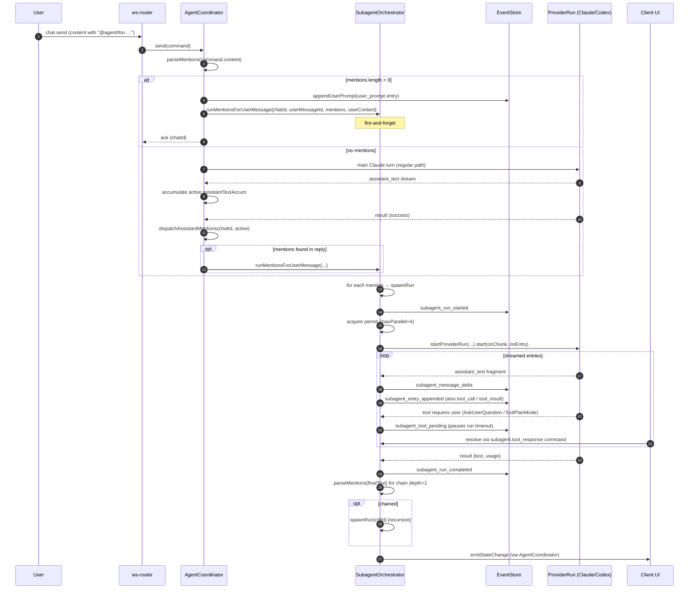
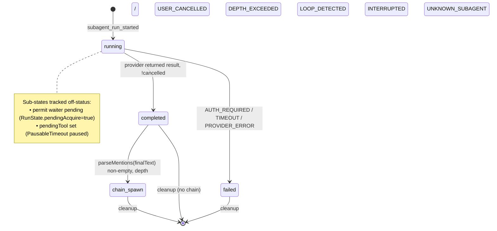
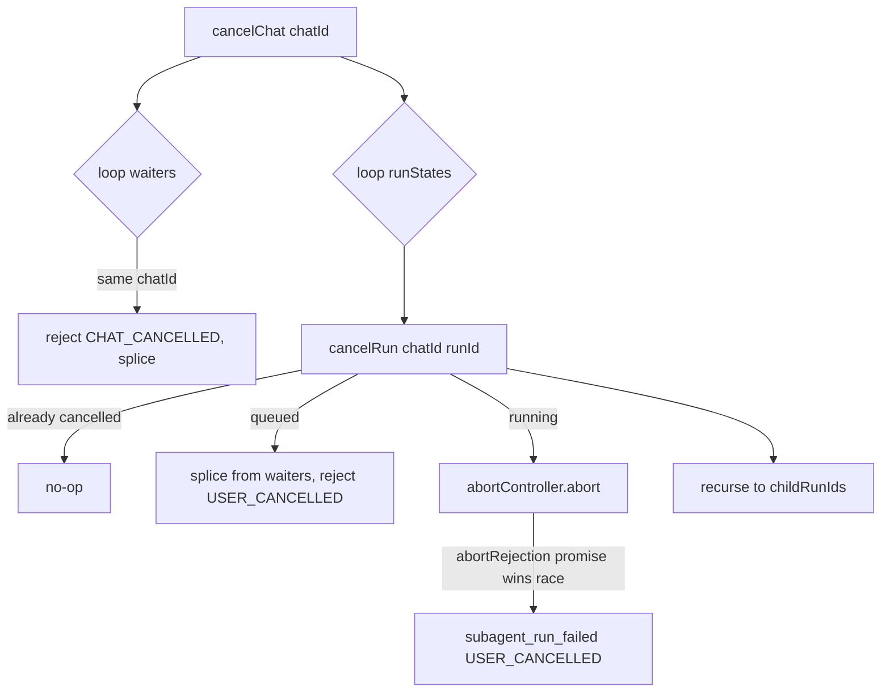
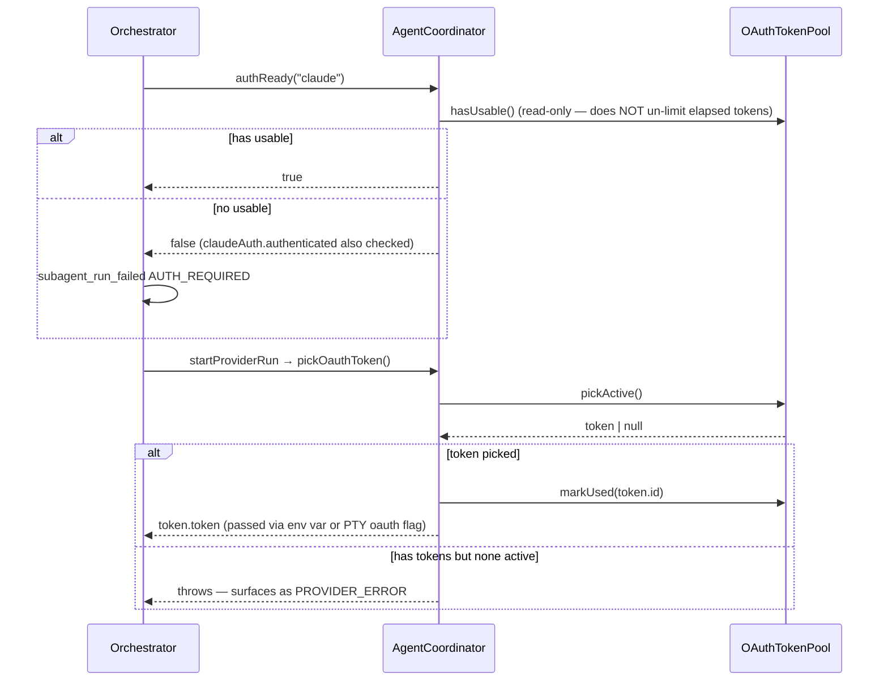
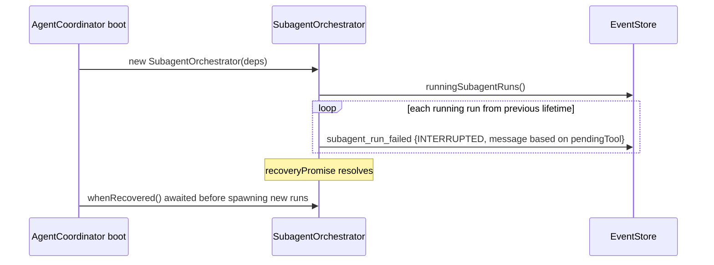

# Subagent end-to-end lifecycle

Status: living doc — captures current behaviour as of `0745f78` (PR #196).
Scope: `src/server/agent.ts`, `src/server/subagent-orchestrator.ts`,
`src/server/subagent-provider-run.ts`, `src/server/mention-parser.ts`,
`src/shared/mention-pattern.ts`.

This document is a reading aid, not a contract — diverging behaviour is a
bug in the code OR in the doc; bisect to find which.

---

## 1. Triggers — what spawns a subagent run

A subagent run is started by exactly one of three triggers, all of which
funnel into `SubagentOrchestrator.runMentionsForUserMessage`:

| # | Trigger                                  | Caller site                                       | `userMessageId`                    | `userContent`                |
|---|------------------------------------------|---------------------------------------------------|------------------------------------|------------------------------|
| 1 | User typed `@agent/<name>` in chat input | `agent.ts:send` → `appendUserPromptForSubagentRun`| The just-appended `user_prompt._id`| Raw `command.content`        |
| 2 | Main Claude reply contains `@agent/<name>`| `agent.ts:dispatchAssistantMentions`              | `active.userMessageId` (turn start)| `active.assistantTextAccum`  |
| 3 | Subagent reply contains `@agent/<name>`  | `subagent-orchestrator.ts:spawnRun` (chain block) | Original ancestor user message id  | Parent run's `finalText`     |

Mention parsing is identical across all three: `parseMentions(text, subagents)`
runs the single regex `(^|[\s\n\t])@agent/([a-z0-9_-]+)/gi` and resolves the
match against the live `Subagent[]` snapshot. Unknown names emit
`unknown-subagent` parsed mentions.

**Asymmetry — top-level vs chained unknowns:**
- Trigger 1 & 2 (user, main reply) — `runMentionsForUserMessage` emits
  `subagent_run_failed{code:UNKNOWN_SUBAGENT}` for each unknown name so
  the UI shows the failure
  (`src/server/subagent-orchestrator.ts:298-321`).
- Trigger 3 (chain inside subagent reply) — the chain loop silently
  drops non-subagent mentions
  (`src/server/subagent-orchestrator.ts:571`). A parent that writes
  `@agent/typo` never produces a failure event.

When a chat is sent with mentions present, **the main Claude turn does
not run** — `agent.ts:send` short-circuits at `parsedMentions.length > 0`
and only spawns subagent runs. This is by design: the user explicitly
delegated; if they wanted both, they'd send two messages.

---

## 2. High-level sequence



---

## 3. Run lifecycle (state machine)

`SubagentRunStatus` (declared in `src/shared/types.ts:1407`) has only four
values: `running | completed | failed | cancelled`. Queueing and
tool-waiting are tracked out-of-band: a queued run sits in `running`
status from the very first `subagent_run_started` event, and a
tool-pending run is signalled via the `pendingTool` field on the
snapshot rather than a separate status.



A `cancelled` value exists in the type but is not emitted by the current
orchestrator — user cancellation surfaces as
`subagent_run_failed{code:USER_CANCELLED}`. Treat `cancelled` as a
reserved status for forward-compat until a producer is wired in.

Notes:

- `runStateByRunId` is registered **before** `acquire` so `cancelRun` can
  reject a queued waiter via `state.permitWaiter`. The permit waiter is
  spliced out of `this.waiters` before rejection so `release()` cannot
  hand a permit to a dead waiter.
- `cancelRun` is idempotent (re-cancel = no-op). `cancelChat` snapshots
  the per-run set before iterating because `cancelRun` mutates the map.
- Pre-existing `running` runs from a previous process lifetime are
  recovered as `subagent_run_failed{code: INTERRUPTED}` in
  `recoverInterruptedRuns()`; callers `await whenRecovered()` before
  spawning new runs.

---

## 4. Provider run composition

```mermaid
flowchart LR
  subgraph Orchestrator
    SR[spawnRun] -->|primer per contextScope| ST[startProviderRun]
    ST -->|userInstruction| BPR[buildSubagentProviderRun]
  end
  subgraph "subagent-provider-run.ts"
    BPR -->|composeInitialPrompt| IP["initialPrompt:
    User asked: &lt;userInstruction&gt;

    &lt;primer&gt;"]
    IP -->|claude| RC[runClaudeSubagent]
    IP -->|codex|  RX[runCodexSubagent]
  end
  RC --> CL[Claude session
  systemPromptOverride=subagent.systemPrompt
  oneShot=true if PTY]
  RX --> CX[Codex session
  scope=sub:&lt;runId&gt;]
  CL -.->|HarnessTurn.stream| DR[drainHarnessTurn]
  CX -.->|HarnessTurn.stream| DR
  DR -->|onChunk / onEntry| Orchestrator
  DR -->|"{text, usage}"| Orchestrator
```

`composeInitialPrompt(subagent, primer, userInstruction)` rules:

| `userInstruction` | `primer`   | Result                                                  |
|-------------------|-----------|---------------------------------------------------------|
| non-empty         | non-empty | `User asked: <i>\n\n<p>`                                |
| non-empty         | null/""   | `User asked: <i>`                                       |
| null/empty        | non-empty | `<p>`  (legacy primer-only)                             |
| null/empty        | null/""   | fallback `(no prior context — … @agent/<name> mention)` |

`contextScope` selects the primer:

- `full-transcript` → `buildHistoryPrimer(transcript, provider, "")`
- `previous-assistant-reply` → `extractPreviousAssistantReply(transcript)`
  (null when no prior assistant_text in the chat — fallback hint fires)

---

## 5. Events emitted (event-store contract)

| Event                       | When                                                   | Reducer effect                          |
|-----------------------------|--------------------------------------------------------|-----------------------------------------|
| `subagent_run_started`      | Before permit acquire (also for UNKNOWN/missing)       | Creates `SubagentRunSnapshot{status:running}` |
| `subagent_message_delta`    | Every assistant_text fragment streamed                 | Appends to streaming display text       |
| `subagent_entry_appended`   | Every TranscriptEntry (assistant_text / tool_call / tool_result / system_init / result) | Stores entry for UI replay |
| `subagent_tool_pending`     | `AskUserQuestion` / `ExitPlanMode` request received    | Marks `pendingTool` in snapshot         |
| `subagent_run_completed`    | `runStart.start()` resolved, !cancelled                | `status:completed`, sets `finalText`+`usage` |
| `subagent_run_failed`       | Any terminal error path                                | `status:failed`, sets `error{code,message}` |

`SubagentErrorCode` values: `UNKNOWN_SUBAGENT | AUTH_REQUIRED |
PROVIDER_ERROR | TIMEOUT | USER_CANCELLED | DEPTH_EXCEEDED |
LOOP_DETECTED | INTERRUPTED`.

---

## 6. Concurrency & limits

| Limit                       | Default | Source                          | Behaviour on hit                              |
|-----------------------------|---------|---------------------------------|-----------------------------------------------|
| Parallel runs (per process) | 4       | `DEFAULT_MAX_PARALLEL`          | Excess runs queue on `this.waiters`           |
| Chain depth                 | 1       | `DEFAULT_MAX_CHAIN_DEPTH`       | Child run fails with `DEPTH_EXCEEDED`         |
| Per-run wall clock          | 600 s   | `DEFAULT_RUN_TIMEOUT_MS`        | `subagent_run_failed{code:TIMEOUT}`           |
| Ancestor loop detection     | n/a     | `ancestorSubagentIds` check     | Child fails `LOOP_DETECTED`                   |

`PausableTimeout` pauses while a tool request is pending so a 9-minute
"please confirm?" prompt doesn't burn the 10-minute wall clock.

---

## 7. Cancellation paths



Codex path: `args.codexManager.stopSession(chatId, scope)` is wired on
abort. Note that codex `stopSession` drains the stream queue without
rejecting, so `runState.cancelled` is double-checked after the await
to convert a "clean" return into the cancel terminal state.

---

## 8. Auth & OAuth pool integration (Claude only)



Subagent runs are NOT reservation-managed: there is no `release(chatId)`
mirror, because subagents are ephemeral and the reservation lifecycle is
shaped around top-level chat sessions. The chat-level rotation race is
between top-level sessions, not subagent ephemerals.

PTY driver: subagents run under `buildClaudeSubagentStarter()` with
`oneShot: true` (single-turn REPL exit), preflight gate + sandbox
inherited from the parent coordinator.

---

## 9. Server restart durability



Tool-callback durability is layered separately: with
`KANNA_MCP_TOOL_CALLBACKS=1`, pending `AskUserQuestion` / `ExitPlanMode`
records in `tool-requests.jsonl` resolve as `session_closed` deny on
boot (see `src/server/tool-callback.ts`). Subagent recovery and tool
recovery happen independently.

---

## 10. Invariants & checks

These properties should hold; cite the line on a violation.

1. Every `subagent_run_started` is followed by exactly one terminal event
   (`_run_completed` OR `_run_failed`), even on cancel / interrupt / boot.
2. `runStateByRunId` is registered before `acquire` (so cancelRun can
   reject a queued waiter). Cleanup deletes from the map on every
   terminal path via `cleanupRunState` in the `finally` of `spawnRun`.
3. Permit grants and waiter pops are balanced — `releaseSlot` is
   idempotent (`released` flag); failure-before-acquire paths do not
   call `release()`; failure-after-acquire paths must.
4. `onRunTerminal` fires once per run, before `cleanupRunState`. It
   rejects any leaked `canUseTool` resolvers in
   `subagentPendingResolvers` so subagent SDK promises don't hang.
5. `composeInitialPrompt` never returns an empty string — the fallback
   sentence is the last-resort branch.
6. Chain mentions only fire on `subagent_run_completed`, not on `_failed`
   (preventing fan-out from a broken parent).
7. Main → subagent dispatch only fires on `!isError && !cancelRequested`
   in both Claude and Codex turn loops. Errored / cancelled main turns
   do not delegate.
8. `dispatchAssistantMentions` is skipped (logged) when `userMessageId`
   is null — typically a `recreateActiveTurnFromSession` ghost turn that
   couldn't find a prior `user_prompt`.

---

## 11. Known correctness bugs (pending fix)

Independent review (`codex-rescue`, 2026-05-18) surfaced these. None are
introduced by PR #196 — all pre-date this lifecycle work — but they
materially affect the flow this doc describes.

| # | Severity | Locus | Symptom |
|---|----------|-------|---------|
| B1 | P1 | `subagent-orchestrator.ts:218-227, 230-237` | Permit "leak" on waiter handoff. `acquire()` decrements `permits` after a waiter is resolved while `release()` did not increment for the handoff. Net effect: every waiter transfer permanently loses one parallel slot. Eventually `permits ≤ 0` forever and all runs queue indefinitely. |
| B2 | P1 | `subagent-orchestrator.ts:458, 465` and outer `finally` at 623-625 | Double-release. Both `PROVIDER_ERROR` early-return and `AUTH_REQUIRED` early-return call `this.release()` raw without flipping the `released` flag; the outer `finally releaseSlot()` then releases again. Allows concurrency above `DEFAULT_MAX_PARALLEL`. |
| B3 | P1 | `subagent-orchestrator.ts:140, 240` | `cancelledChats` is monotonic — added on `cancelChat`, never cleared. After a user ever cancels a chat, every future `@agent/<name>` in that chat fails before start with `CHAT_CANCELLED` / `PROVIDER_ERROR` until process restart. |
| B4 | P1 | `agent.ts:2068-2079` | When a turn is already active, the incoming chat.send is enqueued *before* `parseMentions` runs. Dequeue path `maybeStartNextQueuedMessage → dequeueAndStartQueuedMessage → startTurnForChat` does not re-check for mentions, so the queued message runs as a normal main-provider turn — bypassing the subagent-routing short-circuit. |
| B5 | P1 | `subagent-orchestrator.ts:502-504` (timeout) vs `subagent-provider-run.ts:102, 118` (abort listener) | `PausableTimeout`'s `onFire` only rejects the race promise; it does not call `runState.abortController.abort()`. The provider session keeps streaming after the run is marked `failed{TIMEOUT}`, polluting the event log with post-terminal `subagent_message_delta` / `_entry_appended` events and leaking the provider session. |

These are tracked for a follow-up PR; do not assume the diagrams above
are robust to all failure modes until B1-B5 land.

## 12. Known limitations / TODO seeds

- Mentions inside fenced code blocks or quoted text still match the
  regex. The model can accidentally trigger a real run by quoting a user
  message verbatim. Possible mitigation: strip code fences before
  parseMentions on the assistant-text path.
- `DEFAULT_MAX_CHAIN_DEPTH = 1` means user → subagent → subagent is the
  max chain. Users may want to raise it per chat.
- No per-subagent rate limiting beyond the global parallel cap.
- The "main reply spawns subagent" feature lacks a UI affordance to make
  the delegation visible at compose time; users only learn it works by
  reading the doc.
