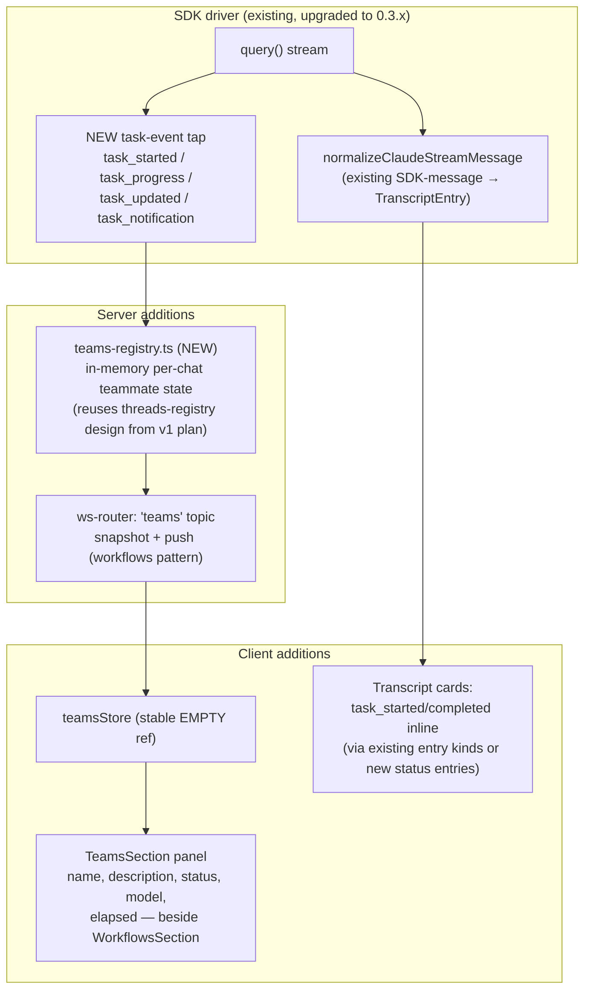

# Agent Teams in Kanna (Agent SDK native multi-agent) — Design v2

Date: 2026-07-08
Status: Approved direction (pivot from hosted Managed Agents API — see probe checkpoint)
Supersedes: `2026-07-08-managed-agents-multiagent-design.md` (hosted-API premise dead: control
plane rejects subscription OAuth tokens; API-key billing forbidden by frame)
Evidence: `2026-07-08-probe-checkpoint.md` — teams probe PASS on `@anthropic-ai/claude-agent-sdk@0.3.204`,
macOS/Bun, subscription OAuth, parallel agents, local execution.

## Summary

Surface the Agent SDK's **native teams multi-agent** in Kanna: the model spawns parallel,
named, background teammates via the `Agent` tool; Kanna renders their lifecycle live in a
per-chat **Teams panel** plus inline transcript cards. Requires upgrading
`@anthropic-ai/claude-agent-sdk` 0.2.140 → 0.3.x. Everything runs locally under the existing
SDK driver with subscription (OAuth pool) billing — no new API surface, no new credentials,
no environment worker.

## Decisions (locked)

| Question | Decision |
| --- | --- |
| Multi-agent engine | Agent SDK native teams (`Agent` tool + `task_*` lifecycle events), NOT the hosted Managed Agents API |
| V1 UI scope | Teams panel (per-teammate status, mirrors Workflows panel) + inline transcript cards. NO UI steering (`SendMessage` from UI) in v1 |
| Driver coverage | SDK driver only. PTY transcript visibility of teams events = separate discovery, later PR |
| Billing / auth | Unchanged: OAuth pool token via existing driver plumbing. API keys remain forbidden |

## Execution frame (carried over, human-owned)

- **Objective metrics:** (1) live e2e: SDK-driver chat where the model spawns ≥2 parallel
  teammates, both execute locally, panel shows live status, coordinator synthesizes — green on
  the developer's macOS machine; (2) UI golden path demo of the same.
- **Anti-goal tripwire:** `bun run test --conditions production` + `bun run lint` green every
  commit; existing SDK/PTY parity tests green. The SDK **upgrade is the biggest tripwire risk**
  — 0.2.140 → 0.3.x lands in its own early task with the full suite as the gate.
- **Anti-goal drift gauge:** pool-token rate-limit lockouts from dev runs.
- **Flags:** Cannot (upgrade breaks driver beyond repair budget), Breaking (suite/lint/parity
  red or lockouts), Pointless (panel built but task events never arrive through Kanna's
  normalizer).

## Architecture

### Event mapping (shapes captured in probe fixtures `scratch/probe-teams/probe-teams-events.jsonl`)

| SDK message | Kanna handling |
| --- | --- |
| `system/task_started` `{task_id, tool_use_id, description, subagent_type?, name?, model?}` | teams-registry upsert `{status:"running"}` + transcript status card |
| `system/task_progress` `{task_id, description}` | registry: update `lastActivity` |
| `system/task_updated` `{task_id, patch:{status, end_time,...}}` | registry: apply patch (completed/failed) |
| `system/task_notification` `{task_id, status, output_file}` | registry: final status + transcript status card |
| `Agent` tool_use / tool_result | already rendered by existing tool hydration — verify only |

### Components

| Piece | File | Notes |
| --- | --- | --- |
| SDK upgrade | `package.json` + `src/server/agent.ts` compile fixes | Own task, own commit, full suite gate. Discovery sub-step: diff 0.2.140 vs 0.3.x types Kanna touches (`SDKMessage` union grew ~10 variants; `sessionId` casing change seen in docs mirror) |
| Task-event tap | inside SDK driver stream loop (`agent.ts`) | Guarded: unknown `system` subtypes remain ignored (forward-compat) |
| `teams-registry.ts` | `src/server/teams-registry.ts` + test | Same interface as the v1 plan's threads-registry: `apply/snapshot/clear/subscribe` keyed by chatId |
| WS topic `teams` | `src/shared/protocol.ts`, `src/server/ws-router.ts` | Mirrors `workflows` topic + snapshot push |
| `teamsStore` | `src/client/stores/teamsStore.ts` | Mirrors `workflowsStore`, stable `EMPTY` |
| `TeamsSection` | `src/client/app/TeamsSection.tsx` | Mirrors `WorkflowsSection`; rows: name/description, status pill, model, elapsed |
| Transcript cards | reuse `StatusEntry` or existing task rendering | Verify what 0.3.x already produces through the normalizer before adding anything |
| Enablement | none needed | `Agent` tool is native; teams activate when the model uses it. Optional later: `teammateMode` option plumbed to settings |

### Integration with configured subagents (Settings → Subagents)

The SDK exposes `options.agents?: Record<string, AgentDefinition>` where
`AgentDefinition = { description, prompt, tools?, disallowedTools?, model? }`. Kanna maps its
configured subagents into this option at SDK-driver spawn time:

| Kanna `Subagent` field | `AgentDefinition` mapping |
| --- | --- |
| `name` | record key (sanitized to the Agent-tool `subagent_type` format) |
| `description` | `description` (drives when the model picks it) |
| `systemPrompt` | `prompt` |
| `model` | `model` (full id passes through) |
| `provider !== "claude"` | **excluded** — codex subagents cannot be native teammates |
| `contextScope`, `triggerMode`, `workingDir`, `allowedPaths` | not mapped in v1 (native teammates inherit the session cwd; path policy stays with `delegate_subagent`) |

Effect: the model can spawn a configured persona as a native teammate via
`Agent { subagent_type: "<name>", run_in_background: true }` — parallel, task-event-visible,
same session tree. The Teams panel joins a teammate row back to the settings subagent by name
(shows its label/description).

**Division of labor (system-prompt guidance updated accordingly):**
- Native teams (`Agent` tool): claude-provider subagents + ad-hoc teammates — parallel fan-out,
  live panel, subscription billing, one session tree.
- `delegate_subagent` MCP: codex subagents, keep-alive multi-turn sessions, cross-provider —
  unchanged.

### Relationship to existing features (no changes in v1)

- **SubagentOrchestrator (`delegate_subagent`)**: complementary — see division of labor above.
- **Workflows panel**: unchanged; teams panel sits beside it (Workflow tool ≠ Agent teams).
- **PTY driver**: out of scope v1; discovery later whether task events appear in transcript JSONL.

## UX review amendments (from user-workflow walkthrough)

1. **PTY empty-state hint.** Teams live view works only on the SDK driver in v1. When the open
   chat runs the PTY driver, the Teams panel renders a one-line empty state: "Teams live view
   requires the SDK driver (Settings → Claude driver)" — prevents silent-broken perception.
2. **Billing doc verification.** CLAUDE.md claims "SDK mode bills at API rates"; the probe
   proved agent-sdk + `CLAUDE_CODE_OAUTH_TOKEN` runs on subscription. The upgrade task must
   verify which claim is true for Kanna's SDK driver as wired (pool token injection) and fix
   CLAUDE.md in the same PR.
3. **Discovery affordance.** Empty Teams panel (SDK-driver chats) shows an example prompt:
   "Ask Claude to 'use parallel agents' to fan work out." No forced orchestration.
4. **Teammate attribution on approvals.** Teammate-originated permission/`AskUserQuestion`
   requests carry `agent_id` in 0.3.x. The approval card prefixes the teammate name (registry
   lookup) so the user knows who is asking.

Accepted without change: three-panel proliferation (copy differentiates), per-teammate token
cost (shapes don't carry usage), restart amnesia of the in-memory registry.

## Error handling

- Unknown/new `system` subtypes: ignored (existing behavior preserved).
- Registry is in-memory; server restart mid-team loses panel state but not transcript (entries
  are event-sourced). Acceptable v1.
- Teammate failure: `task_updated {status:"failed"}` → red pill + status card; turn outcome
  remains whatever the coordinator reports.
- Cancel chat: existing interrupt path; teammates are children of the SDK session and die with it.

## Testing

- `teams-registry.test.ts` — lifecycle from probe-fixture events.
- SDK-driver tap test — feed fixture `SDKMessage`s, assert registry calls + transcript entries
  (extend existing driver/normalizer tests).
- ws-router `teams` topic test — mirrors workflows topic tests.
- Client: store + section tests + `renderForLoopCheck`.
- `.live.test.ts` env-gated: real OAuth token, spawn-two-teammates prompt (the probe script,
  productionized), assert parallel `task_started` + both results.
- Upgrade gate: full `bun run test` + `bun run lint` on the upgrade commit itself.

## Risks

1. **0.2.140 → 0.3.x upgrade** — biggest. New SDKMessage variants, possible option renames,
   behavior changes in the embedded harness. Mitigation: dedicated early task, full-suite gate,
   revert path is a one-line pin.
2. Model may not spontaneously use teams — golden-path prompt in live test explicitly requests
   parallel agents; UX copy can hint. No forced orchestration in v1.
3. `task_*` shapes are SDK-internal (not a stable public contract) — fixtures pinned from probe;
   tap is defensive.

## Out of scope (v1)

UI steering (`SendMessage`, per-teammate interrupt), PTY driver coverage, teammateMode settings,
worktree/remote isolation UI, persistence of team history across restarts.

## C3 impact

- Contract delta on `c3-210 agent-coordinator` (task-event tap) — change-unit with the PR.
- New component `teams-registry` under c3-2; client panel under c3-1.
- `c3-225` (PTY) untouched.
