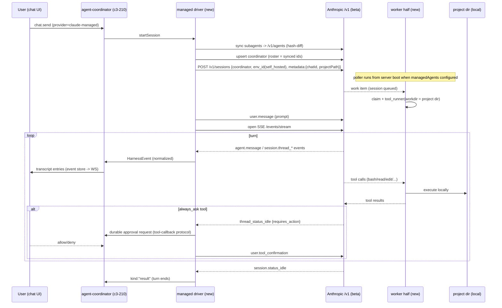

# Claude Managed Agents (Multi-Agent) Provider — Design

Date: 2026-07-08
Status: Approved (brainstorm complete)
Source research: https://platform.claude.com/docs/en/managed-agents/multi-agent, /environments, /self-hosted-sandboxes, /events-and-streaming
API beta: `managed-agents-2026-04-01`

## Summary

Add a new provider `claude-managed` to Kanna that runs a chat as an Anthropic
Managed Agents **multi-agent session**: a coordinator agent (built from the
chat's selected model) delegates to a roster of agents synced from Kanna's
existing subagent settings. Orchestration (the model) runs on Anthropic's
control plane; **tool execution runs locally** — the Kanna server acts as a
self-hosted environment worker, executing `bash/read/write/edit/glob/grep`
in the chat's project directory.

## SDK boundary (important)

Kanna's existing "SDK driver" uses `@anthropic-ai/claude-agent-sdk` (the
Claude Code agent loop run in-process). **Managed Agents is NOT part of that
SDK.** It is a hosted platform REST API exposed only through the Anthropic
client SDK `@anthropic-ai/sdk` (`client.beta.agents / sessions /
environments`, beta header `managed-agents-2026-04-01`) — a dependency Kanna
does not currently have.

Two options for the new driver's transport:

1. **Add `@anthropic-ai/sdk` as a dependency (recommended).** Gains typed
   request/response models, SSE stream helpers, and the self-hosted worker
   helpers (`EnvironmentWorker`, `WorkPoller`, `tool_runner`,
   `AgentToolContext` + `beta_agent_toolset_20260401`) — the worker half
   nearly for free. Import confined to `src/server/claude-managed/*.adapter.ts`
   files so the rest of the codebase never sees it. Bun compatibility of the
   worker helpers is verified by the phase 1 spike; known requirement is
   Node 22+ semantics plus `unzip`/`tar` on PATH (skills extraction).
2. **Raw REST via `fetch` inside `managed-api.adapter.ts`.** No new
   dependency, but re-implements SSE parsing, pagination, the work-queue
   claim/keep-alive protocol, and all types by hand from the reference docs.

Decision: option 1, with option 2 as the fallback if the worker helpers do
not run under Bun (in that case only the worker claim-loop is hand-rolled
against the Environments Work REST endpoints; the typed client is still
used for everything else).

The existing `@anthropic-ai/claude-agent-sdk` dependency and both current
drivers (Agent-SDK driver, PTY driver) are untouched by this feature.

## Decisions (locked during brainstorm)

| Question | Decision |
| --- | --- |
| V1 scope | Multi-agent from day one (coordinator + roster + threads panel) |
| Roster source | Sync Kanna subagent settings to `/v1/agents`; coordinator rebuilt on roster change |
| Sandbox mode | Self-hosted only. Kanna server = environment worker. No cloud sandboxes in v1 |
| UI entry point | "Claude Managed" provider in the existing chat provider/model picker; chat = session |
| Tool approvals | Local tools auto-run (current Kanna trust model); only API-flagged `always_ask` tools route through the durable approval protocol |
| Architecture | Approach A: in-process driver + worker halves in the Kanna server process |

## Architecture

### Concept mapping

| Kanna concept | Managed Agents concept |
| --- | --- |
| Chat | Session (`/v1/sessions`), id event-sourced on the chat |
| Follow-up turn | `user.message` to the same session |
| Interrupt button | `user.interrupt` (primary thread); per-thread interrupt in panel |
| Kanna subagent | Agent definition (`/v1/agents`), synced by hash |
| Chat's selected model | Coordinator model |
| Threads (max 25) | New threads read-model + WS topic + panel (WorkflowsSection pattern) |
| Billing | Anthropic API key (new settings field). NOT the OAuth pool |

## Server components

New directory `src/server/claude-managed/` (mirrors `claude-pty/`):

| File | Role | Seal |
| --- | --- | --- |
| `driver.ts` | Driver contract (start / sendPrompt / interrupt / close) emitting `HarnessEvent`s, same shape as the Agent-SDK and PTY drivers | pure coordinator |
| `managed-api.adapter.ts` | ALL calls to `api.anthropic.com` via `@anthropic-ai/sdk` (`client.beta.*`): agents/sessions/events/threads CRUD, SSE streams, environment work endpoints. Sole import site of `@anthropic-ai/sdk` (with `worker/tool-exec.adapter.ts`) | `.adapter.ts` leaf |
| `managed-types.ts` | Every beta API request/response shape, typed once (single blast radius for beta drift) | pure |
| `sse-to-event.ts` | Pure translation: managed event stream → `HarnessEvent` (sibling of `jsonl-to-event.ts`). `agent.message` → assistant text; `session.status_idle` → `kind:"result"`; `session.thread_*` → threads registry feed | pure |
| `agent-sync.ts` | Pure hash-diff of Kanna subagents ↔ managed agent definitions; decides create/update/skip; triggers coordinator upsert when the roster hash changes | pure |
| `worker/work-poller.ts` | Claim-loop state machine (poll → claim → dispatch → stop) | pure logic |
| `worker/tool-exec.adapter.ts` | Local execution of `bash/read/write/edit/glob/grep` in the session's workdir; posts results back | `.adapter.ts` leaf |
| `threads-registry.ts` | Per-chat thread snapshots + subscribe (mirrors `workflow-registry.ts`) | pure, IO injected |

### Wiring

- **`agent.ts` (AgentCoordinator):** third driver branch when provider is
  `claude-managed`. New event `managed_session_started` persists the session
  id so follow-up turns and server restarts reattach.
- **`provider-catalog.ts` / `types.ts`:** add provider `claude-managed`.
  Subagent models come from Kanna subagent config (fallback to a default).
- **Settings (`app-settings.ts`):** new `managedAgents` block — `apiKey`,
  `environmentId`, `environmentKey`, `enabled`. File is already mode 0600.
- **Worker lifecycle:** one poller per environment, started at server boot
  when `managedAgents.enabled` and creds present. Workdir per claimed
  session resolved from session `metadata` (`chatId`, `projectPath`) written
  at session creation.
- **Approval bridge:** `requires_action` stop reason → existing
  `tool-callback.ts` durable protocol → `user.tool_confirmation` post.
  Reuses the 600 s timeout and fail-closed restart semantics.
- **Dependency:** `@anthropic-ai/sdk` added as a new server dependency (see
  "SDK boundary" above). Phase 1 spike verifies its worker helpers
  (`WorkPoller`, `tool_runner`) run under Bun; fallback is hand-rolling the
  claim loop against the Environments Work REST endpoints inside
  `managed-api.adapter.ts`. Component boundaries do not change either way.

## Client UI

- **Settings page** — new "Managed Agents" card: masked API key input,
  Environment ID, Environment key (Console-generated; paste-in, same UX
  precedent as MCP OAuth), enable toggle, "Test connection" button (server
  RPC validates the key and hits `work/stats`), status pill. Setup hint
  links to the Anthropic Console for environment creation + key generation.
- **Chat entry** — provider picker shows "Claude Managed" only when
  configured + enabled. Model picker selects the coordinator model.
- **Threads panel** — `ManagedThreadsSection` beside `WorkflowsSection`:
  one row per thread (agent name, status pill, created time), actions
  interrupt / archive (idle only), drill-in per-thread transcript via a
  `managedThreads.getThread` WS command (mirrors `workflows.getRun`).
  Store `managedThreadsStore` with a stable `EMPTY` ref.
- **Transcript cards** — `agent.thread_message_sent/received` render as
  delegation cards inline (like `delegate_subagent` cards today).
  Approvals reuse the existing `pending_tool_request` UI unchanged.
- UI work follows the impeccable + kanna-react-style skills.

## Error handling and lifecycle

- **SSE drop:** reconnect and catch up via `events.list` (events are
  persisted server-side with ids); the driver dedupes by event id.
- **Server restart mid-session:** session id is event-sourced; on boot the
  driver reattaches the SSE stream and the poller restarts. Pending
  approvals fail closed (existing `recoverOnStartup`).
- **No worker connected:** the session queues rather than failing (API
  semantics). Kanna surfaces a "waiting for worker" state if the poller is
  down.
- **Auth failure (401 / expired environment key):** chat error entry +
  settings status pill. Single API key; no OAuth-pool rotation.
- **Cancel:** `cancelChat` sends `user.interrupt` to the primary thread and
  all running child threads, and `work.stop` for the claimed work item.
- **Thread cap (25):** panel shows the count; archive is the user action.
- **Beta drift:** all API shapes live in `managed-types.ts` +
  `managed-api.adapter.ts` — one place to update.

## Testing

Colocated bun tests, run with `--conditions production`:

- `sse-to-event.test.ts` — fixture event streams → expected `HarnessEvent`
  sequences (parity-matrix pattern).
- `agent-sync.test.ts` — roster diff cases: new / changed / deleted
  subagent, coordinator rebuild trigger.
- `worker/work-poller.test.ts` — claim/dispatch/stop state machine against
  a fake adapter.
- `threads-registry.test.ts` — snapshot/subscribe (mirrors
  workflow-registry tests).
- Approval bridge test — `requires_action` → durable protocol →
  confirmation post.
- `.live.test.ts` — env-gated real API round-trip (needs API key +
  environment key).
- UI — store + section component tests; `renderForLoopCheck` on new
  selectors.

## Constraints and risks (accepted)

1. **Billing:** API-key rates only. No Pro/Max subscription path — this
   provider bills differently from the PTY driver. Surfaced in settings copy.
2. **Data flow:** tool inputs/outputs transit Anthropic's control plane
   even with self-hosted execution. Documented in settings copy.
3. **Platform:** docs state the worker needs a Linux host with `/bin/bash`;
   macOS is unstated. Phase 1 spike verifies; if broken on macOS, the
   feature flags itself unsupported there.
4. **Environment key is Console-only:** the user must create the
   environment and generate the key in the Anthropic Console, then paste
   both into Kanna settings.
5. **Memory feature** of Managed Agents is unsupported with self-hosted
   sandboxes — out of scope.
6. **Token/cost display:** unknown whether usage rides session events;
   v1 degrades to no cost display for managed chats.
7. **Beta API** may change shape; isolation in `managed-types.ts` +
   adapter limits the blast radius.
8. **Coordinator version pinning:** roster references pin agent versions at
   coordinator create/update time — `agent-sync.ts` must upsert the
   coordinator whenever any roster member changes.

## Out of scope (v1)

- Cloud sandbox environments (self-hosted only).
- MCP servers / skills / vaults on managed agent definitions.
- Managed Agents memory.
- Cross-chat managed session browser (chat-scoped only).
- Cost/usage display for managed chats.

## C3 impact

- New component under `c3-2` (server): `claude-managed-driver` (peer of
  `c3-225 claude-pty-driver`).
- `c3-210 agent-coordinator` gains the third driver branch (contract
  delta).
- `c3-212 provider-catalog` gains the `claude-managed` provider.
- Client: threads panel + settings card belong to `c3-116 settings-page`
  and the chat sidebar components.
- Change-unit (`/c3 change`) to be opened with the implementation PR.
