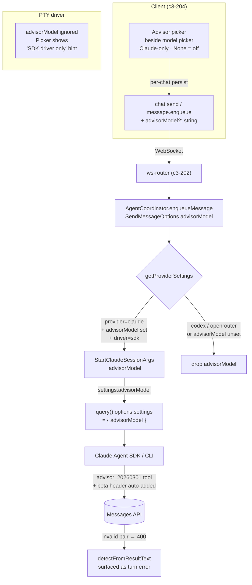

# Advisor Tool — Design Spec

Date: 2026-07-09  
Status: approved  
Branch: feat/advisor-tool

---

## Summary

Wire Claude's server-side advisor tool into Kanna.
Executor model (chat's selected Claude model) consults a higher-intelligence advisor
model mid-generation for strategic guidance — all inside one API request, no extra round-trips.

The advisor is opt-in per chat. Off by default (None selected). Claude SDK driver only;
PTY shows a "SDK driver only" hint like Agent Teams does.

---

## How the Advisor Tool Works (API level)

The Claude Agent SDK exposes `advisorModel?: string` in the `Settings` interface (`sdk.d.ts:6093`).
Passing `settings: { advisorModel: "claude-opus-4-8" }` inside `query()` options causes the CLI to:
- inject the `advisor_20260301` server-tool into the Messages API `tools` array
- add the `advisor-tool-2026-03-01` beta header

All wiring is CLI-internal. Kanna sets one field; the SDK handles the rest.

The executor decides when to call the advisor (like any other tool). The advisor sub-inference
runs server-side and returns advice as an `advisor_tool_result` block in the turn.
Invalid executor/advisor pairs return a 400 from the API.

---

## Architecture



---

## Data Model Changes

### `src/shared/protocol.ts`

Add `advisorModel?: string` top-level field (parallel to `model`, NOT inside `ModelOptions`)
to these two command shapes:

```typescript
// chat.send
| {
    type: "chat.send"
    // ... existing fields ...
    model?: string
    advisorModel?: string          // NEW
    modelOptions?: ModelOptions
    effort?: string
    // ...
  }

// message.enqueue
| {
    type: "message.enqueue"
    // ... existing fields ...
    model?: string
    advisorModel?: string          // NEW
    modelOptions?: ModelOptions
    // ...
  }
```

### `src/server/agent.ts`

Extend `SendMessageOptions`:
```typescript
interface SendMessageOptions {
  // ... existing ...
  advisorModel?: string
}
```

Extend `StartClaudeSessionArgs` (or the inline args shape passed to `startClaudeSession`):
```typescript
advisorModel?: string
```

In `getProviderSettings` (claude branch only):
```typescript
// existing: model, effort → query options
// new: thread advisorModel into SDK settings
settings: advisorModel ? { advisorModel } : undefined
```

`query()` currently has no `settings` field — this adds it. `{ advisorModel }` is a valid
partial `Settings` object (sdk.d.ts `Settings` interface; the CLI merges it with file-based settings).

### `src/shared/types.ts` — no change

`ModelOptions` unchanged. Advisor is orthogonal to executor's reasoning effort / context window.

---

## Transport to Spawn

The per-chat model/provider/effort already ride on `chat.send` → `SendMessageOptions` →
`getProviderSettings` → `startClaudeSession`. `advisorModel` follows the same path:

1. WS command carries it on `chat.send` / `message.enqueue`.
2. `ws-router` passes it to `enqueueMessage`.
3. `enqueueMessage` sets it on `SendMessageOptions`.
4. `getProviderSettings` (claude branch) reads it → `StartClaudeSessionArgs.advisorModel`.
5. `startClaudeSession` (SDK path) passes `settings: { advisorModel }` to `query()`.
6. **Guard:** only threaded when `provider === "claude"` AND driver is SDK AND field is non-null.

---

## Client UI

UI placement decided during implementation with the impeccable skill for UX consistency.
Constraints:
- Advisor picker is **Claude-only**. Hidden (not just disabled) for Codex / OpenRouter chats.
- **PTY driver active:** picker renders a "Advisor requires SDK driver" inline note, no dropdown.
- Selection persists per chat the same way the executor model selection does.
- Picker offers the full Claude model list from the existing `availableProviders` catalog
  (`mergeCustomModels([...PROVIDERS], customModels)` — already in the chat snapshot).
- Default: `None` (no advisor). Turning it on is opt-in.
- Label: "Advisor" with the selected model id / "None".

No new client-server transport for the catalog — it reuses `availableProviders` already
in the chat snapshot.

---

## Validity and Error Handling

No client-side compatibility matrix. The docs matrix is model-version-specific and would
drift as models are added (the codebase already learned this lesson with `HARD_CODED_CODEX_MODELS`).

Invalid executor/advisor pair → API returns 400 `invalid_request_error` with the pair name
→ surfaces through the existing `detectFromResultText` / turn-error path as a turn error
the user sees inline. Clear enough UX; no silent drop.

---

## Drivers

| Driver | Behavior |
|--------|----------|
| SDK    | Full support: `settings.advisorModel` → `query()` |
| PTY    | `advisorModel` silently ignored at spawn; picker shows a driver hint in UI |

PTY precedent: Agent Teams (c3-225) is SDK-only with a PTY hint in `TeamsSection`. Same pattern here.

---

## C3 Change Protocol

This is a **change op** → ADR-first.

- Create `adr-20260709-advisor-tool` before touching code.
- Files touched: `src/shared/protocol.ts` (c3-301), `src/server/agent.ts` (c3-210),
  `src/client/**` (advisor picker component, chat store).
- Update c3-210 (agent-coordinator) contract after implementation.
- Run `c3x check` before PR.

---

## Tests

**Unit tests (required):**

- `src/server/agent.test.ts` (or colocated): `getProviderSettings` with `provider=claude` +
  `advisorModel` set → `settings.advisorModel` present in spawn args.
- Same: `provider=codex` → `advisorModel` absent from spawn args.
- Same: `provider=claude` + `advisorModel` unset → `settings` absent (no empty object).
- Chat snapshot: `advisorModel` round-trips through protocol correctly.

**Live test (optional, env-gated):**
Pattern: `src/server/advisor.live.test.ts` — analogous to `teams.live.test.ts`.
Gate: `KANNA_ADVISOR_LIVE_OAUTH_TOKEN`.
Assert: turn completes, response contains an `advisor_tool_result` block.

---

## Out of Scope

- PTY driver advisor support
- Per-model-catalog-entry default advisor (simpler than per-chat; deferred)
- UI cost-warning for advisor token overhead
- Advisor prompt caching (`caching` param on the tool def)
- `max_uses` / `max_tokens` per-tool controls
