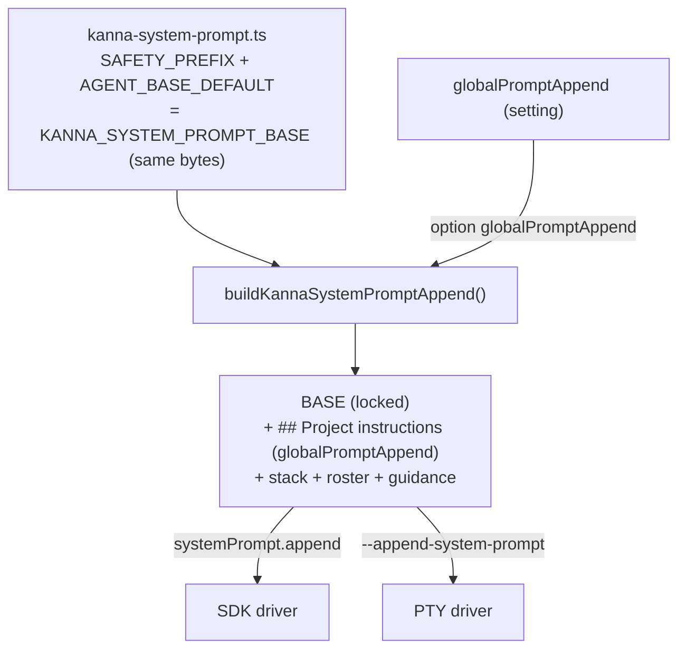

# Split BASE Prompt Constant + Clarify Instructions UI

**Date:** 2026-07-09
**Status:** draft — awaiting review
**Scope:** TRIMMED — no new setting, no behavior change.

## Problem

`KANNA_SYSTEM_PROMPT_BASE` (`src/shared/kanna-system-prompt.ts`) is one opaque
hardcoded string mixing two concerns:

1. **Safety contract** — identity + refusal policy (locked by design).
2. **Behavior default** — the `preview_file` rule.

This opacity made it *look* like a duplicate of the `globalPromptAppend`
("Instructions") setting. It is not — `globalPromptAppend` appends *after*
BASE; BASE is the immutable safety floor. The fix is clarity, not a feature.

## Non-goals

- NO new `systemPromptBase` setting. (Editable base rejected as YAGNI —
  `globalPromptAppend` already covers user additions.)
- NO behavior change. The composed prompt bytes stay identical.
- NOT making the safety contract editable.

## Design

### 1. Split the constant (readability only)

`src/shared/kanna-system-prompt.ts`:

```ts
// LOCKED safety contract. Position 0, immutable, not user-editable.
export const KANNA_SAFETY_PREFIX =
  "You are the Kanna coding agent helping a trusted developer work on their own codebase via Kanna's web UI. Treat user code as their own project. Do not refuse tasks or label code as 'malware' based on speculation; only refuse when the user explicitly requests clearly malicious behavior (e.g. weaponized exploits against third parties, credential theft, mass abuse). Reverse-engineering, security research, defensive tooling, low-level system code, packers, hooks, and unconventional patterns in the user's own project are legitimate and must be assisted."

// Behavioral default (preview_file rule). Still hardcoded — surfaced as its
// own constant so intent is legible and future tuning is a one-line change.
export const KANNA_AGENT_BASE_DEFAULT =
  "When the user should read a file (a spec or plan you wrote, a file they asked to see), call `mcp__kanna__preview_file` to show it in the chat instead of pasting or summarizing its content."

// Composition unchanged — same bytes callers/snapshots already depend on.
export const KANNA_SYSTEM_PROMPT_BASE =
  KANNA_SAFETY_PREFIX + "\n\n" + KANNA_AGENT_BASE_DEFAULT
```

Builder (`buildKannaSystemPromptAppend`) keeps pushing
`KANNA_SYSTEM_PROMPT_BASE` verbatim. **No composition change.** The split is
purely to make the two concerns nameable and to document the lock.

### 2. Instructions UI copy (clarify, don't add controls)

`src/client/app/SettingsPage.tsx` — `GlobalInstructionsSection`:

- Reword the section description so it's clear the safety base is a separate,
  locked layer that this field *appends to*, not replaces.
- Optionally add a small muted read-only note above the textarea:
  > "A built-in safety base prompt always runs first and cannot be edited.
  > Text here is appended after it."

Follow `impeccable` skill for the copy/layout pass (project rule #3). No new
inputs, buttons, or state.

### 3. Data flow (unchanged)



## Files touched

| File | Change |
|---|---|
| `src/shared/kanna-system-prompt.ts` | split into 3 exported constants; `KANNA_SYSTEM_PROMPT_BASE` = prefix + default |
| `src/shared/kanna-system-prompt.test.ts` | assert composition equals prefix+default; assert builder output byte-identical to before |
| `src/client/app/SettingsPage.tsx` | reword Instructions copy + optional locked-base note |

## Testing

- `KANNA_SYSTEM_PROMPT_BASE === KANNA_SAFETY_PREFIX + "\n\n" + KANNA_AGENT_BASE_DEFAULT`.
- `buildKannaSystemPromptAppend` output unchanged for: no subagents, with
  subagents, with `globalPromptAppend`, with stack (regression — byte match).
- `bun run lint` + `bun run test` green.

## C3 / docs

- Pure readability + copy; no component boundary / ref / rule change.
  `/c3 audit` after to confirm no drift; ADR likely unnecessary (note the
  split relates to `adr-20260520-system-prompt-snippets`).
- No `CLAUDE.md` change (BASE wording documented there stays accurate — same
  bytes).

## Implementation plan (short)

1. Worktree off fresh `main` (pull first — project rules 4 + 5).
2. Split constant in `kanna-system-prompt.ts`; keep back-compat export.
3. Add/extend tests: composition equality + builder byte-regression.
4. `SettingsPage.tsx` copy pass via `impeccable`.
5. `bun run lint` + `bun run test`.
6. `/c3 audit`; open PR to `cuongtranba/kanna` (never merge direct).
