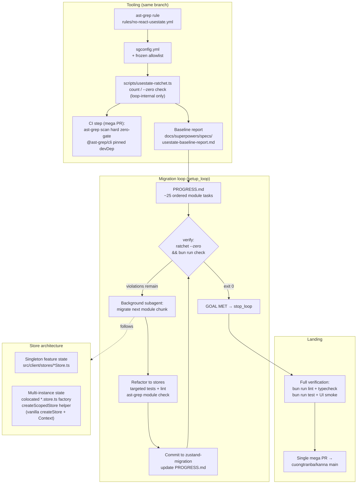

# useState → Zustand Migration Initiative — Design

**Date:** 2026-07-12
**Status:** Approved for planning
**Branch:** `zustand-migration` (single mega PR to `cuongtranba/kanna` main)

## Objective

Centralize frontend state management: all application state and actions move
from React `useState` into Zustand stores. Components become render-focused;
state, business logic, and side effects live in stores. Enforced by an
ast-grep rule that CI hard-gates at zero violations.

## Decisions (locked)

| Decision | Choice |
|---|---|
| Rule scope | Pragmatic allowlist — zero `useState` in app/feature/component code; frozen exemptions for tests, `ui/` primitives, generic utility hooks |
| CI strategy | Hard zero-violation gate, landing in the same (single) PR as the migration. The ratchet script exists only as loop-internal tooling during the burn-down |
| Loop engine | Kanna `setup_loop` — notification-driven autonomous loop, background subagent per iteration, `PROGRESS.md` as durability contract |
| Git strategy | Single mega-branch `zustand-migration` in worktree `.worktrees/zustand-migration`; ONE PR containing tooling + migration + CI gate |
| Store shape | Feature stores for singletons; vanilla `createStore` factories + React context for multi-instance component state |

## Baseline (measured 2026-07-12, ast-grep — all four call forms: plain,
generic `useState<T>(...)`, `React.useState`, `React.useState<T>`)

- **287 total call sites** in `src/client/`
- **277 in-scope call sites across 60 files** after allowlist exclusions
- Top hotspots: `SettingsPage.tsx` (42), `RightSidebar.tsx` (31),
  `useKannaState.ts` (30), `McpServersSection.tsx` (18), `KannaSidebar.tsx` (15),
  `ChatPage/index.tsx` (8)
- Note: the ast-grep rule MUST match generic type-argument calls
  (`useState<T>(...)`) — a bare `useState($$$)` pattern misses ~half the sites.

The authoritative machine-readable baseline is regenerated by
`scripts/usestate-ratchet.ts` during implementation; numbers above are the
design-time snapshot.

## Architecture

## 1. ast-grep rule + allowlist

- `sgconfig.yml` at repo root; rule `no-react-usestate` under `rules/`.
- Matches: `useState($$$)` calls, `React.useState($$$)`, and the `useState`
  import specifier from `react`. Severity `error`.
- Message: direct remediation guidance — singleton state goes to
  `src/client/stores/`, per-instance state uses the scoped-store factory
  pattern (`src/client/lib/createScopedStore.tsx`).
- **Frozen allowlist** (rule `ignores`; changing it requires PR review):
  - `**/*.test.ts`, `**/*.test.tsx`
  - `src/client/components/ui/**` (shadcn-style primitives)
  - `src/client/hooks/useIsMobile.ts`, `useNow.ts`, `useStickyState.ts`,
    `useTheme.tsx`, `useIsStandalone.ts` (generic utility hooks)
- Everything else migrates — including Lexical plugins and feature hooks
  (`useViewportFetch`, `useMentionSuggestions`, `useTerminalToggleAnimation`,
  `useChatPageSidebarActions`, `textLoader`).
- `@ast-grep/cli` pinned as a devDependency; no reliance on global installs.

## 2. Ratchet script (loop-internal) + CI gate

- `scripts/usestate-ratchet.ts` (bun): runs `ast-grep scan --json`, prints
  total + per-file counts, compares against `usestate-baseline.json`.
  - Default mode: fail if count exceeds baseline (guards loop iterations
    against introducing new `useState` while migrating).
  - `--zero`: fail unless count is exactly 0 (loop goal condition).
  - `--update`: rewrite baseline after a successful iteration.
- CI: the mega PR adds an `ast-grep scan` step (zero tolerance) to the
  existing test workflow. The ratchet script and `usestate-baseline.json` are
  **deleted in the same PR** once the count reaches zero — mirroring the
  side-effect-seal endgame. Only the hard gate ships to main.
- One-time baseline report generated to
  `docs/superpowers/specs/usestate-baseline-report.md`: total violations,
  violations by file, by feature/module, and estimated effort per module.

## 3. Store architecture

**Singleton feature state** → stores in `src/client/stores/` following the
existing convention (13 stores today): narrow store per concern, typed state +
actions in the store, stable-`EMPTY`-ref selectors, `useShallow` for derived
collections (render-loop rule / React error #185 guard).

**Multi-instance component state** (message cards, `ThinkingBlock`,
`MermaidDiagram`, typeahead plugins — anything rendered N times with
independent state) → **scoped store factories**:

- One shared helper `src/client/lib/createScopedStore.tsx` written once:
  wraps vanilla `zustand` `createStore`, returns `{ Provider, useScopedStore }`
  backed by React context. Provider instantiates one store per component
  instance; `useScopedStore(selector)` subscribes with selector semantics.
- Each migrated multi-instance component gets a colocated
  `<Component>.store.ts` defining its state/actions factory.
- This is a new pattern in the codebase; the helper gets its own unit tests
  plus a `renderForLoopCheck` regression test.

**Rules for all migrated code:**
- No behavior change — pure state relocation plus extraction of handlers into
  store actions.
- Strong typing throughout (no `any`); actions typed on the store interface.
- Derived state computed in selectors, not duplicated in state.
- Side-effect seal untouched: stores are client-layer, browser `fetch` OK,
  no new IO primitives.
- react-hooks v7 lint set must stay clean (no new warnings — the lint cap is
  a ratchet).

## 4. Task generation + priority

`PROGRESS.md` on the mega-branch holds ~25 module-scoped tasks, ordered
shared/high-traffic first:

1. `createScopedStore` helper + tests (foundation, blocks multi-instance tasks)
2. `useKannaState.ts` (9 call sites — the app-wide state hub)
3. `ChatPage/index.tsx` + `ChatTranscriptViewport` + `useChatPageSidebarActions`
4. `ChatInput.tsx` + chat-ui input satellites
5. `KannaSidebar.tsx` + sidebar satellites (`Menus`, `StackChatCreateRow`, `StackCreatePanel`)
6. `RightSidebar.tsx` (17)
7. `messages/*` cards (multi-instance heavy: `SubagentTaskMessage`,
   `MermaidDiagram`, `SystemMessage`, `ExitPlanModeMessage`, …)
8. `file-preview/*` (`FilePreviewSheet`, `useViewportFetch`, bodies)
9. `SettingsPage.tsx` (18) + settings sections (`McpServersSection` 13,
   `ModelsSection`, `SubagentsSection`, `TextSnippetsSection`, `OAuthTokenPoolCard`)
10. Remainder (App.tsx, WorkflowsPage, share, LocalDev, lexical plugins, misc)

**Acceptance criteria per task:**
- ast-grep reports zero hits in the task's files.
- Ratchet count strictly decreased; no file outside the task gained a hit.
- Targeted tests for touched files pass (`bun test --conditions production <files>`).
- Targeted lint passes with no new warnings.
- Behavior unchanged (existing tests are the oracle; UI smoke at landing).

## 5. Loop execution

- All work in worktree `.worktrees/zustand-migration` (already created).
- Arm via `setup_loop`:
  - **goal:** "zero useState violations (ast-grep) and full check passes"
  - **verify_command:** `bun run migrate:verify` → `bun scripts/usestate-ratchet.ts --zero && bun run check` (fails fast on count > 0, cheap during burn-down; thorough at the end)
  - **tracking_file:** `PROGRESS.md` (in the worktree)
- Each iteration: background subagent takes the next task from PROGRESS.md,
  migrates, validates per acceptance criteria, commits to the mega-branch,
  updates PROGRESS.md, terminates. Loop ends by absence of delegation once
  verify exits 0 (`GOAL MET` → `stop_loop`).
- Subagent briefs include: store-architecture rules (§3), render-loop
  regression rules, side-effect seal constraints, and the task's acceptance
  criteria. Subagents run targeted tests only; full `bun run check` runs in
  the verify step and at landing.

## 6. Landing + Definition of Done

Before the PR (verification-before-completion):
- `bun run lint` — zero errors, warning count ≤ cap
- `bun run typecheck` (TS7) — clean
- `bun run test` — full suite green
- UI smoke test in browser: chat send/receive, sidebar nav, settings CRUD,
  message cards render, file preview
- `ast-grep scan` — zero violations

Definition of done:
- No `useState` outside the frozen allowlist in `src/client/`.
- All migrated state/actions in Zustand (feature stores or scoped factories).
- CI enforces the ast-grep rule (hard zero gate) to prevent regressions.
- Ratchet tooling deleted; baseline report + PROGRESS.md document the migration.
- Single PR merged to `cuongtranba/kanna` main.

## Out of scope

- `wiki/` (isolated build, not part of `src/`).
- Server code (`src/server/`) — React-free.
- Refactoring beyond state relocation (no component redesigns, no new
  features, no styling changes).
- Replacing the exempted generic hooks or `ui/` primitives.
