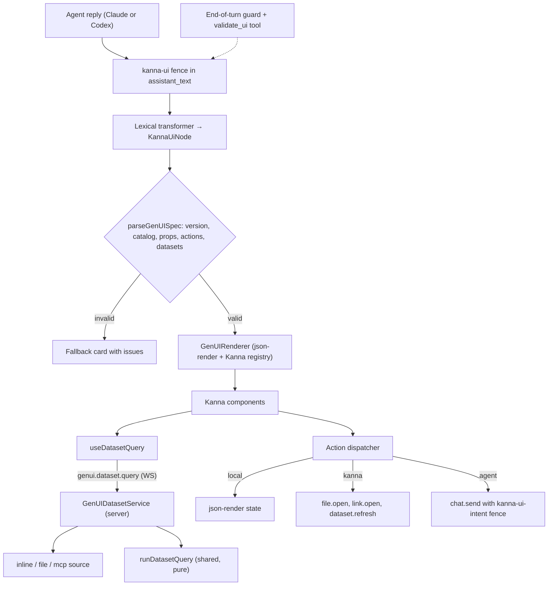

# Generative UI — implementation note

Status: in progress on `feat/generative-ui`. Source handoff: `KANNA_GENERATIVE_UI_HANDOFF.md`
(uploaded to the chat). This note maps every concept in that handoff onto an existing Kanna
abstraction before any code is written, as the handoff's Phase 0 requires.

## Decisions taken with the user

1. **Financial reporting is an example, not the domain.** A dataset's rows come from wherever
   the user points: data given in chat (`inline`), a workspace file (`file`), or a tool on a
   configured MCP server (`mcp`). One resolver, three sources. Since
   `adr-20261001-genui-inline-tabular-datasets`, inline is the default for any data the
   agent already holds, and it may be written as a `{columns, rows}` table.
2. **The contract is a fenced block, not a tool.** The agent writes a ` ```kanna-ui ` fence in
   its reply. Codex receives no Kanna MCP tools (`codex-transcript-translator.ts` passes
   `mcpServers: []`), so a `present_ui` tool would be Claude-only. The fence works on every
   provider, persists in `assistant_text`, and restores on reload with no new entry kind.
3. **Scope is the whole handoff.**

## Flow



## Handoff concept → Kanna abstraction

| Handoff concept | Kanna home | Notes |
| --- | --- | --- |
| `present_ui(spec)` | ` ```kanna-ui ` fence + `mcp__kanna__validate_ui` + end-of-turn guard | Same shape as the mermaid gate (`adr-20260810-mermaid-validation-gate`): a deterministic validator the model calls in-turn, and a guard that asks once when a broken spec slips through. |
| Versioned protocol | `src/shared/genui/spec.ts` | `version: 1`; any other value fails closed. |
| Catalog / registry | `src/shared/genui/catalog.ts` (schemas, one source) + `src/client/components/genui/registry.tsx` (renderers) | A drift test asserts every catalog entry has a renderer and a prompt line. |
| Validation | `parseGenUISpec` (shared) | json-render's `catalog.validate` checks only the component *name*: it accepts wrong prop types, unknown actions and bad params (probed on 0.21.0). Kanna validates props with strict Zod schemas, every `on` binding against the action catalog and its param schema, dataset references against the spec's `datasets`, and structure via json-render's `validateSpec`. |
| Dataset references + semantic layer | `datasets` block in the spec (`fields.metrics`, `fields.dimensions`, optional `scenario`) | The UI asks for `metric: "revenue"`; the dataset maps it to a column, a format and an aggregation. |
| DatasetResolver | `GenUIDatasetService` (`src/server/genui/`) + `runDatasetQuery` (`src/shared/genui/query.ts`, pure) | The server fetches rows and runs the shared, deterministic query engine; the client never receives more than the aggregated result. |
| Authorization | Server-side, in the dataset service | File paths stay inside the chat's cwd and honour the chat policy's `readPathDeny`. MCP datasets must name an enabled custom server; a tool is callable only if it declares `readOnlyHint` or the user approved it for that chat. The MCP server's own credentials decide what data is visible, so an id in a model-written argument is never proof of access. |
| Local UI action | json-render state (`setState` built-ins, `$bindState`) | No agent call. |
| Deterministic Kanna action | Client dispatcher → existing capabilities (`openLocalFile`, `window.open` for https links, dataset refetch) | Rendered through `runPendingAction` where it is async. |
| Agent action | `chat.send` whose content carries a ` ```kanna-ui-intent ` fence | Reuses the send pipeline unchanged: queueing, persistence, provider neutrality. The user bubble renders the fence as a compact context chip; the model reads the structured JSON. No protocol change. |
| Chart interaction | VChart `dimensionClick` / `click` → `normalizeChartEvent` → `financial.drilldown` | Raw VChart events never leave the chart module. |
| Persistence (handoff §24) | Option 2: the spec is part of `assistant_text` | Reload restores it without asking the model. Local presentation state (selected period, drill path) lives in a bounded per-chat registry and is intentionally ephemeral. |
| Streaming | An unclosed fence renders a quiet placeholder; only a closed, valid spec renders and enables actions. | |
| Share view | `lexicalToReact` renders the same block with `readonly: true`: structure and static props show, datasets and actions are disabled (a share link is unauthenticated). | |

## Duplicates deliberately left out of the catalog

| Handoff component | Existing Kanna feature |
| --- | --- |
| `Question`, `Approval` | AskUserQuestion, ExitPlanMode, the durable `pending_tool_request` flow |
| `TaskList`, `Progress` | `todo_write` card, the chat task list (`mcp__kanna__task_*`), the loop Progress panel |
| `ToolCall`, `CodeBlock`, `Diff` | `ToolCallMessage`, `MessageCodeBlock`, `FileContentView` |

Static tables and simple static charts stay markdown tables and mermaid; the prompt says so.
GenUI is for dataset-bound, interactive views.

## Repository constraints the design respects

- `ws-router-dispatch-arms` is pinned at 0: the router gets one more handler module
  (`ws-router-genui.ts`), not a `case`.
- `deps-bundles` is an exact pin: the server side is a service object with injected source
  ports, not a new `*Deps` bundle.
- `untyped-command-results` is an exact pin: the client decodes `socket.command` results with a
  shared decoder instead of `command<T>`.
- No `unknown`/`any`: json-render's `unknown`-typed surfaces are wrapped at one boundary module.
- VChart loads as a lazy chunk (the entry bundle is capped at 350 KB gzip), charts have a fixed
  height and no animation (the transcript virtualizer forbids height animation), and colours
  resolve from Kanna's OKLCH tokens at runtime.
- No comments in `src/`; no module mocks in tests; every async trigger shows a pending state.
