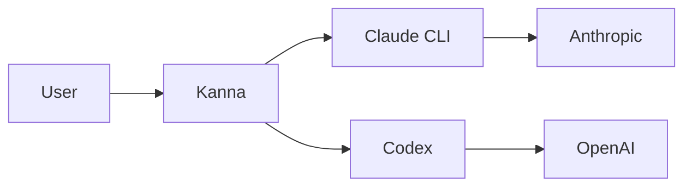

import Screenshot from '../../../components/Screenshot.astro'

## Self-update

One-click pull/rebuild/reload from the UI. Works under pm2, systemd, docker, or plain shell via a host-agnostic supervisor. Install any prior release straight from the changelog UI.

<Screenshot
  light="/screenshots/light/settings-general.png"
  dark="/screenshots/dark/settings-general.png"
  alt="In-app self-update UI"
/>

## Expose port (Cloudflare tunnel)

The agent can call `mcp__kanna__expose_port` to surface a localhost port via a Cloudflare quick tunnel. Always-ask or auto-expose modes, configurable per-project.

<Screenshot
  light="/screenshots/light/settings-general.png"
  dark="/screenshots/dark/settings-general.png"
  alt="Expose-port approval dialog"
/>

## Mermaid rendering

Mermaid diagrams in agent output render inline in the transcript.

## Standalone HTML transcript export

Export any chat to a self-contained HTML file. Inline CSS + screenshots, no external dependencies, sharable.

## Customizable keybindings

See [Reference → Keybindings](/reference/keybindings/) for the full default map and customization syntax.

## Password gate

Protect the HTTP/WS/API surface with a password. Set `KANNA_PASSWORD=<secret>` and Kanna prompts on every browser session.

## PWA / mobile layout

Kanna is installable as a PWA. Mobile layout adapts to small viewports with a slide-in sidebar and touch-tuned composer.
