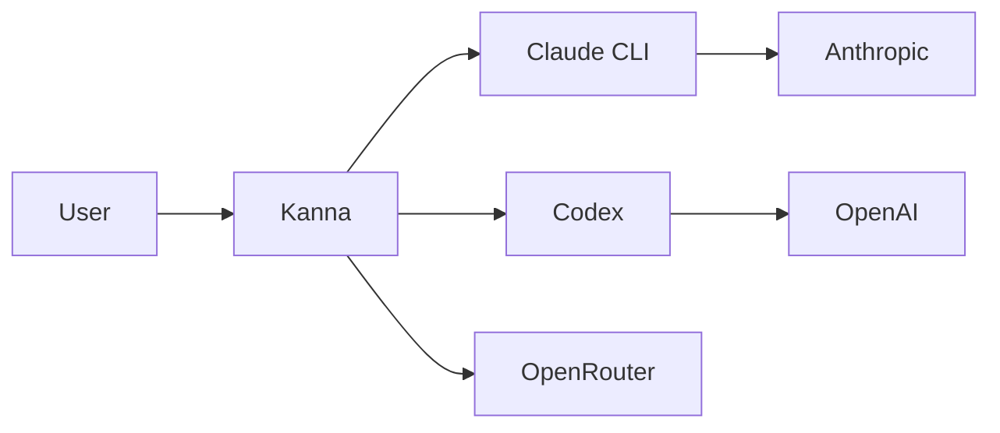

import Screenshot from '../../../components/Screenshot.astro'

## Self-update

One-click pull/rebuild/reload from the UI. Works under pm2, systemd, docker, or plain shell via a host-agnostic supervisor. Install any prior release straight from the changelog UI.

<Screenshot
  light="/screenshots/light/settings-general.png"
  dark="/screenshots/dark/settings-general.png"
  alt="In-app self-update UI"
/>

## Expose port (Cloudflare tunnel)

The agent can call `mcp__kanna__expose_port` to surface a localhost port via a Cloudflare quick tunnel. Always-ask or auto-expose modes, configurable per-project.

<Screenshot
  light="/screenshots/light/settings-general.png"
  dark="/screenshots/dark/settings-general.png"
  alt="Expose-port approval dialog"
/>

## Custom MCP servers

Register your own MCP servers from **Settings → MCP servers**. Entries persist in `settings.json` (`customMcpServers`, file mode `0600`) and are merged into both the SDK and PTY Claude drivers at chat spawn time, so their tools appear as `mcp__<name>__<tool>`.

- **Transports:** `stdio`, `http`, `sse`, `ws`. The name `kanna` is reserved.
- **OAuth:** `http` and `sse` servers support OAuth 2.1 (PKCE + dynamic client registration + rotating refresh). Kanna has no redirect server, so after the provider redirects to `http://localhost:3334/callback?code=…` you copy that URL from the address bar and paste it back into Settings to complete the flow. Tokens refresh automatically before expiry.
- **Connect-test:** creating or updating a server fires a list-tools probe; the row shows a status pill, and a manual **Test** button re-runs it.
- **Trust model:** user MCP tool calls auto-allow — if you installed it, Kanna trusts it.

## Workflow status panel

Kanna surfaces Claude Code's native **Workflow** tool (dynamic multi-agent orchestration) in a read-only per-chat panel: every run with live status, drill-in progress, token totals, and an inline transcript card on the launch. It works under both the SDK and PTY drivers by watching the `wf_<runId>.json` sidecars Claude writes to disk — no event-stream coupling. Stopping or relaunching runs from the panel is out of scope.

## Agent self-scheduled wake

The agent can schedule its own chat re-entry via the `mcp__kanna__schedule_wakeup` tool — useful for polling long-running background work and then continuing. Kanna owns the timer (it survives a server restart via event replay and obeys the cancel cascade) rather than the CLI's in-memory cron. A runaway-loop cap, `KANNA_MAX_AGENT_WAKES` (default 25), bounds consecutive self-wakes per chat and resets on a real user turn. Background subagent results are delivered through the same re-entry path and are exempt from the cap.

## Local skills & slash commands

The composer's `/` picker lists local Claude Code skills and slash commands discovered on disk alongside Kanna's built-ins, so installed plugin skills are one keystroke away.

## Per-turn token cost

Each turn shows its token usage and estimated USD cost in the transcript, computed from the provider's model pricing — so you can see what a session is spending as it runs.

## Mermaid rendering

Mermaid diagrams in agent output render inline in the transcript.

## Standalone HTML transcript export

Export any chat to a self-contained HTML file. Inline CSS + screenshots, no external dependencies, sharable.

## Customizable keybindings

See [Reference → Keybindings](/reference/keybindings/) for the full default map and customization syntax.

## Password gate

Protect the HTTP/WS/API surface with a password. Set `KANNA_PASSWORD=<secret>` and Kanna prompts on every browser session.

## PWA / mobile layout

Kanna is installable as a PWA. Mobile layout adapts to small viewports with a slide-in sidebar and touch-tuned composer.
