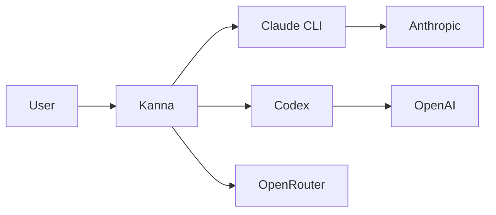

import Screenshot from '../../../components/Screenshot.astro'

## Self-update

One-click pull/rebuild/reload from the UI. Works under pm2, systemd, docker, or plain shell via a host-agnostic supervisor. Install any prior release straight from the changelog UI.

<Screenshot
  light="/screenshots/light/settings-general.png"
  dark="/screenshots/dark/settings-general.png"
  alt="In-app self-update UI"
/>

## Expose port (Cloudflare tunnel)

The agent can call `mcp__kanna__expose_port` to surface a localhost port via a Cloudflare quick tunnel. Always-ask or auto-expose modes, configurable per-project.

<Screenshot
  light="/screenshots/light/settings-general.png"
  dark="/screenshots/dark/settings-general.png"
  alt="Expose-port approval dialog"
/>

## Custom MCP servers

Register your own MCP servers from **Settings → MCP servers**. Entries persist in `settings.json` (`customMcpServers`, file mode `0600`) and are merged in at chat spawn time, so their tools appear as `mcp__<name>__<tool>`.

- **Transports:** `stdio`, `http`, `sse`, `ws`. The name `kanna` is reserved.
- **OAuth:** `http` and `sse` servers support OAuth 2.1 (PKCE + dynamic client registration + rotating refresh). Kanna has no redirect server, so after the provider redirects to `http://localhost:3334/callback?code=…` you copy that URL from the address bar and paste it back into Settings to complete the flow. Tokens refresh automatically before expiry.
- **Connect-test:** creating or updating a server fires a list-tools probe; the row shows a status pill, and a manual **Test** button re-runs it.
- **Trust model:** user MCP tool calls auto-allow — if you installed it, Kanna trusts it.

## Workflow status panel

Kanna surfaces Claude Code's native **Workflow** tool (dynamic multi-agent orchestration) in a read-only per-chat panel: every run with live status, drill-in progress, token totals, and an inline transcript card on the launch. It works by watching the `wf_<runId>.json` sidecars Claude writes to disk, so the panel stays accurate without touching the event stream. Stopping or relaunching runs from the panel is out of scope.

## Agent chat re-entry

The agent can hand work off and have the chat pick it up again later, without polling on a timer.

Call `mcp__kanna__delegate_subagent({ run_in_background: true, … })` and the tool returns immediately with a run id while the subagent works. When it finishes, Kanna clears the main agent's context and re-enters the chat as a fresh turn carrying the result — so a long job costs one wake, not a polling loop. Delivery is event-driven and provider-agnostic, and it survives a server restart via event replay.

For work that should recur on a **clock** rather than on completion, use [cron jobs](/features/cron-jobs/).

:::note[Removed]
The timer-based `mcp__kanna__schedule_wakeup` tool and its `KANNA_MAX_AGENT_WAKES` cap no longer exist — they were removed when re-entry became notification-driven. A self-polling agent lost momentum across context compaction, which is what the background-delegation path above fixes.
:::

## Local skills & slash commands

The composer's `/` picker lists local Claude Code skills and slash commands discovered on disk alongside Kanna's built-ins, so installed plugin skills are one keystroke away. `/clear`, `/compact` and `/cron` are Kanna's own — see [Slash commands](/features/slash-commands/).

## Text snippets

**Settings → Text snippets** maps a short `shortcut` to a longer `expansion`, expanded as you type in the composer. Useful for the paragraph of standing context you retype into every new chat.

## Global instructions

**Settings → Instructions** appends text to the system prompt of every agent spawn, on every provider. This is the place for house rules that are not repo-specific — repo-specific ones belong in that repo's `CLAUDE.md` or `AGENTS.md`, which the agent already reads.

## Per-turn token cost

Each turn shows its token usage and estimated USD cost in the transcript, computed from the provider's model pricing — so you can see what a session is spending as it runs.

## Mermaid rendering, checked before you see it

Mermaid diagrams in agent output render inline in the transcript.

Because a syntax error would reach you as a broken diagram, the agent validates
its diagrams against mermaid's real parser (`mcp__kanna__validate_mermaid`)
before answering, and fixes them in the same turn — so you never see the bad
version. If one slips through anyway, an end-of-turn check asks the agent to
correct it, **once** per diagram. Set `KANNA_MERMAID_GUARD=disabled` to turn off
that second pass; the tool itself stays.

## Standalone HTML transcript export

Export any chat to a self-contained HTML file. Inline CSS + screenshots, no external dependencies, sharable.

## Customizable keybindings

See [Reference → Keybindings](/reference/keybindings/) for the full default map and customization syntax.

## Password gate

Protect the HTTP/WS/API surface with a password: run `kanna --password <secret>` and Kanna prompts on every browser session. See [Security](/features/security-sandboxing/#password-gate).

## PWA / mobile layout

Kanna is installable as a PWA. Mobile layout adapts to small viewports with a slide-in sidebar and touch-tuned composer.
